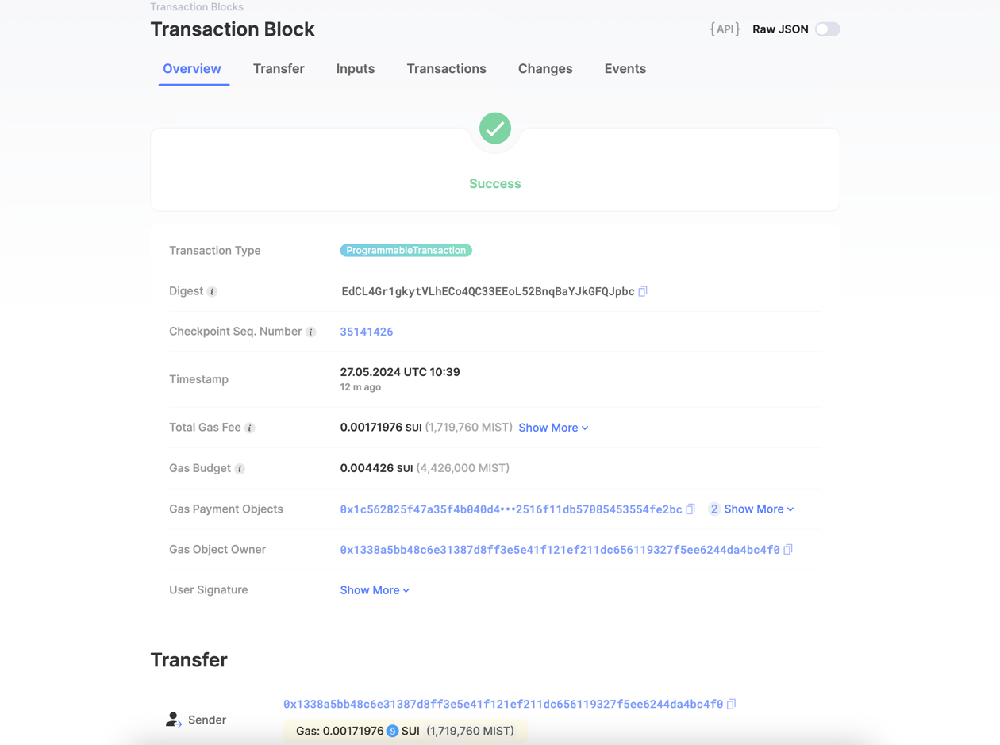
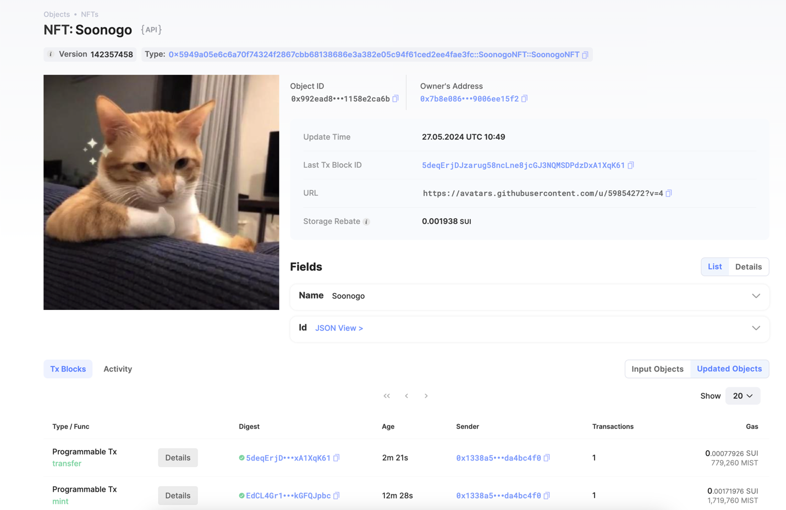

## 基本信息
- Sui钱包地址: `0x1338a5bb48c6e31387d8ff3e5e41f121ef211dc656119327f5ee6244da4bc4f0`
> 首次参与需要完成第一个任务注册好钱包地址才被合并，并且后续学习奖励会打入这个地址
- github: `Soonogo`

## 个人简介
- 工作经验: 1.5年
- 技术栈: `js`
- 对Move感兴趣，学习Move和区块链知识
- 联系方式: tg: `none` 

## 任务

##   01 hello move  
- [x] package id: 0x14470e13e5fe95d4cecef55369b11483ba1c988b95bda41c18528a3c539aa19b

##   02 move coin
- [x] My Coin package id : 0x310336543b5fd5f400c0a68066eed5289f48216d5f445f47677d23ee99874623
- [x] Faucet package id : 0x508ad168492aa2c45764df4e3109b218f529db6a2cf6f94e07ee1c1759e11baf
- [x] 转账 `My Coin` hash: CQaHLpHmnnAuMrHPs8MLHSJNuhXr4XyNsPWQAxvsnHWT

##   03 move NFT
- [x] nft package id : 0x5949a05e6c6a70f74324f2867cbb68138686e3a382e05c94f61ced2ee4fae3fc
- [x] nft object id : 0x992ead8231581afc115dbceb86a252adae55bb73a7d05e373790c11158e2ca6b
- [x] 转账 nft  hash: 5deqErjDJzarug58ncLne8jcGJ3NQMSDPdzDxA1XqK61
- [x] mint 浏览器截图: 

##   04 Move Game
- [] game package id :
- [] call game hash:

##   05 Move Swap
- [] swap package id :
- [] call swap hash:

##   06 SDK PTB
- [] save hash :
