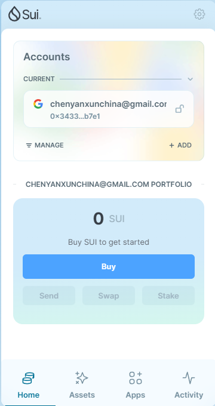
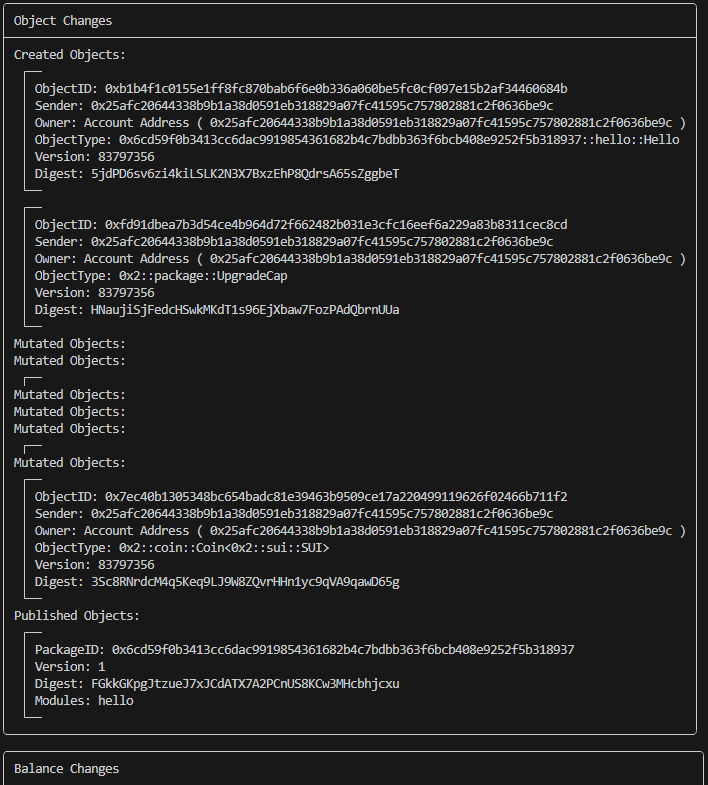
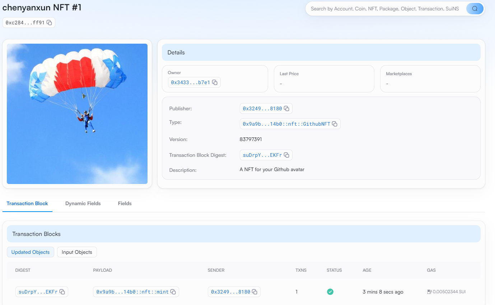

## 基本信息
- Sui钱包地址: `0x3433e27dbe077c5679e941c8099fadceabf2b05e5e0ee03d573014ecb987b7e1`
> 首次参与需要完成第一个任务注册好钱包地址才被合并，并且后续学习奖励会打入这个地址
- github: `chenyanxun`

## 个人简介
- 工作经验: 7年
- 技术栈: `Vue`
> 重要提示 请认真写自己的简介
- 多年web2开发经验，对Move特别感兴趣，想通过Move入门区块链
- 联系方式: wx:chenyx3740 

## 任务

##   01 hello move  
- [&#x2714;] Sui cli version:sui 1.30.1-a4185da5659d
- [&#x2714;] Sui钱包截图: 
- [&#x2714;] package id: 0x6cd59f0b3413cc6dac9919854361682b4c7bdbb363f6bcb408e9252f5b318937
- [&#x2714;] package id 在 scan上的查看截图:

##   02 move coin
- [&#x2714;] My Coin package id : 0x1a85ad3480a87e3b8f5c5cecb3d3d2c6917c484d2ee8ba61c246c8f14810143d
- [&#x2714;] Faucet package id : 0xaf670ea2220ea05286d87724392a8b848f9cf6e42bf61a28f957ecffda8f253e
- [&#x2714;] 转账 `My Coin` hash: A1d6tpXvCEVgTb5NQurZBZhJLTsrKZ2qrUQ791am56A9
- [&#x2714;] `Faucet Coin` address1 mint hash: 9Fk3JceYeKnohCVZfNDPE7PAsTx2GmmYpGJbEqdKTppU
- [&#x2714;] `Faucet Coin` address2 mint hash: CjyvZvAdr6zvEGc244j8zSkZJtskdYBwRp2c8o3FJUBo

##   03 move NFT
- [&#x2714;] nft package id :0x9a9b278b08a15d9c7892d91e7625018c1f68ababf3517523c2bd224657d714b0
- [&#x2714;] nft object id : 0xc284da7b8e6e5abc436859a06ffbd88e19ac3e3dca1977eb7d9224671c89ff91
- [&#x2714;] 转账 nft  hash: 8TzFFPSr7N6WvRiMJ5TUMhC8AMjRNDJJ9fA8giAcpETU
- [&#x2714;] scan上的NFT截图:

##   04 Move Game
- [&#x2714;] game package id : 0xad370dc6dc2eade0473612af4f9990527b29bcf54f790b902c34568133767102
- [&#x2714;] deposit Coin hash: 7VeG6B39h22MtxNpCqBmBCjZq788oUfwSPozWi2TXKK1
- [&#x2714;] withdraw `Coin` hash: GBFyDorqt78etDGBT8qHsP1xWz878PtXx8dUjssm7X8Z
- [&#x2714;] play game hash: 8zac1KjqmjY9vN8PePb31eikzkYrKJ6aynBznu4catW8

##   05 Move Swap
- [&#x2714;] swap package id :0xfca79ed9b1cc25c9015754625b019beed0c468c50f2ad85bafb06cf8c52f0fe9
- [&#x2714;] call swap CoinA-> CoinB  hash : 8tREAySD5wyDQjfoBvd1hXBBhwdtMzAit8Mn1MNaQz3s
- [&#x2714;] call swap CoinB-> CoinA  hash : 43LaumkEDhfj3jBmcGZcHbAWLLzKVBmWjLGfRZdssBhT

##   06 Dapp-kit SDK PTB
- [] save hash :

##   07 Move CTF Check In
- [] CLI call 截图 : 
- [] flag hash :

##   08 Move CTF Lets Move
- [] proof : 
- [] flag hash :
