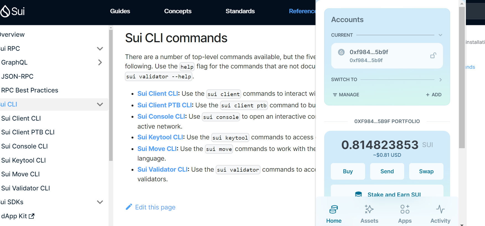
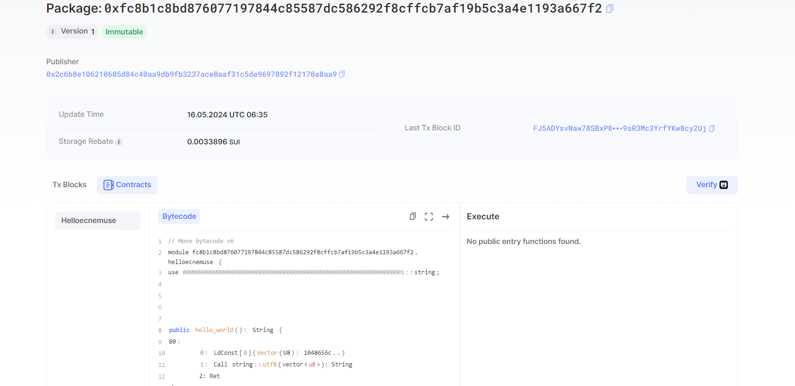

## 基本信息
- Sui钱包地址: `0xc1a02183f9184607fd75ff6f87a04b252afa0838334007ffe434a1fa380ee6b9`
> 首次参与需要完成第一个任务注册好钱包地址才被合并，并且后续学习奖励会打入这个地址
- github: `ecnemuse`

## 个人简介
- 工作经验: 0年
- 技术栈: `C++``Python`
- 业余的MOVE爱好者，特别对Defi感兴趣，擅长基础理论，请多多指教！
- 联系方式: tg: [chir99021](https://t.me/chir99021)

## 任务

##   01 hello move  
- [√] Sui cli version:sui 1.22.0-0362997-dirty
- [√] Sui钱包截图: 
- [√] package id: [0xfc8b1c8bd876077197844c85587dc586292f8cffcb7af19b5c3a4e1193a667f2](https://suivision.xyz/package/0xfc8b1c8bd876077197844c85587dc586292f8cffcb7af19b5c3a4e1193a667f2)
- [√] package id 在 scan上的查看截图:
      
##   02 move coin
- [x] My Coin package id :
- [x] Faucet package id : 
- [x] 转账 `My Coin` hash : 

##   03 move NFT
- [x] nft package id :
- [x] nft object id : 
- [x] 转账 nft hash :
##   04 Move Game
- [x] game package id :
- [x] call game hash : 

##   05 Move Swap
- [x] swap package id :
- [x] call swap hash: 
 
##   06 SDK PTB
- [√] save hash  : [A2s1Cvz6Toka4JbpR27mHgaXGgnCv1pJ2YLid3tDivpN](https://suivision.xyz/txblock/A2s1Cvz6Toka4JbpR27mHgaXGgnCv1pJ2YLid3tDivpN)
