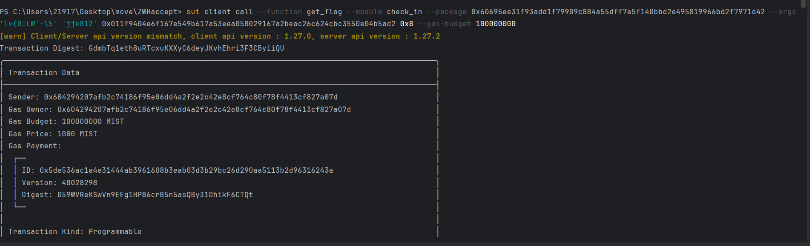
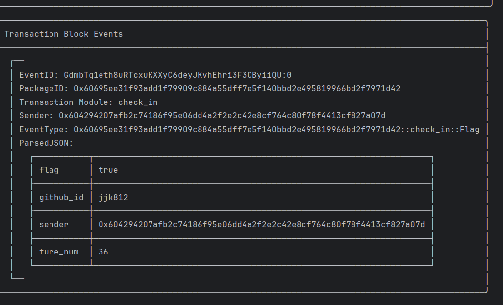

## 基本信息
- Sui钱包地址: `0x604294207afb2c74186f95e06dd4a2f2e2c42e8cf764c80f78f4413cf827a07d`
> 首次参与需要完成第一个任务注册好钱包地址才被合并，并且后续学习奖励会打入这个地址
- github: `jjk812`

## 个人简介
- 工作经验: 在校学生

  

- 联系方式: tg: `jjk812` 

## 任务

##   01 hello move  
- [x] package id: 0xd5e4f66cfae35208a454a39b4b4a1b822d006a63a50d3f15ade2678c91257c00

##   02 move coin

- [X] My Coin package id : 0x87d64eeefcc1f3abc521d671d79d9042de08caf6ed597c58b7a3c5926aeccc10
- [X] Faucet package id : 0x01513f2977f9847e22c4b22f0ef2101f7f3b8c922bd3c31bd835fd2ff830de1e
- [X] 转账 `My Coin` hash: 9XKgKy9EXqCPZRbtAFfGCL3fwSPQfZT5F8ZHvyZzG6hC

##   03 move NFT

- [X] nft package id :0xb2e71f22585bece3d3984c81fd69d6c8222f632c7a6d09df3110fcf332456a4e
- [X] nft object id : 0x7d9104b57428ba6e767ddc72a713cd54d9e1130212d91bc6c6725ea8c96229e1
- [X] 转账 nft  hash: 3iLyYGyis3QkoijfyHVK1r3Mif5oViGMiUe4eB7PQhgU

##   04 Move Game

- [X] game package id :0xdd607407ae85acf725e60b1e3c868c08ab7e24c0ac69f1a36721e932960ea2c1
- [X] call game hash:86S9RhqGTKuktLCUXU3TYbGMjn3QbGaR8vX7BUUnhrqZ

##   05 Move Swap

test测试网部署的

- [X] swap package id :0x9f099d9f96c0b4a5c69689a09c706edcbf163a61997d3b5fcb0952fda35e8105
- [X] call swap hash: EcDhqUGebm7pk2JJHsDWVSJXGJGGR2jPvSMGhbw4ktta

##   06 SDK PTB
- [X] save hash :2WZTAk44ygh7stRt1j6rMxFYKrYd4sh9o7X5dAyZwSSu
  
##   07 Move CTF Check In
- [X] CLI call 截图
- 
- 

- [X] flag hash : GdmbTq1eth8uRTcxuKXXyC6deyJKvhEhri3F3CByiiQU

##   08 Move CTF Lets Move