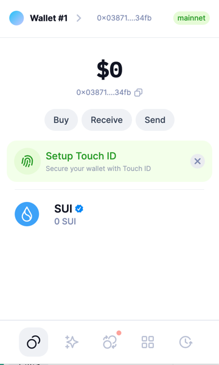
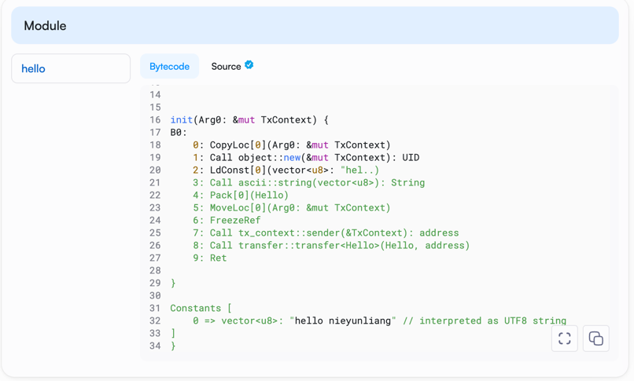

## 基本信息
- Sui钱包地址: `0x03871e316b8680c5cc3006b1eea9cac5c30b6bb3f46c3b405e9fa2de664f34fb`
> 首次参与需要完成第一个任务注册好钱包地址才被合并，并且后续学习奖励会打入这个地址
- github: `nieyunliang`

## 个人简介
- 工作经验: 8年
- 技术栈: `HTML CSS JavaScript`
> 重要提示 请认真写自己的简介
- 多年web2开发经验，对Move特别感兴趣，想通过Move入门区块链
- 联系方式: tg: `@Ihaowanj1a` 

## 任务

##   01 hello move  
- [] Sui cli version: sui 1.30.1-a4185da5659d
- [] Sui钱包截图: 
- [] package id: 0x7bb6690cae9ded719458f1480f2265833819d06ce607e2daab3d4849c7a79bdd
- [] package id 在 scan上的查看截图:

##   02 move coin
- [] My Coin package id : 0x055588f8d4093990f2f848ae4e42e375a7af233cdd414e2a24a6c25350c9ae7a
- [] Faucet package id : 0x055588f8d4093990f2f848ae4e42e375a7af233cdd414e2a24a6c25350c9ae7a
- [] 转账 `My Coin` hash: 5opN8uqTYWGECUjK5sBGTnuuV8kany5rD1goUYDWjUYj
- [] `Faucet Coin` address1 mint hash: FZxKsgpES9R62SBY2ivBb2eE56QCwon4y2zahcuPv5bh
- [] `Faucet Coin` address2 mint hash: HPg3yAbx1dRsgRzCHQSVBuFDghDaC5wA1gYs7dJbcCp4

##   03 move NFT
- [] nft package id :
- [] nft object id : 
- [] 转账 nft  hash:
- [] scan上的NFT截图:

##   04 Move Game
- [] game package id :
- [] deposit Coin hash:
- [] withdraw `Coin` hash:
- [] play game hash:

##   05 Move Swap
- [] swap package id :
- [] call swap CoinA-> CoinB  hash :
- [] call swap CoinB-> CoinA  hash :

##   06 Dapp-kit SDK PTB
- [] save hash :

##   07 Move CTF Check In
- [] CLI call 截图 : 
- [] flag hash :

##   08 Move CTF Lets Move
- [] proof : 
- [] flag hash :
