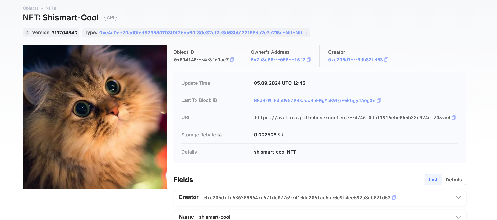

## 基本信息
- Sui钱包地址: `0xc205d7fc5862888647c57fde077597410dd206fac6bc0c9f4ee592a3db82fd53`
> 首次参与需要完成第一个任务注册好钱包地址才被合并，并且后续学习奖励会打入这个地址
- github: `shismart-cool`

## 个人简介
- 工作经验: 2年
- 技术栈: `Java` `Android`
> 重要提示 请认真写自己的简介
- Android开发者，对Move特别感兴趣，想通过Move入门区块链

## 任务

##   01 hello move  
- [] Sui cli version: sui 1.30.1-a4185da5659d
- [] Sui钱包截图: 
- [] package id: 0xfc72b7f84dca2534ac35319a5771ca23f9c99ec5f6f438ef9c4162ba3d88f812
- [] package id 在 scan上的查看截图:

##   02 move coin
- [] My Coin package id : 0xa2ffdc57459844d38293b2e131c5d22b03c9da1120a0f60ed23eec0f169a350f
- [] Faucet package id : 0xa94f93c5077d56374d9bcc9aa55e42c82ffe09db3b48079dee281eef252ff12d
- [] 转账 `My Coin` hash: EyTYRLipgtFoPAd68sG48MbP52fgE2FegHuuKvzx6QtX
- [] `Faucet Coin` address1 mint hash: 5Pbd8ZTQ4CnZoKML1hVFy91EdCUqEHMsN5bGBT76U714
- [] `Faucet Coin` address2 mint hash: EyNQst79cyJBRs3DDezeGwe9NH3tC2jx4E5TmL2g3puk

##   03 move NFT
- [] nft package id : 0xc4a0ee29cd0fed923589793f0f3bba69f80c32cf2e3d58bb132185da2c7c215c
- [] nft object id : 0xc4a0ee29cd0fed923589793f0f3bba69f80c32cf2e3d58bb132185da2c7c215c
- [] 转账 nft  hash: NGJ3zWrEdhD95ZV8XJow4hFMgYcK9QiEwk6gymAegXn
- [] scan上的NFT截图:,地址:https://suiscan.xyz/mainnet/object/0x894148bc4c5c2af957006d4226790bbbcecdcbcbba68829696956614e8fc9ae7

##   04 Move Game
- [] game package id :
- [] deposit Coin hash:
- [] withdraw `Coin` hash:
- [] play game hash:

##   05 Move Swap
- [] swap package id :
- [] call swap CoinA-> CoinB  hash :
- [] call swap CoinB-> CoinA  hash :

##   06 Dapp-kit SDK PTB
- [] save hash :

##   07 Move CTF Check In
- [] CLI call 截图 : 
- [] flag hash : B7RymNyoVQtumKbW2XTr45xhHtFHp4umCK5kB6EavzU2

##   08 Move CTF Lets Move
- [] proof : 57832145
- [] flag hash : DbLT1bGGUeYBF4q4ddwzgnLChQFDjLLc1SGVc6tFA4PU
