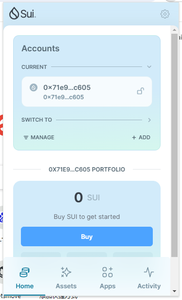
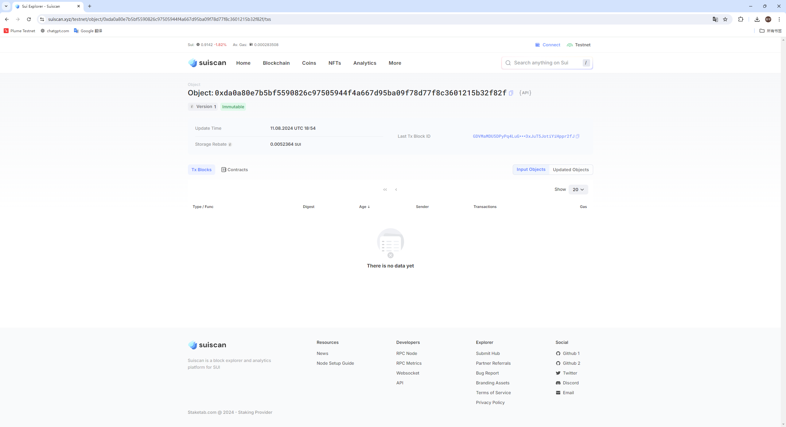
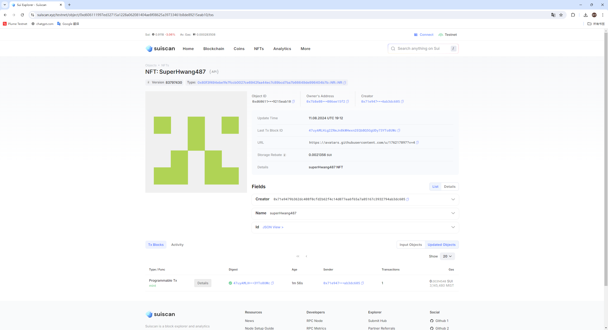
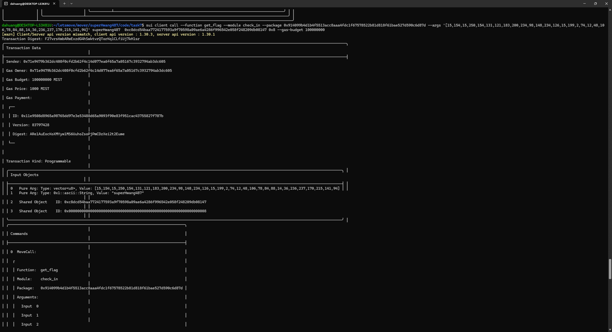

## 基本信息
- Sui钱包地址: `0x71e9479b362dc408f0cfd2b62f4c14d077ea6f65a7a05167c3932794ab3dc605`
> 首次参与需要完成第一个任务注册好钱包地址才被合并，并且后续学习奖励会打入这个地址
- github: `superHwang487`

## 个人简介
- 工作经验: 3年
- 技术栈:  `Python`
> 重要提示 请认真写自己的简介
- 多年服务端开发经验，对Move特别感兴趣，想通过Move入门区块链
- 联系方式: tg: `@spring_no01` 

## 任务

##   01 hello move  
- [x] Sui cli version: 1.30.3
- [x] Sui钱包截图: 
- [x] package id:  0xda0a80e7b5bf5590826c97505944f4a667d95ba09f78d77f8c3601215b32f82f 
- [x] package id 在 scan上的查看截图:

##   02 move coin
- [] My Coin package id : 
- [] Faucet package id : 
- [] 转账 `My Coin` hash:
- [] `Faucet Coin` address1 mint hash:
- [] `Faucet Coin` address2 mint hash:

##   03 move NFT
- [x] nft package id : 0x80f3f494ebe1fe7fccb0027ce6942faa44ec7c89bcd7ba7b66649de996404b7b 
- [x] nft object id : 0xd606111997ed32715a1228a062081404ae8f08625a39733461b8de89215eab10
- [x] 转账 nft  hash: 47uyAMLHig2ZRmJn8kWHwxn2EQbBQ5GgUDy73YTo8UWc
- [x] scan上的NFT截图:

##   04 Move Game
- [] game package id :
- [] deposit Coin hash:
- [] withdraw `Coin` hash:
- [] play game hash:

##   05 Move Swap
- [] swap package id :
- [] call swap CoinA-> CoinB  hash :
- [] call swap CoinB-> CoinA  hash :

##   06 Dapp-kit SDK PTB
- [] save hash :

##   07 Move CTF Check In
- [x] CLI call 截图 : 
- [x] flag hash : F27vrsKmbARwExzdG4hSwktvrQTorKq1CLfiUj7kH1sr

##   08 Move CTF Lets Move
- [x] proof : #xm|-
- [x] flag hash : D7hv6YGJccsRRsjfRhn48yRS3aN473VPR8eFY4wxAL7M