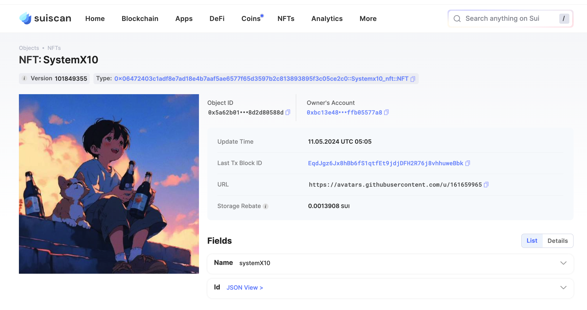

## 基本信息
- Sui钱包地址: `0xbc13e48ab6b931d2a88b2080695303d8e885fabde458a4ca827d1fffb05577a8`
> 首次参与需要完成第一个任务注册好钱包地址才被合并，并且后续学习奖励会打入这个地址
- github: `systemX10`

## 个人简介
- 工作经验: 2年
- 技术栈: `Golang` `Java`
- 2年web2开发经验，想通过Move入门区块链

## 任务

##   01 hello move  
- [x] package id: 0xe3e0e48112533b9e6ad3234f33580980d8e199c77ffa2065eeacfa57fb4e35e9

##   02 move coin
- [x] My Coin package id : 0xc68d680300776f79884c5a83d03c14dedfb305d63d3f931be9522decf2d1279b
- [x] Faucet package id : 0xd4fa152434f3861ac0d9b40432a0f01bcafbe5a214c0ac266a9a6e981816a6e2 
- [x] 转账 `My Coin` hash: EMcH9dPwk3un3zxgwCEg9bhkSX8TNMTHwgAEEAVnwCQS
- [x] `Faucet Coin` address1 mint hash: 9suFbcsoZ4ZobUTxjA7847ChYpSy3cHWvuvi66vTFhbm
- [x] `Faucet Coin` address2 mint hash:  D5BXRbrpeEkdYgUJ8c5VxHsVbGZ1KN9d2AES9gcaeVmz

##   03 move NFT
- [x] nft package id : 0x06472403c1adf8e7ad18e4b7aaf5ae6577f65d3597b2c813893895f3c05ce2c0 
- [x] nft object id : 0x5a62b015d3ff4d741dcd8d8f885ae862de679023a64c3fb3b56bf28d2d80588d  
- [x] 转账 nft hash: 6yxu5WbEu7GL3RXwCzstAbpDP2bnY6SHzvsmLvVy8r4n
- [x] scan上的NFT截图: 

##   04 Move Game
- [] game package id :
- [] call game hash:

##   05 Move Swap
- [x] swap package id : 0x828afefc76dac1ae9b9d9e6a63bb98ac097bbf76807af8927fa618e80ebbca24
- [x] call swap CoinA-> CoinB hash : AUfTHg4rPaCXS5YfFKuAzUFYCg7g7EX8rbRpHTwP1UAZ
- [x] call swap CoinB-> CoinA hash : At7aYVBt6dCTwUCU7SwEtqB7bXnVDesCk76Cbh9id98r

##   06 SDK PTB
- [x] save hash : 5zL8cwKYnCUam99VB3oP3L3HpbZ97XmpnoQSXh4wkmUg

##   07 Move CTF Check In
- [x] CLI call 截图 : 
- [x] flag hash : 2dqaRo3nSAFTcbngJ6QcqZd24KeUS4fCC8yiPQMr1hBU

##   08 Move CTF Lets Move
- [x] proof :  2d857a0dbc729596e00f
- [x] flag hash : AcQ1yY1g7Rg2ShBNmDX9UatPwk17a9QDfbEQGPegMP8G