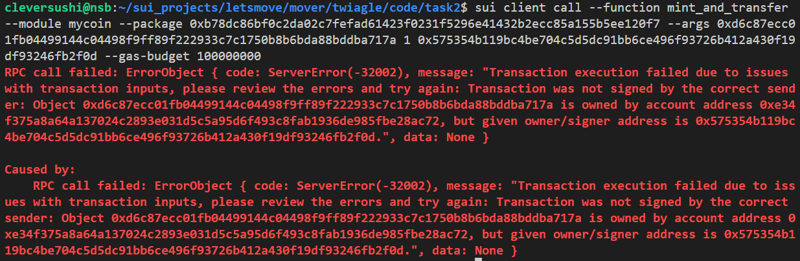

测试网  
package owner:  
0x575354b119bc4be704c5d5dc91bb6ce496f93726b412a430f19df93246fb2f0d  
另一个测试账户：0xe34f375a8a64a137024c2893e031d5c5a95d6f493c8fab1936de985fbe28ac72  
### 央行模式  
使用部署package的账户执行，可以给任何地址mint
sui client switch --address 切换到另一个测试账户执行，无法执行  
sui client call --function mint_and_transfer --module twiaglecoin --package 0x892bf3a4fcb00c8e8e4a03073d29f3f8a413f2c01e7e16f7753a9e8c907f5850 --args 0x2141a90ccac58704e688150611f853585f195f886fc559150d7855cbdc855f5d 1000000 0xe34f375a8a64a137024c2893e031d5c5a95d6f493c8fab1936de985fbe28ac72 

### 水龙头模式
两个账户均可执行
sui client call --function mint_and_transfer --module twiaglefaucet --package  0x1dff8ee913ca2a5e5441b273025bb5fccc304c37cbbd9b128f5620f0e4b5a57b --args 0xe4d837ab3e8e4e96c9c39fa961f8dfb7febf8b260732bf064930ef00d5db0c60 1 0xe34f375a8a64a137024c2893e031d5c5a95d6f493c8fab1936de985fbe28ac72   
sui client call --function mint_and_transfer --module twiaglefaucet --package  0x1dff8ee913ca2a5e5441b273025bb5fccc304c37cbbd9b128f5620f0e4b5a57b --args 0xe4d837ab3e8e4e96c9c39fa961f8dfb7febf8b260732bf064930ef00d5db0c60 1 0x575354b119bc4be704c5d5dc91bb6ce496f93726b412a430f19df93246fb2f0d 
### mainnet
sui client call --function mint_and_transfer --module twiaglecoin --package 0xbea2b5fdc52a58271004d9488ae303db146f82c8b9f0cd45fbdb9e3460d531bc --args 0x4e5fa42b23976ff9dabf09f21d426d37ebb69c4416231e4e572ee5a051326f2c 1000000 0x7b8e0864967427679b4e129f79dc332a885c6087ec9e187b53451a9006ee15f2 
