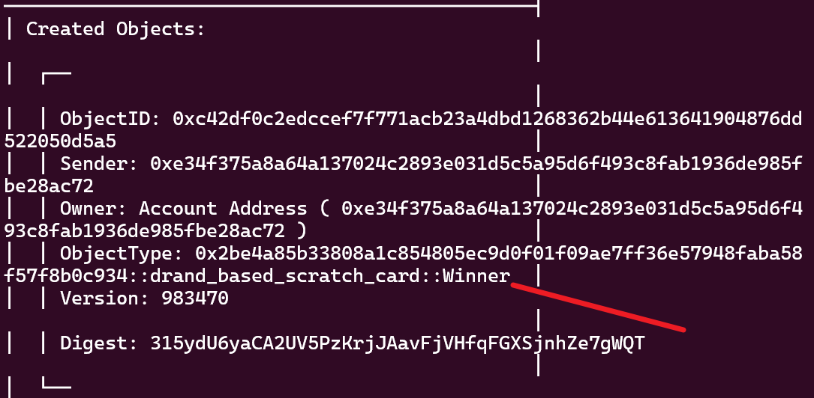
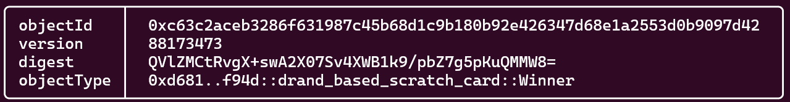

基于drand随机数的 刮刮卡 游戏合约  
测试网记录  
package owner:  0xe34f375a8a64a137024c2893e031d5c5a95d6f493c8fab1936de985fbe28ac72  
alice: 0xe34f375a8a64a137024c2893e031d5c5a95d6f493c8fab1936de985fbe28ac72  

curl -s https://drand.cloudflare.com/52db9ba70e0cc0f6eaf7803dd07447a1f5477735fd3f661792ba94600c84e971/public/latest  
{"round":6778418,"randomness":"1c238e0bfeff97455d2e014ee8343aa4634af2783014da6dafb468b27beab251","signature":"ab27b4981f35d9f29ba747aa56be64dfdd2872771ac014dd2539ff9070fd6acc5018d7c1746aca85d603d59d2d708a94"}  

export BASE_ROUND=6778418  
3秒1个随机数，10分钟后round, 20 * 10 = 200  
export END_ROUND=6778618  

创建奖金  
sui client split-coin --coin-id 0x82922aeec4c86b5b516466fb9519ace5527c0da7eab1e21e24b47442f99447b3 --amounts 100 --gas-budget 10000000  
export PACKAGE_ID=0x02be4a85b33808a1c854805ec9d0f01f09ae7ff36e57948faba58f57f8b0c934  
export REWARD_COIN=0x1db5a996b179194e51ab861722135d1fd607f30197c81fba758e5889403a2c70  
export REWARD_FACTOR=2  
alice 买刮刮乐的钱  
sui client split-coin --coin-id 0x82922aeec4c86b5b516466fb9519ace5527c0da7eab1e21e24b47442f99447b3 --amounts 50 --gas-budget 10000000  
export ALICE_COIN1=0x04793d71d3328859af19867f6e1acaf5512b7c8c8b8780a34aa07b83c6a87d6d  

创建游戏和奖励  
sui client call --function create --package 0x02be4a85b33808a1c854805ec9d0f01f09ae7ff36e57948faba58f57f8b0c934 --module drand_based_scratch_card --args $REWARD_COIN $REWARD_FACTOR $BASE_ROUND --gas-budget 10000000  
export GAME=0xe277edf0f5f642bcd0c208e02af9bd0d84085c682b6648246f4634ed9141d836  
export REWARD=0xcccf6a9099f4e7dbb54bc3b14001c54d0148653758d37f25aa46d384f4210906  

alice买刮刮乐  
sui client call --function buy_ticket --package $PACKAGE_ID --module drand_based_scratch_card --args $ALICE_COIN1 $GAME --gas-budget 10000000  
export TICKET_ALICE1=0xfb67d59f4fd70e88ba73c8ecf6850be9baea3a7798a0ed736e894e19a79757b2  

10min后  
curl -s https://drand.cloudflare.com/52db9ba70e0cc0f6eaf7803dd07447a1f5477735fd3f661792ba94600c84e971/public/$END_ROUND  
{"round":6778618,"randomness":"10f06eb973f487738f413b041adc4e6812059498e5950a57d2ccd9cc12e044f9","signature":"b2e6aa0a6b42619a50cece0b307a94bf69b6570ed43a331c0d2ee8b84003afaee16b763a1b6cee24b4564f589446d54b"}  

注意这里的0x  
export DRAND_SIG=0xb2e6aa0a6b42619a50cece0b307a94bf69b6570ed43a331c0d2ee8b84003afaee16b763a1b6cee24b4564f589446d54b  
sui client call --function evaluate --package $PACKAGE_ID --module drand_based_scratch_card --args $TICKET_ALICE1 $GAME $DRAND_SIG --gas-budget 10000000  
Winner 收到对象即代表中奖  

mainnet 记录
export PACKAGEID=0xd68186e5060dec5aa3ca5bdc1419a427dbf43f17a4d609ded7b1054fa64df94d  
export ALICE=0xe2469bd8dcba6c0218e653771e5aa44f4f54b4399e313f90db8b80fa2cb55dd6  
curl -s https://drand.cloudflare.com/52db9ba70e0cc0f6eaf7803dd07447a1f5477735fd3f661792ba94600c84e971/public/latest  
{"round":6808409,"randomness":"8139557684aba07530536cde75900949613fb45979cc9e5f050cb85bf5e7909b","signature":"8351200b5859e1cb96d2d23b0dcc30c60a097a0a074d3c2989277d4c0e99e6e89b192dea27f181b3c85502bc620388c2"}  
export BASE_ROUND=6808409  
export END_ROUND=6808609  
sui client transfer-sui --to 0xe2469bd8dcba6c0218e653771e5aa44f4f54b4399e313f90db8b80fa2cb55dd6 --sui-coin-object-id  0xa93537d6c37609cb02d80dfc18421201266ffaaf9c9cf4e8bc177ba4b3892f64 --amount 50  --gas-budget 10000000  
sui client transfer-sui --to 0xe2469bd8dcba6c0218e653771e5aa44f4f54b4399e313f90db8b80fa2cb55dd6 --sui-coin-object-id  0xa93537d6c37609cb02d80dfc18421201266ffaaf9c9cf4e8bc177ba4b3892f64 --amount 100  --gas-budget 10000000  
export REWARD_COIN=0xd3c4c9ecba16d89b7d4dc66a505d33745f59061d1d7c4ef03039b131980d816b  
export ALICE_COIN1=0x8b4bd5908e6a9dd7f18a2ca4eb19ecd77066ed5d56d3bf8e642ff1a7021add7e  
export REWARD_FACTOR=2  
创建游戏和奖励  
sui client call --function create --package $PACKAGEID --module drand_based_scratch_card --args $REWARD_COIN $REWARD_FACTOR $BASE_ROUND --gas-budget 10000000  
export GAME=0x33e6e8adaf7d37df8143c226d23c4f305e2cb8e7354c8370ec200c19aadf0948  
export REWARD=0x8d07ff54dc526cd55d64d56b4a12e81e2121052c6c166cd79b7da97c6a59a6d8  
alice买刮刮乐  
sui client call --function buy_ticket --package $PACKAGEID --module drand_based_scratch_card --args $ALICE_COIN1 $GAME --gas-budget 10000000  
export TICKET_ALICE1=0x0e9b41191c033f2ebbe546fa50a9fc33fcb2e19f5db845ffa0d11487e04332fc
10min
curl -s https://drand.cloudflare.com/52db9ba70e0cc0f6eaf7803dd07447a1f5477735fd3f661792ba94600c84e971/public/$END_ROUND
export DRAND_SIG=0xa20a43cf0088c06d0cfe2436d47ebe59584421e64ccbdc8447040259823f4923e13d9505d792ef05fef0d75ee70a8976
确认奖号
sui client call --function evaluate --package $PACKAGEID --module drand_based_scratch_card --args $TICKET_ALICE1 $GAME $DRAND_SIG --gas-budget 10000000  
很幸运又一次中奖了  
  
export WINNER=0xc63c2aceb3286f631987c45b68d1c9b180b92e426347d68e1a2553d0b9097d42  
凭借WINNER对象兑奖吧  
sui client call --function take_reward --package $PACKAGEID --module drand_based_scratch_card --args $WINNER $REWARD --gas-budget 10000000  
