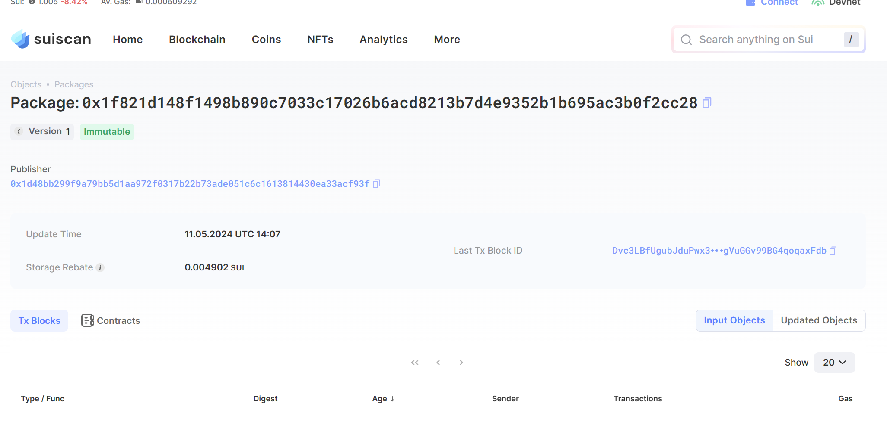
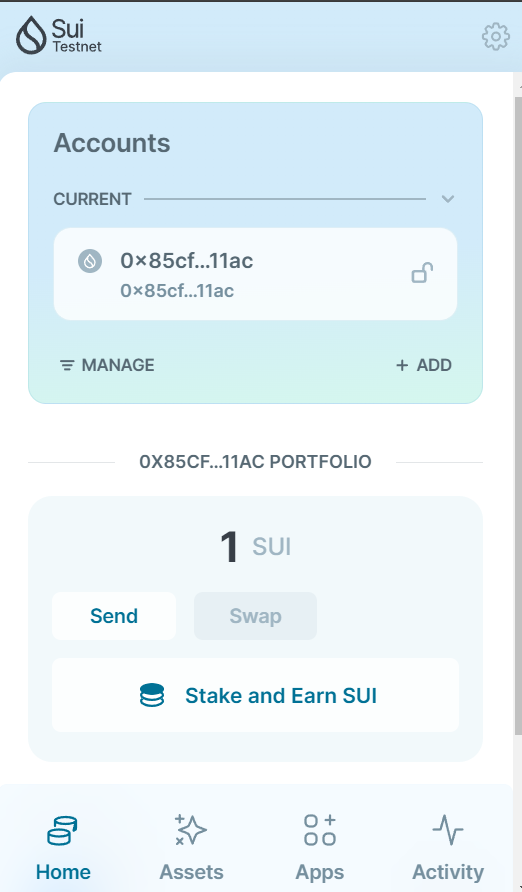

## 基本信息
- Sui钱包地址: `0x85cf7a47e9221be413bd2ea3da966d7f20de542b8b1f791d53155635470711ac`
> 首次参与需要完成第一个任务注册好钱包地址才被合并，并且后续学习奖励会打入这个地址
- github: `tzy168`

## 个人简介
- 工作经验: 0年
- 技术栈: `solidity` `javascript` `go` 
> 重要提示 请认真写自己的简介
- 区块链本科在读，系统学习区块链，对区块链的兴趣十分浓厚
- 联系方式: tg: `@tzy888168` 
           qq: `3265577395`

## 任务

##   01 hello move  
- [x] Sui cli version:sui 1.22.0-0362997
- [x] Sui钱包截图: 
- [x] package id: 0x1f821d148f1498b890c7033c17026b6acd8213b7d4e9352b1b695ac3b0f2cc28
- [x] package id 在 scan上的查看截图:

##   02 move coin
- [x] My Coin package id : 0x9358c030d9a7cf7b4049bc9ad9d5d103e977e38e1dc13c721aa54339b953acf3
- [x] Faucet package id : 0xd2b2c525f12e63a3e05fdf110002a3a40c6eb0c26af6b97006781c9f6f18271e
- [x] 转账 `My Coin` hash:HVqumbHPSkwyJ31ATReJs4AwLZ4BziTJcNZvfMfTkC4v
- [x] `Faucet Coin` address1 mint hash:CdYFaaJkwr5DLCVkA3fnGgyN8wUERt8sXJey8cDAkRbT
- [x] `Faucet Coin` address2 mint hash:9oCxPRAZnCTqkFVQiJrWZFgLHTr9NUzowDxFvLbTwriE

##   03 move NFT
- [x] nft package id :0xb031874611345d9f84616e3c82354978103134f1be7df89c2b21bc427803393a
- [x] nft object id : 0x0096a2c5ac15db7e6396a2a68fa772b8d2e523d1f2f0255303e979b9033c89db
- [x] 转账 nft  hash:CQjZduC16mu1nfoAY2tFsXWUburWeK83XfjVKFoeg5be
- [x] scan上的NFT截图:

##   04 Move Game
- [] game package id :
- [] deposit Coin hash:
- [] withdraw `Coin` hash:
- [] play game hash:

##   05 Move Swap
- [x] coin(A,B) package id : 0xe4a63a8b1d5c287de09a4a77f3cbb649b742e3a400f72c3e3bb7469919bb4e5a
- [x] swap package id : 0xc1408a153f949505cf3540f4ee2c85b20c18a3978abdf6e2508c959c95ef2ed8
- [x] call swap CoinA-> CoinB  hash : 7QX1QScmiXGrbnEvjBTq1rsuU6djf2G1qwZQfEkCkJFo
- [x] call swap CoinB-> CoinA  hash : 3RXwFG5vQmyg7HgQvrkxkvMR8Xdce7Svt4PTT19EsbHr

##   06 SDK PTB
- [] save hash :
