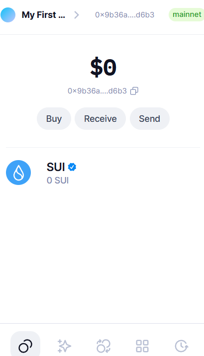
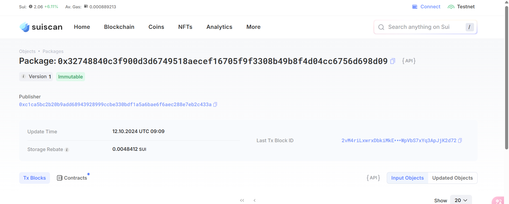

## 基本信息
- Sui钱包地址: `0x9b36a9363244aaa8706efe8d07ad723c3ee7ab8548adfe84fcdc8a479975d6b3`
> 首次参与需要完成第一个任务注册好钱包地址才被合并，并且后续学习奖励会打入这个地址
- github: `06017020forever`

## 个人简介
- 工作经验: 0年
- 技术栈: `Solidity` `Nodejs`   
> 重要提示 请认真写自己的简介
- 区块链技术专业，熟悉 Solidity,Nodejs,Java,go等编程语言，熟悉使用react、express、Beego框架，有前后端相关的交互经验，熟悉使用 Remix，Metamask, Mysql等工具。2.熟悉使用IPFS管理软件，例如:Piñata等，有过区块链金融代币数据统计的相关的工作经验，并且使用过相关软件，例如:CoinGecko、CoinMarketCap、GeckoTerminal等;熟悉使用Etherscan API访问链上的数据。对Move特别感兴趣，想通过Move更好的了解区块链
- 联系方式: tg: `18827941997` 

## 任务

##   01 hello move  
- [] Sui cli version: sui 1.33.0-77b18b45c195
- [] Sui钱包截图: 
- [] package id:     `0x32748840c3f900d3d6749518aecef16705f9f3308b49b8f4d04cc6756d698d09`
- [] package id 在 scan上的查看截图:

##   02 move coin
- [] My Coin package id : 
- [] Faucet package id : 
- [] 转账 `My Coin` hash:
- [] `Faucet Coin` address1 mint hash:
- [] `Faucet Coin` address2 mint hash:

##   03 move NFT
- [] nft package id :
- [] nft object id : 
- [] 转账 nft  hash:
- [] scan上的NFT截图:

##   04 Move Game
- [] game package id :
- [] deposit Coin hash:
- [] withdraw `Coin` hash:
- [] play game hash:

##   05 Move Swap
- [] swap package id :
- [] call swap CoinA-> CoinB  hash :
- [] call swap CoinB-> CoinA  hash :

##   06 Dapp-kit SDK PTB
- [] save hash :

##   07 Move CTF Check In
- [] CLI call 截图 : 
- [] flag hash :

##   08 Move CTF Lets Move
- [] proof : 
- [] flag hash :
