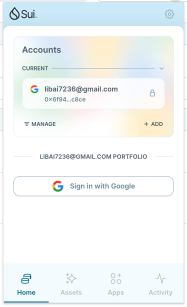
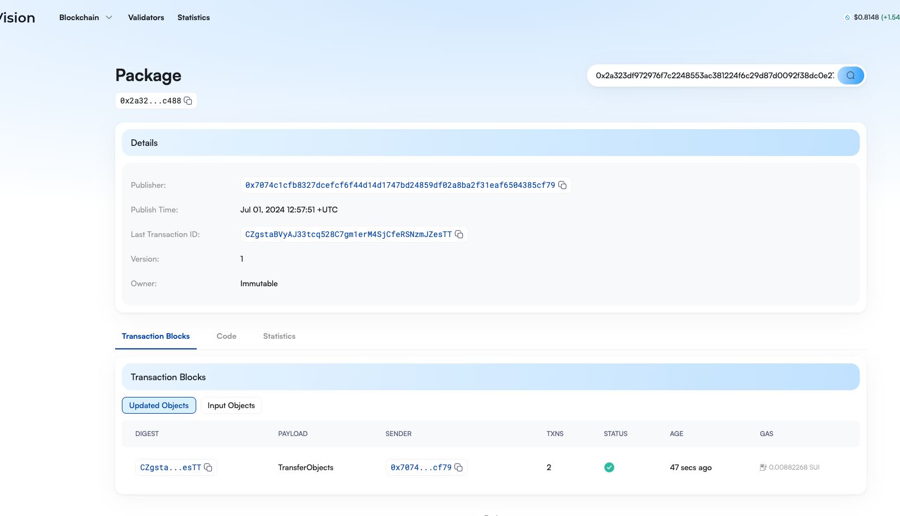

## 基本信息
- Sui钱包地址: `0x417457a075a398d71a89b53591191651768f9495c1ae1c6931d25bc322b5a699`
> 首次参与需要完成第一个任务注册好钱包地址才被合并，并且后续学习奖励会打入这个地址
- github: `0x-wen`

## 个人简介
- 工作经验: 8年
- 技术栈: `Go` `Python`
> 重要提示 请认真写自己的简介
- 通过登链、theweb3等社区学习区块链相关知识，对智能合约感兴趣，希望学习move部署自己的合约应用
- 联系方式: tg: `https://t.me/libai7236` 

## 任务
 
##   01 hello move  
- [x] Sui cli version: sui 1.27.2-homebrew
- [x] Sui钱包截图: 
- [x] package id: 0x2a323df972976f7c2248553ac381224f6c29d87d0092f38dc0e277f6300cc488
- [x] package id 在 scan上的查看截图:

##   02 move coin
- [] My Coin package id : 
- [] Faucet package id : 
- [] 转账 `My Coin` hash:
- [] `Faucet Coin` address1 mint hash:
- [] `Faucet Coin` address2 mint hash:

##   03 move NFT
- [] nft package id :
- [] nft object id : 
- [] 转账 nft  hash:
- [] scan上的NFT截图:

##   04 Move Game
- [] game package id :
- [] deposit Coin hash:
- [] withdraw `Coin` hash:
- [] play game hash:

##   05 Move Swap
- [] swap package id :
- [] call swap CoinA-> CoinB  hash :
- [] call swap CoinB-> CoinA  hash :

##   06 Dapp-kit SDK PTB
- [] save hash :

##   07 Move CTF Check In
- [] CLI call 截图 : 
- [] flag hash :

##   08 Move CTF Lets Move
- [] proof : 
- [] flag hash :
