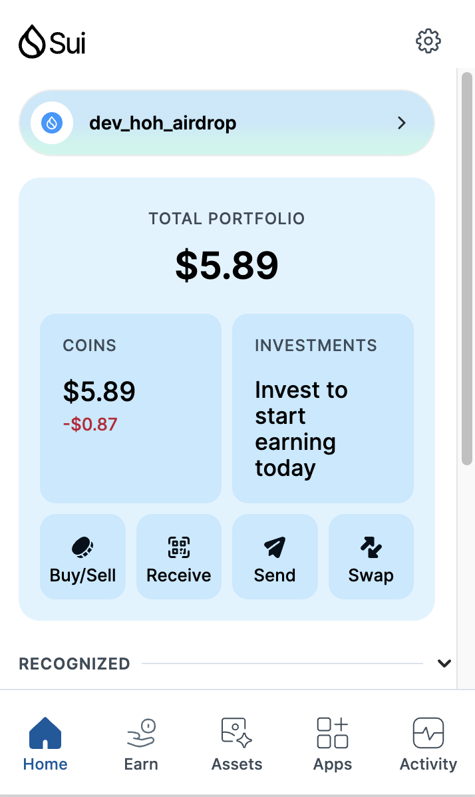
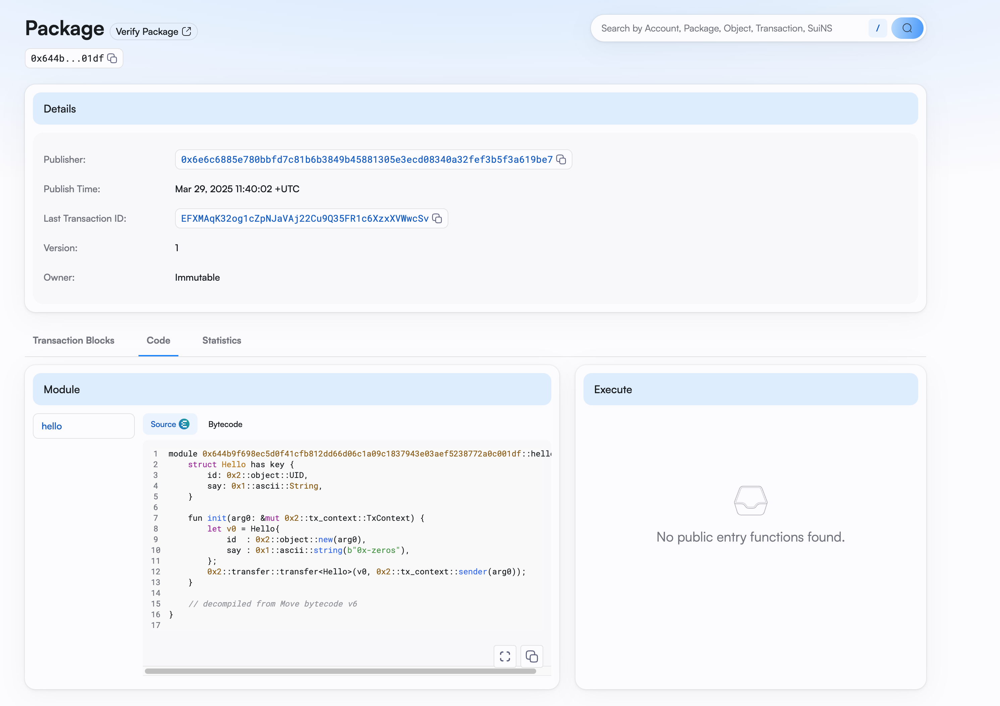
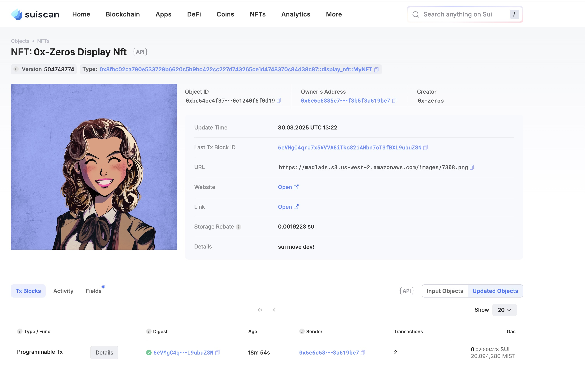
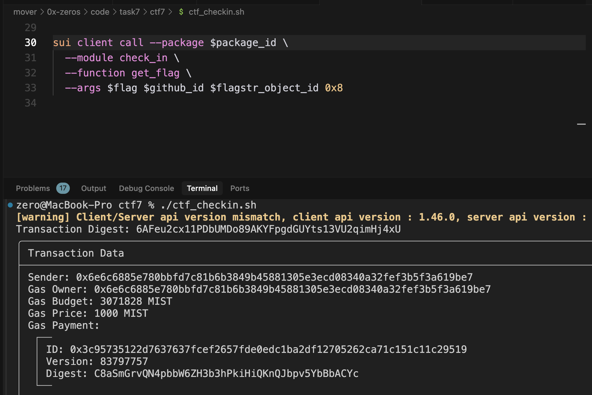

## 基本信息
- Sui钱包地址: `0x0005ffcc2267c12ca18459cfe2334d3cb6b63e9f2e00b4d6f45d78aedeee9f48`
> 首次参与需要完成第一个任务注册好钱包地址才被合并，并且后续学习奖励会打入这个地址
- github: `0x-zeros`

## 个人简介
- 工作经验: 10年
- 技术栈: `Javascript` `Typescript` `Python` `C++` `Unity3d` `CocosCreator` 
> 重要提示 请认真写自己的简介
- 多年游戏开发经验，对sui的开发特别感兴趣，想通过Move sui开发入门区块链
- 联系方式: tg: `zeros_none`

## 任务

##   01 hello move  
- [x] Sui cli version: sui 1.45.2-homebrew
- [x] Sui钱包截图: 
- [x] package id: 0x6e6c6885e780bbfd7c81b6b3849b45881305e3ecd08340a32fef3b5f3a619be7
- [x] package id 在 scan上的查看截图:

##   02 move coin
- [x] My Coin package id : 0x7952b17ed79ad43f3f2e23176ed60a0a3e3ccb78ff8324e231a887a45b048b97
- [x] Faucet package id : 0x7952b17ed79ad43f3f2e23176ed60a0a3e3ccb78ff8324e231a887a45b048b97
- [x] 转账 `My Coin` hash: CsAWbzSAnSuTEhBUtoRV3y7PBasPPjBmoqCdcudDYomE
- [x] `Faucet Coin` address1 mint hash: 4JTksiXhybz22yZWU9wjSLHJeupCup6BJ8TFueLLBB5b
- [x] `Faucet Coin` address2 mint hash: 29cXQbqDrXxkH3WqMwiptV2cnrtuSamABnvwmSaw9Wge

##   03 move NFT
- [x] nft package id : 0x8fbc02ca790e533729b6620c5b9bc422cc227d743265ce1d4748370c84d38c87
- [x] nft object id : 0xbc64ce4f37cf5d500aa0a79ebfcb55c6cfdd14bf695d8987ebf0c1240f6f0d19
- [x] 转账 nft  hash: 5PbkvafoZipbkTUZ3X6HaJNvGzPPaiwJRLbT8Q6Vws9
- [x] scan上的NFT截图:

##   04 Move Game
- [x] game package id : 0xc87e8ea75d7c36535c86ab7a5b275b2c9cc195a3603c85eab5b48a3f453ea158
- [x] deposit Coin hash: 6vQx7bStkVL7raFBAyeGpTArZTNRXmLotZP9brmNyxtr
- [x] withdraw `Coin` hash: FTsL21jVD3nNNEtAGhgYZ7edayvUAJZH85fWUnbxCfSZ
- [x] play game hash: ANo1fxd2AdK3LJikg4CwGPJzrMdmMH246Z3mEqMAwNdi

##   05 Move Swap
- [x] swap package id : 0xe1baec3e1ecb8b21bdfe02d4769bd23cd4f318d1393a7ff787a2dadda8e1e540
- [x] call swap CoinA-> CoinB  hash : 2P4CLMM43q1zyFyyjPyEShzTLXqLSXYToYtFALewN3BE
- [x] call swap CoinB-> CoinA  hash : FwByFW5V1Jw7RHGfoR3McVrXc6i6b2ianYZ2ekbj5Kbb

##   06 Dapp-kit SDK PTB
- [x] save hash : GKWdoYX3ov5cBnBFmQWZENRXAp7MwUrYKyqA8bqSUTPK
- [x] save hash (考虑了borrow fee): 5o2idoMymmpUj2gQHG9exi4TBQ36EXcxqu8EyKSv527D

##   07 Move CTF Check In
- [x] CLI call 截图 : 
- [x] flag hash : 6AFeu2cx11PDbUMDo89AKYFpgdGUYts13VU2qimHj4xU

##   08 Move CTF Lets Move
- [x] proof : 0xd4dd5b0000000000
- [x] flag hash : 8ZmHsF6KTUbFiehjFCv9kf19mVFfxRRYVaPzLq6TCN6k

