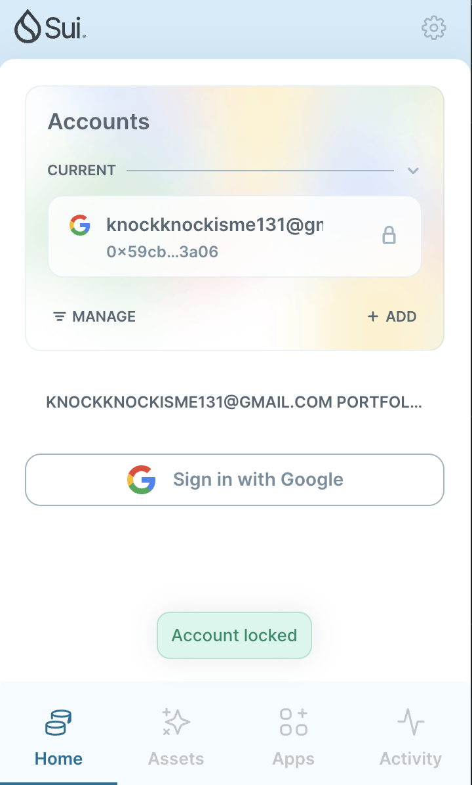
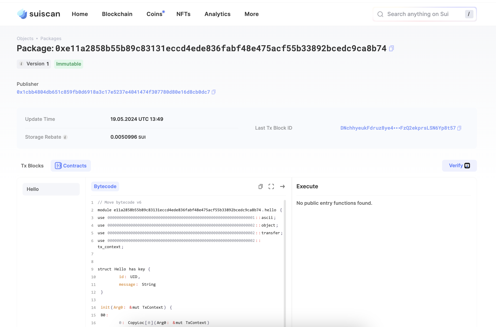
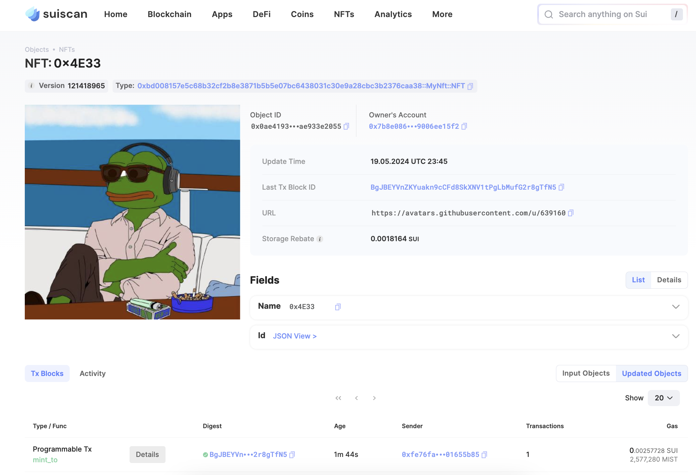

## 基本信息
- Sui钱包地址: `0x59cb565360964093d1c07144648ef2eb0a19df66ac68dd931bef09767a543a06`
> 首次参与需要完成第一个任务注册好钱包地址才被合并，并且后续学习奖励会打入这个地址
- github: `0x4E33`

## 个人简介
- 工作经验: 4年
- 技术栈: `Golang` `Solidity`
> 重要提示 请认真写自己的简介
- 3年Go后端,1年合约开发经验,目前从事的方向是智能合约开发和链上数据分析,很喜欢Web3的技术栈 

  All in Web3

- 联系方式: tg: @knockknockiskac

## 任务

##   01 hello move  
- [] Sui cli version: sui 1.25.0-homebrew
- [] Sui钱包截图: 
- [] package id: 0xe11a2858b55b89c83131eccd4ede836fabf48e475acf55b33892bcedc9ca8b74 
- [] package id 在 scan上的查看截图:

##   02 move coin
- [] My Coin package id : 0xda3238f8f7fe4f095aeb9a54e8b16760bf46fde6857bfaa77842491559b18a96
- [] Faucet package id : 0x77422af070abfe9e4470868ec61424dce2b604c3889ce9675d2619368a4a60e0
- [] 转账 `My Coin` hash: 3NrwYiNpqeGYZqtvvdyN1adD3azyzhJJoZMSPscBjSRc
- [] `Faucet Coin` address1 mint hash: 5exbuAfTw5z2UZcJ7wYVPCHWCsryWM6KLwkXxja7nsmw
- [] `Faucet Coin` address2 mint hash: 7posgqMCfzKvpz9F1vKNNkf9ehbSoi92VTRuYbPUeDBr

##   03 move NFT
- [] nft package id :0xbd008157e5c68b32cf2b8e3871b5b5e07bc6438031c30e9a28cbc3b2376caa38
- [] nft object id : 0x0b81430552d5e79e41353e081a1433c6c594abc79864b6984981cb47d0e38037
- [] 转账 nft  hash: BgJBEYVnZKYuakn9cCFd8SkXNV1tPgLbMufG2r8gTfN5
- [] scan上的NFT截图:

##   04 Move Game
- [] game package id : 
- [] deposit Coin hash:
- [] withdraw `Coin` hash:
- [] play game hash:

##   05 Move Swap
- [] swap package id :
- [] call swap CoinA-> CoinB  hash :
- [] call swap CoinB-> CoinA  hash :

##   06 Dapp-kit SDK PTB
- [] save hash :
