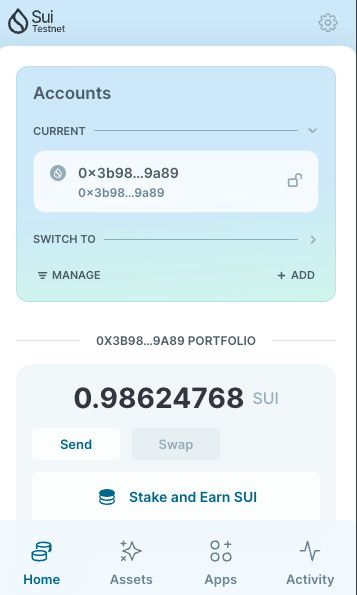

## 基本信息
- Sui钱包地址: `0x63818e608985f763d665d5e057c7da00eb9645d6e6162775f11d5977aa8feed2`
> 首次参与需要完成第一个任务注册好钱包地址才被合并，并且后续学习奖励会打入这个地址
- github: `0xAiboo`

## 个人简介
- 工作经验: 7年
- 技术栈: `solidty` `react` `next`  `NodeJs`
> 重要提示 请认真写自己的简介
- 两年web2前端开发经验，5年web3前端开发经验，智能合约开发经验，对Move,Sui特别感兴趣，想学习Move转到Sui的智能合约开发与前端开发
- 联系方式: tg: `Nathan_0xAiboo` (https://t.me/Nathan_0xAiboo)

## 任务

##   01 hello move  
- [] Sui cli version: sui 1.27.2
- [] Sui钱包截图: 
- [] package id: 0x35f566e5526b13176e772b67e481e5465f55d79b76337569ad5d373323dcf44e
- [] package id 在 scan上的查看截图:

##   02 move coin
- [] My Coin package id : 0xaa53e6aaa3cdbba1f3d6feeb003157748c0cc8f1f5cf93908bb4dd74697874d4
- [] Faucet package id : 0xaa53e6aaa3cdbba1f3d6feeb003157748c0cc8f1f5cf93908bb4dd74697874d4
- [] 转账 `My Coin` hash: 4R6LowjRiUam7VRdB2LousQpzutZ7pFox6UrRPvj6hFY
- [] `Faucet Coin` address1 mint hash: AEkA8u7TnQpbJvV7Jbb8PiKDYBmvqQ3TWYjEbhtHTxmF
- [] `Faucet Coin` address2 mint hash: GFzNJ4aVNQ3MYeE9MiNyPJ4i9fyTeiyJ4SShh8toErpY

##   03 move NFT
- [] nft package id :
- [] nft object id : 
- [] 转账 nft  hash:
- [] scan上的NFT截图:

##   04 Move Game
- [] game package id :
- [] deposit Coin hash:
- [] withdraw `Coin` hash:
- [] play game hash:

##   05 Move Swap
- [] swap package id :
- [] call swap CoinA-> CoinB  hash :
- [] call swap CoinB-> CoinA  hash :

##   06 Dapp-kit SDK PTB
- [] save hash :

##   07 Move CTF Check In
- [] CLI call 截图 : 
- [] flag hash :

##   08 Move CTF Lets Move
- [] proof : 
- [] flag hash :
