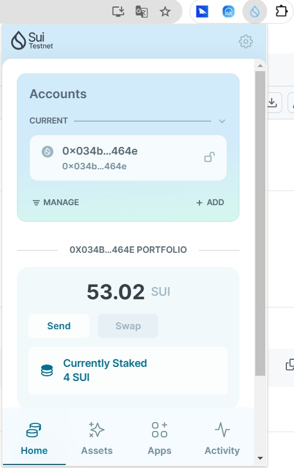
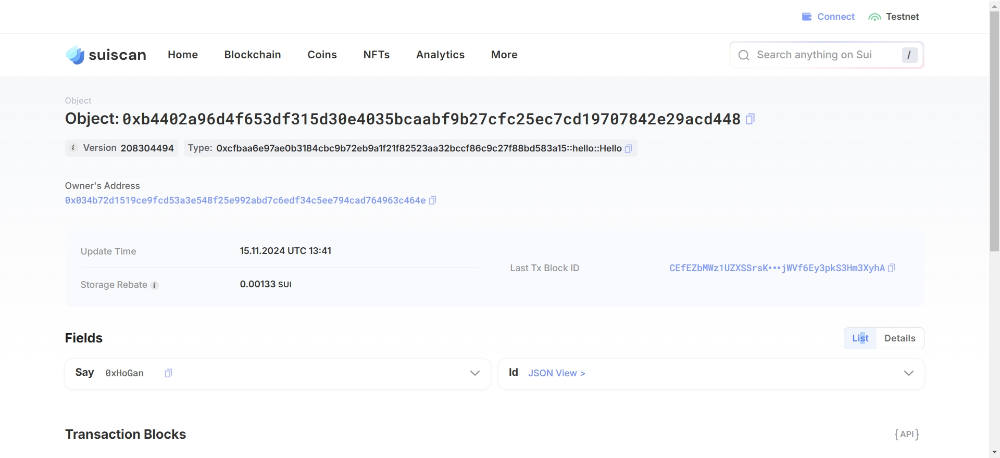
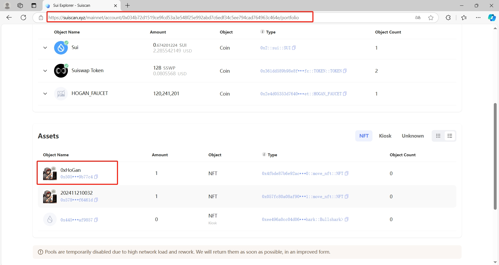

## 基本信息
- Sui钱包地址: `0x034b72d1519ce9fcd53a3e548f25e992abd7c6edf34c5ee794cad764963c464e`
> 首次参与需要完成第一个任务注册好钱包地址才被合并，并且后续学习奖励会打入这个地址
- github: `0xHoGan`

## 个人简介
- 工作经验: 8年
- 技术栈: `Java` `Python`
> 重要提示 请认真写自己的简介
- 多年后端开发经验，熟悉Java、Python
- 联系方式: tg: `hogan0x`

## 任务

##   01 hello move  
- [√] Sui cli version: sui 1.37.3-b8eb8920aeca
- [√] Sui钱包截图: 
- [√] package id: 0xcfbaa6e97ae0b3184cbc9b72eb9a1f21f82523aa32bccf86c9c27f88bd583a15
- [√] package id 在 scan上的查看截图:

##   02 move coin
- [√] My Coin package id : 0x2e4d05353d7640db60c3ea4d556a0fcf7b3147c92658a80a7aff8e874f399ece
- [√] Faucet package id : 0x2e4d05353d7640db60c3ea4d556a0fcf7b3147c92658a80a7aff8e874f399ece
- [√] 转账 `My Coin` hash: 2bdu9CLb9Cm4VweJDZ4M7MfaoDpg3ZbGQ28j1JfPMEKQ
- [√] `Faucet Coin` address1 mint hash: DLzeMrV3fmq1xh5r9NuUULyqUkHSU8NjLYRf3ELpxKd2
- [√] `Faucet Coin` address2 mint hash: DLzeMrV3fmq1xh5r9NuUULyqUkHSU8NjLYRf3ELpxKd2

##   03 move NFT
- [√] nft package id: 0x4fbde87b6e92ac5268bbad71c5cb1bcaf575673f47e1fdab4462fd40a2565ef0
- [√] nft object id: 0x505629976a95e1833f0b792f47e7972405236d87b66aeb42fffb2430b09b77c4
- [√] 转账 nft  hash: H2EkoPWYs9ADQNWrdVo2mfSma3p1Zf9Nv46ARukF36tm
- [√] scan上的NFT截图: 
##   04 Move Game
- [] game package id : 
- [] deposit Coin hash:
- [] withdraw `Coin` hash:
- [] play game hash:

##   05 Move Swap
- [] swap package id :
- [] call swap CoinA-> CoinB  hash :
- [] call swap CoinB-> CoinA  hash :

##   06 Dapp-kit SDK PTB
- [] save hash :

##   07 Move CTF Check In
- [] CLI call 截图 : 
- [] flag hash :

##   08 Move CTF Lets Move
- [] proof : 
- [] flag hash :
