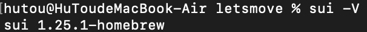
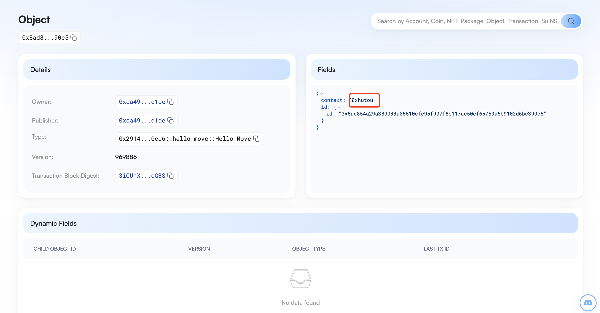

## 基本信息
- Sui钱包地址: `0xe71e4e7036ed652728d9cbfe91e9ea5bf915318dd7fa8604fcdc8dc7785082d5`
> 首次参与需要完成第一个任务注册好钱包地址才被合并，并且后续学习奖励会打入这个地址
- github: `0xhutou`

## 个人简介
- 工作经验: 无
- 技术栈: 无
- 学生，学过一点入门的solidity，然后发现move才是未来！学好move，光宗耀祖！
- 联系方式: tg: `hutou2021` 

## 任务

##   01 hello move  
- [] package id: 0x2914220ffe2c350e481729a7591a34c351910834187be73c2178d71c804d0cd6
- [] Sui Cli Version: 
- [] 插件安装截图: 
- [] object内容为github id: 

##   02 move coin
- [] My Coin package id : 0x2edfbab877bf2f3bcb332dd72b462fdeea08ba1843507eabe3893ad6295b750e
- [] TreasureCap id : 0x9f0f2155507f40c177382742af9d38fcd367823741d087f712276fb519361507
- [] 转账 `My Coin` hash : DBeQS4YTP5Qm1Q4Rq2Da1Btcwq5eNh8dmqByg4R1ZN3d

- [] Faucet package id : 0xb2167a378a72d98ceeebb73ace9b0f28c41067ba5f0f2e9112826943fa9f894b
- [] TreasureCap id : 0x99ebcc8ff545ddbb58fad0a1895a3025c2bd50706d7b57b9fab6e2505df82757
- [] Faucet mint hash1 : AHfSHa1Vb2urAa9ZkPWpDxUJCuCcqKYQZAY7AzKhRJoU
- [] Faucet mint hash2 : 8BzWKQ8E7GFWoRmsX5zbdcDZw3V6priGsfDDtbZUWZ51

##   03 move NFT
- [] nft package id : 0x700945ac0913a6f8659d0e440857fb74fa0959d9c7003501d8b311f7536978a8
- [] nft object id : 0x018a7dd60b06e58a63e96728f529ac3a9cb376c887be6a34ebb74e9c6f67796e
- [] 图片是Pinata上传到ipfs服务器的，但是不知道为什么在钱包里不显示
- [] 转账 nft  hash: Hq3mwRp11graqzqXY5Ccx3QSqYSrtmgzDP9pV7L5gJqX

##   04 Move Game
- [] 任务说明：猜真假的游戏，调用的时候输入task2里发布的FAUCET代币（目前是定死的，需要输入一个10个FAUCET的object），并且猜测true或者false，然后利用随机数的object生成一个随机的布尔值，跟输入的猜测对比，如果赢了就翻倍返还，如果输了就把钱留在资金池。目前试了3次，两次赢一次输，游戏逻辑应该是没问题的，就是目前还比较粗糙，只能输入固定的10个FAUCET ：）。
- [] game package id : 0x70399eaafab25d70c790a021137aef094952753f4532ad5c4fa079ee2f3ff7a1
- [] call game hash1: 8srjVTPadeZ4i5FEWU75eNhwcFmEJxMhaDACqpFgSY8 赢了
- [] call game hash2: 5wJvuPRMoNvuUDM9xQviL1QBdyFR2yF4xVAFv8w4HhVq 赢了
- [] call game hash3: AHv4A8mukA12SNbjbzW4C48vDr1nPUFoF37otY5isfx 输了

##   05 Move Swap
- [] 任务说明：faucet本身是公开mint的，mycoin是只有发布者才能mint，但是swap合约一开始忘记写mycoin的水龙头了，另开一张合约写了一个mycoin的水龙头，水龙头pkg id: 0xad7798231f334daf897746c83bbe286877ef7e5bb5dfb811cf19bf9c438cfd4a, 函数为mycoinfaucet,参数为水龙头的pool id: 0x1301149590c2e28a2d799c21937a6a9b55e03ecd3d6f26c6a6e05fc075b3e49c，水龙头里已经预充了1亿个MYCOIN，单次执行水龙头获得10个MYCOIN。
- [] swap package id : 0x0c33bf65f7599cacd775ac183184d713db9042d6a23b26ab3023e3031dc877f2
- [] call swap hash1 (10FAUCET -> 10MYCOIN) : FTJj6cua64cDBBEePhr6aQSaBmBTEZnye7RU2HH8TSiZ
- [] call swap hash2 (10MYCOIN -> 10FAUCET) : CJzCwpZhUQEsGd97Pmh5pcTjJVtjcaKjJdSE4d1K9827
