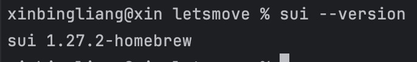
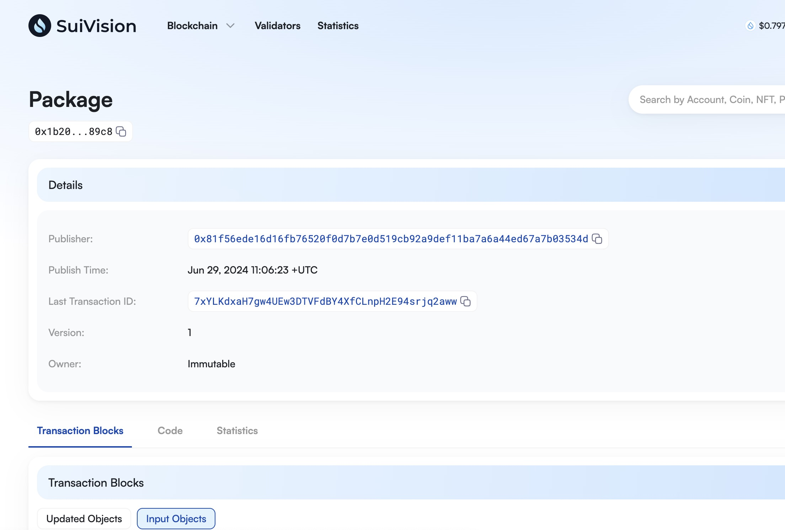

## 基本信息
- Sui钱包地址: `0xf9143f4063a803216b6f7dd741c65c7a4ba0ef5da4cae095375a5a6ee6c59107`
> 首次参与需要完成第一个任务注册好钱包地址才被合并，并且后续学习奖励会打入这个地址
- github: `0xweb-3`

## 个人简介
- 工作经验: 7年
- 技术栈: `golang` `python` `solidity`
> 重要提示 请认真写自己的简介
- 多年web2开发经验，有部分钱包开发经验，熟悉solidity编程
- 联系方式: tg: `17612724518` 

## 任务

##   01 hello move  
- [x] Sui cli version: sui 1.27.2-homebrew
- [x] Sui钱包截图: 
- [x] package id: 0x1b20d28de02575904854a7d38e162c628bc6513b51729860007e23dc807489c8
- [x] package id 在 scan上的查看截图:

##   02 move coin
- [] My Coin package id : 
- [] Faucet package id : 
- [] 转账 `My Coin` hash:
- [] `Faucet Coin` address1 mint hash:
- [] `Faucet Coin` address2 mint hash:

##   03 move NFT
- [] nft package id :
- [] nft object id : 
- [] 转账 nft  hash:
- [] scan上的NFT截图:

##   04 Move Game
- [] game package id :
- [] deposit Coin hash:
- [] withdraw `Coin` hash:
- [] play game hash:

##   05 Move Swap
- [] swap package id :
- [] call swap CoinA-> CoinB  hash :
- [] call swap CoinB-> CoinA  hash :

##   06 Dapp-kit SDK PTB
- [] save hash :

##   07 Move CTF Check In
- [] CLI call 截图 : 
- [] flag hash :

##   08 Move CTF Lets Move
- [] proof : 
- [] flag hash :
