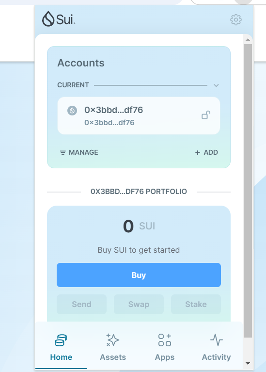
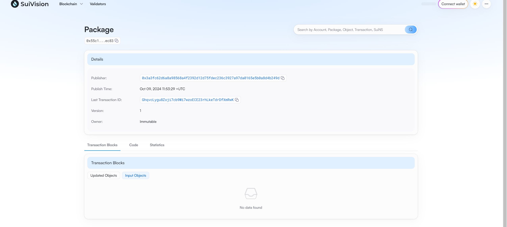

## 基本信息
- Sui钱包地址: `0xced22143b8753ea4a141584e95008db7e0507f27a30d3c298eeecb5b901ace5f`
> 首次参与需要完成第一个任务注册好钱包地址才被合并，并且后续学习奖励会打入这个地址
- github: `135230620`

## 个人简介
- 工作经验: 无
- 技术栈: `go` `solidity` 
> 重要提示 请认真写自己的简介
- 本科专业为区块链专业，学习了大量关于区块链的知识，参与黑客松，对move和sui感兴趣，想深入研究,对区块链十分感兴趣。
- 联系方式: tg: `15779335409` 

## 任务

##   01 hello move  
- [] Sui cli version:sui 1.35.0-40d9ec7ecd5d
- [] Sui钱包截图: 
- [] package id: 0x55c172ca4474f114538ecfe25c4e456f6d61cb05486f7a63a8553c7780d1ec83
- [] package id 在 scan上的查看截图:

##   02 move coin
- [] My Coin package id : 
- [] Faucet package id : 
- [] 转账 `My Coin` hash:
- [] `Faucet Coin` address1 mint hash:
- [] `Faucet Coin` address2 mint hash:

##   03 move NFT
- [] nft package id :
- [] nft object id : 
- [] 转账 nft  hash:
- [] scan上的NFT截图:

##   04 Move Game
- [] game package id :
- [] deposit Coin hash:
- [] withdraw `Coin` hash:
- [] play game hash:

##   05 Move Swap
- [] swap package id :
- [] call swap CoinA-> CoinB  hash :
- [] call swap CoinB-> CoinA  hash :

##   06 Dapp-kit SDK PTB
- [] save hash :

##   07 Move CTF Check In
- [] CLI call 截图 : 
- [] flag hash :

##   08 Move CTF Lets Move
- [] proof : 
- [] flag hash :
