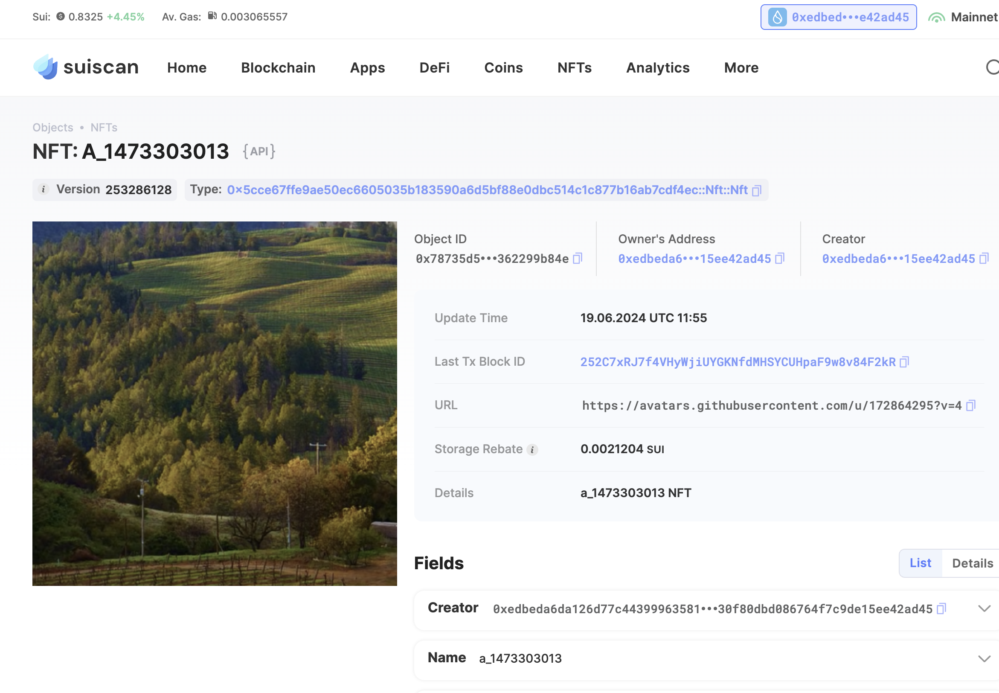

## 基本信息
- Sui钱包地址: `0xedbeda6da126d77c44399963581ee7279730f80dbd086764f7c9de15ee42ad45`
> 首次参与需要完成第一个任务注册好钱包地址才被合并，并且后续学习奖励会打入这个地址
- github: `1473303013`

## 个人简介
- 工作经验: 2年
- 技术栈: 前端
> 重要提示 请认真写自己的简介
- 前端开发,目前在学习 web3 开发
- 联系方式: `1473303013@qq.com`

## 任务

##   01 hello move  
- [x] Sui cli version: 1.27.0
- [x] Sui钱包截图: 
- [x] package id: 0x1f20646979445d9826058fe458a7cc13e0dd2831f9af7c4f947564588f7cf4a6
- [x] package id 在 scan上的查看截图:

##   02 move coin
- [x] My Coin package id : 0xb0687b83e5d37b7f3e27474ecca0a89b8871699fcd1869a845c172a56e52803d
- [x] Faucet package id : 0x4b28c5dac3adf3d065e7a05155cc2babfbcb42c2b7cfdf13a4fc7034cf9787cd
- [x] 转账 `My Coin` hash: 4Jdju4Rbhjy34QgEtY4bQFX5c7USALvtT9uB3GLLwMaY
- [x] `Faucet Coin` address1 mint hash: 4RCn9Jj7b1tUt4HAuvZYSNdLBztYyjZxbEvYAgkEe675
- [x] `Faucet Coin` address2 mint hash: B22GzB3aTGX4CXLFEh7V1qjZuCkBiVzKz1UZZ9qYfEZ5

##   03 move NFT
- [x] nft package id : 0x5cce67ffe9ae50ec6605035b183590a6d5bf88e0dbc514c1c877b16ab7cdf4ec
- [x] nft object id : 0x55647360d29342b8b0267ab780cc87ce34cec3f0158acac909a12e9e400bd027
- [x] 转账 nft  hash: 6JCAFBEBd8871PjU3mEasDL6mHZqRqjnMdoDMWqbDiD7
- [x] scan上的NFT截图: 

##   04 Move Game
- [] game package id :
- [] deposit Coin hash:
- [] withdraw `Coin` hash:
- [] play game hash:

##   05 Move Swap
- [] swap package id :
- [] call swap CoinA-> CoinB  hash :
- [] call swap CoinB-> CoinA  hash :

##   06 Dapp-kit SDK PTB
- [] save hash :

##   07 Move CTF Check In
- [x] CLI call 截图 : 
- [x] flag hash : 4ZVe82vmU6axwvNJ4DbL7maXy3bNogS1Aewme7c4EKPU 

##   08 Move CTF Lets Move
- [x] proof : 19855736
- [x] flag hash : CEdyrKMr4PEQifmrBj2q5y8XDSHe7bEn6LUyH2W3aBWZ
