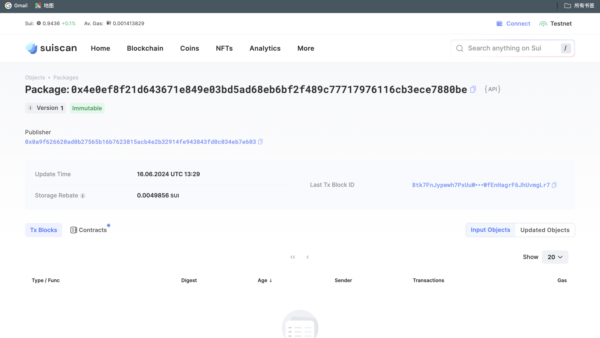
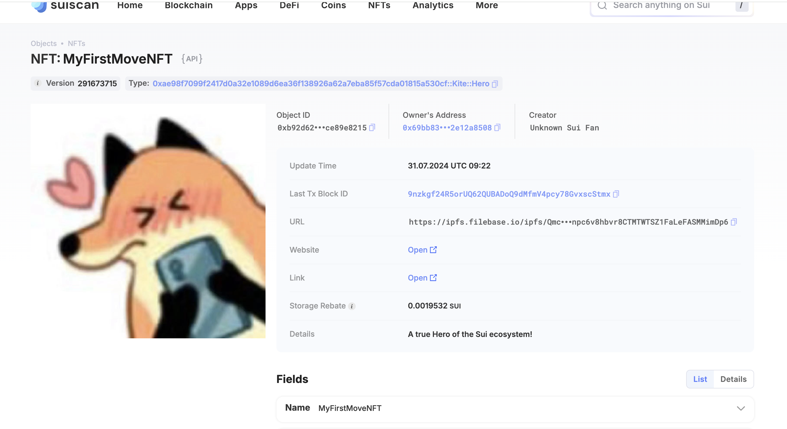

## 基本信息

- Sui 钱包地址: `0xc4956ee079c47f7ff3a43477e61d65861820dc01082a62ecd9297f29b8ee8e94`
  > 首次参与需要完成第一个任务注册好钱包地址才被合并，并且后续学习奖励会打入这个地址
- github: `1pzq`

## 个人简介

- 工作经验: 0 年
- 技术栈: `solidity` `react` `java`
  >
- 目前为在校学生，希望通过学习 move 来进行更多智能合约的开发
- 联系方式: WeChat：shepiroder

## 任务

## 01 hello move

- [x] Sui cli version: sui 1.27.0-homebrew
- [x] Sui 钱包截图: 
- [x] package id: 0x4e0ef8f21d643671e849e03bd5ad68eb6bf2f489c77717976116cb3ece7880be
- [x] package id 在 scan 上的查看截图:

## 02 move coin

- [x] My Coin package id : 0xe9f70ff13eefa964cdd63460da595d87048f974d62cb9aa92adcebc57998043b
- [x] Faucet package id : 0x7840c8e3c523f0a2f4e8795ff7ab8269eeda12be297b54f9ed9ce80aa178bccb
- [x] 转账 `My Coin` hash:6CrDweobAXtiFqnQPc8HJdT9j6Gz28FMFzwwdQkvD6fx
- [x] `Faucet Coin` address1 mint hash:9dBmnUmXD5Ry5daYaV7LvKD7TT7wjdZNYhdiaFqPn2Nq
- [x] `Faucet Coin` address2 mint hash:DDnCwMynRpA6Ns8zgd93AQXrfnGAGk3PB23LjQFBMBTL

## 03 move NFT

- [x] nft package id :0xae98f7099f2417d0a32e1089d6ea36f138926a62a7eba85f57cda01815a530cf
- [x] nft object id : 0xb92d62ee0a1c32b128404dba3c79216d7de2e310f3210e4ab767845ce89e8215
- [x] 转账 nft hash:94FEeT5PqGQcXL7dH9LRQzp4KszhRzwB9EhzZQFYPaC9
- [x] scan 上的 NFT 截图:

## 04 Move Game

- [x] game package id : 0xa08f96ff2fbe01c8e1cc131c7e4c27dea2368292bfcf0bb810cac819e0837bcf
- [x] withdraw `Coin` hash: 0xe297673dd04d76b0c6b29cc42ee204f88bbdfd9ad3f93ab70412651bd49be3ec
- [x] play game hash: BzD2YkNWzfmAaLAdD1n7KGGVK6WsJC1esBhSLLLeCSy9

## 05 Move Swap

- [x] swap package id : 0xd4ce61db015c09854c782cb898eb2af8ee6ec2f54d3f8c154e40b469530c5315
- [x] call swap CoinA-> CoinB hash : 5wDdRDXxEQ6dZ4CfMqU9nUBp3jR4hyBXVgXAcWRSo6kq
- [x] call swap CoinB-> CoinA hash : 4QJpnusjSBX1RkrLqmsLAfQmGMx67q4NoVs7o7fQXwjq

## 06 Dapp-kit SDK PTB

- [] save hash :

## 07 Move CTF Check In

- [] CLI call 截图 : 
- [] flag hash :

## 08 Move CTF Lets Move

- [] proof :
- [] flag hash :
