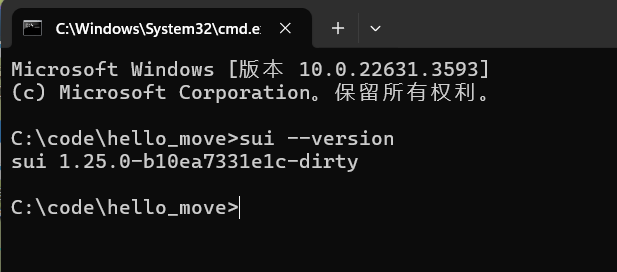
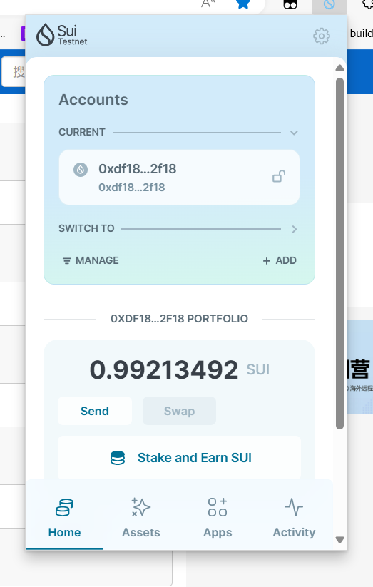
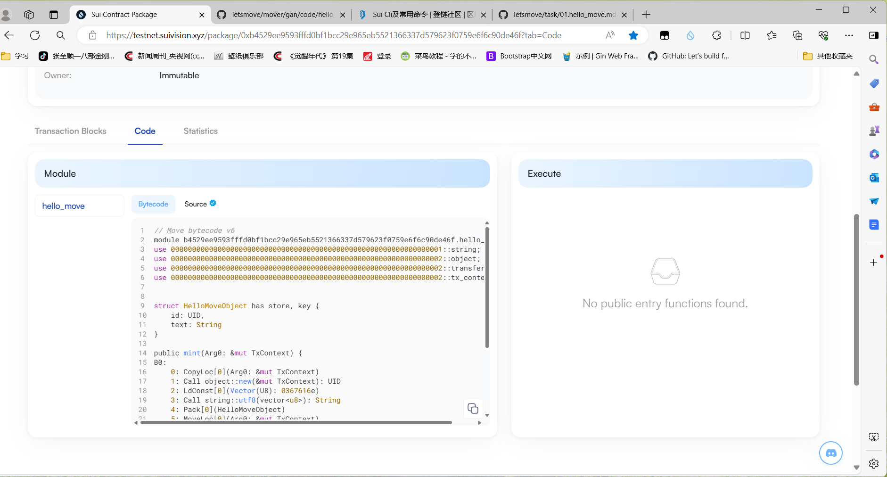

## 基本信息

- Sui 钱包地址: `0xdf186a40ac92ad614fc7ec020ef45a89e86a4f3dfdb686b99b321bd22c0b2f18`
  > 首次参与需要完成第一个任务注册好钱包地址才被合并，并且后续学习奖励会打入这个地址
- github: `16938075`

## 个人简介
- 工作经验: 0年
- 技术栈: `java`
> 重要提示 请认真写自己的简介
- 在校学生，对Move特别感兴趣，想通过Move入门区块链
- 联系方式:  邮箱: `2304044574@qq.com`

## 任务

##   01 hello move  
- [x] Sui cli version:sui 1.25.0-b10ea7331e1c-dirty
- [x] 版本号截图: 
- [x] Sui钱包截图: 
- [x] package id: 0x5ae7480eb790b8b1940da6f7b00f20ce3a28c0cf70c05c7017fda3c70a8d96bb
- [x] package id 在 scan上的查看截图: