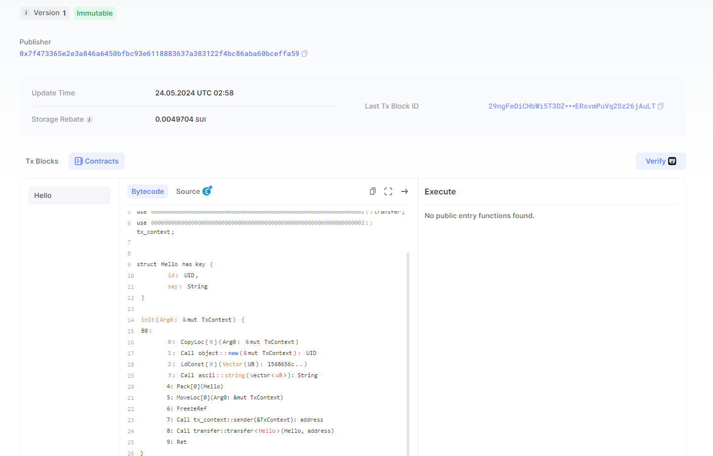

## 基本信息
- Sui钱包地址: `0x7f473365e2e3a846a6450bfbc93e6118883637a383122f4bc86aba60bceffa59`
> 首次参与需要完成第一个任务注册好钱包地址才被合并，并且后续学习奖励会打入这个地址
- github: `321llljjjfff123`
https://github.com/321llljjjfff123
## 个人简介
- 工作经验: x年
- 技术栈: `Rust` `go` `java` ` javascript`
> 重要提示 请认真写自己的简介
- 多年web2开发经验，对Move特别感兴趣，想通过Move入门区块链
- 联系方式: tg: `xxx` 

## 任务

##   01 hello move  
- [] Sui cli version:
- [] Sui钱包截图: 
- [] package id: 0xdd662fe48393eb2c0f702bacf4b883602ebcfba6a091f1ece19067cdb5fcdaad
- [] package id 在 scan上的查看截图:

##   02 move coin
- [] My Coin package id : 
- [] Faucet package id : 
- [] 转账 `My Coin` hash:
- [] `Faucet Coin` address1 mint hash:
- [] `Faucet Coin` address2 mint hash:

##   03 move NFT
- [] nft package id :
- [] nft object id : 
- [] 转账 nft  hash:
- [] scan上的NFT截图:

##   04 Move Game
- [] game package id :
- [] deposit Coin hash:
- [] withdraw `Coin` hash:
- [] play game hash:

##   05 Move Swap
- [] swap package id :
- [] call swap CoinA-> CoinB  hash :
- [] call swap CoinB-> CoinA  hash :

##   06 Dapp-kit SDK PTB
- [] save hash :
