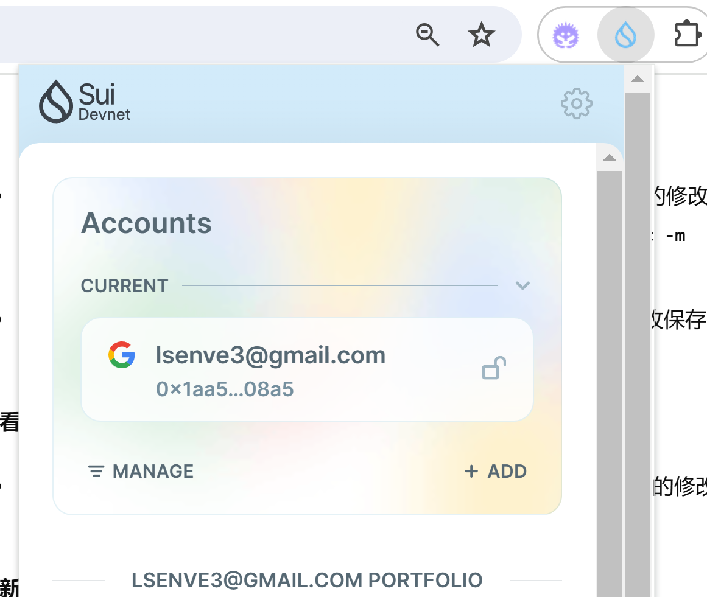

- 基本信息

  - Sui钱包地址: `0x1aa50d1de8de613816f4e3061bfc71dc8a3a5a5bf475041e29adf16fee2808a5`

  - github: `404ll`

  ## 个人简介
  - 工作经验: 0
  - 技术栈: C， solidity

  

  - 区块链专业大一在读，All in Web3，非常热爱加密，正在不断学习中，热爱建设，如果有需要帮忙的地方随叫随到！
  - 联系方式: tg: '77'

  ## 任务

  ##   01 hello move  
  - [sui 1.28.3] Sui cli version:
  - [] Sui钱包截图: 
  - [0x1a852fe63cdf97456f142a042e499e2766fef8f7579c2bb8c10fc7cb2a17904d] package id: 
  - [] package id 在 scan上的查看截图:

  ##   02 move coin
  - [0x6765b41dc00617512667e5d8623ecb0ea826874614c23c90bdd1ac461ac47b67] My Coin package id : 
  - [0x796fe22eb9df4f8d926e111c888d8ef4447d4348c3131f2cb4a82f1ec09c5e63] Faucet package id : 
  - [0xed3f44cfe2b4c9e7e0de2deaefd47457fdf206a763a235bb99d391bba31313b4] 转账 `My Coin` hash:
  - [0x42bd0305cafd782e8cd5f3b8f92e108c1bd66b0ea8838d040ccc6bb945b35c8b] `Faucet Coin` address1 mint hash:
  - [0x9b8b1f4ece3c93c75f3abc1cd14b50d0aa7135fc4ba8a6ffe5f2929dca1f78ce] `Faucet Coin` address2 mint hash:
  
  ##   03 move NFT
  - [0x9582447aab8669b8f97791efc7319114761d657251c75667f987a98b10be7dd6] nft package id :
  - [0xb5794e99d1e39a098d7a004cd64b1cd45762a3e5a999a8927f1fd00432e4b62f] nft object id : 
  - [DCc5whebJi8fWKyBvu4A1WSsshmbraqpfzv5E9bBLZsR] 转账 nft  hash:
  - [] scan上的NFT截图:
  
  ##   04 Move Game
  - [] game package id :
  - [] deposit Coin hash:
  - [] withdraw `Coin` hash:
  - [] play game hash:
  
  ##   05 Move Swap
  - [] swap package id :
  - [] call swap CoinA-> CoinB  hash :
  - [] call swap CoinB-> CoinA  hash :
  
  ##   06 Dapp-kit SDK PTB
  - [] save hash :
  
  ##   07 Move CTF Check In
  - [] CLI call 截图 : 
  - [] flag hash :
  
  ##   08 Move CTF Lets Move
  - [] proof : 
  - [] flag hash :
