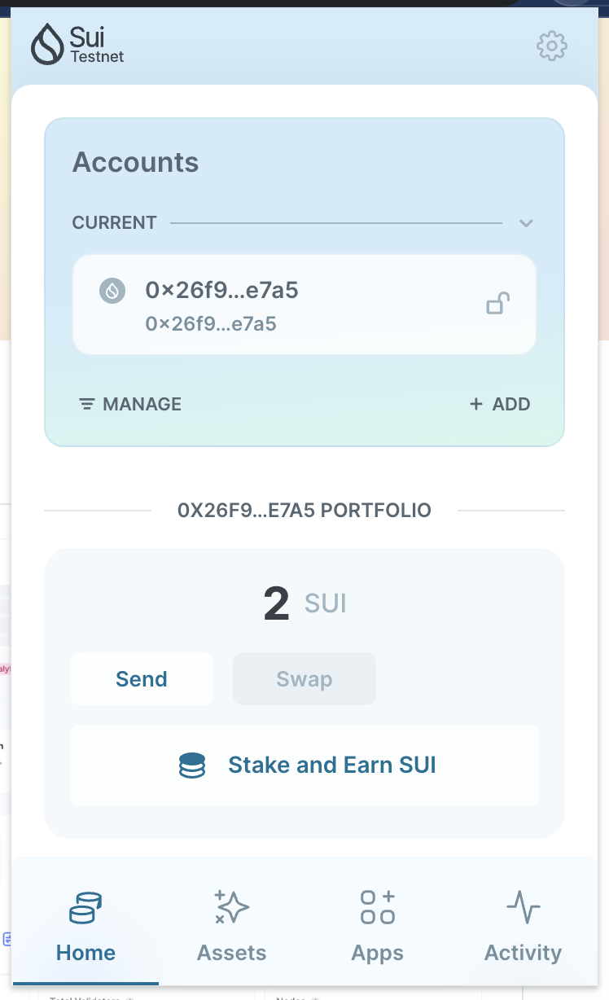
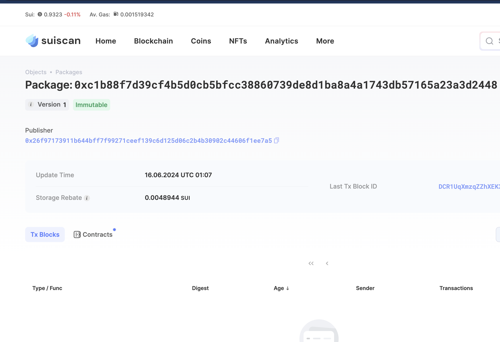
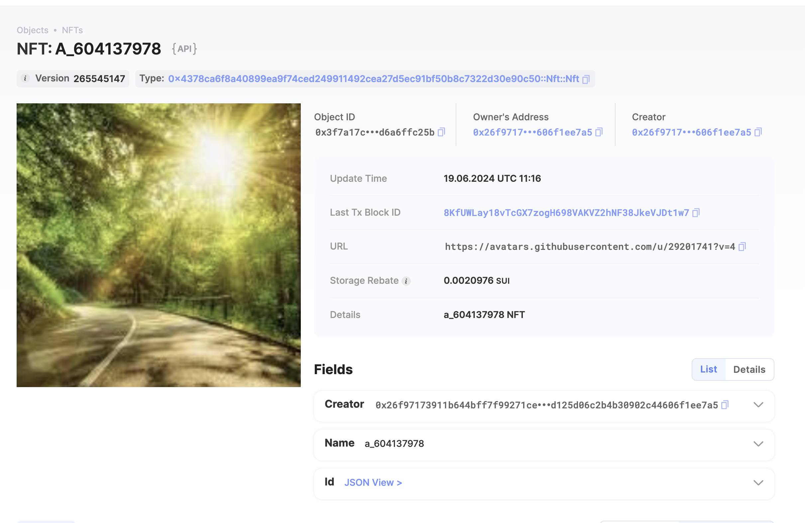
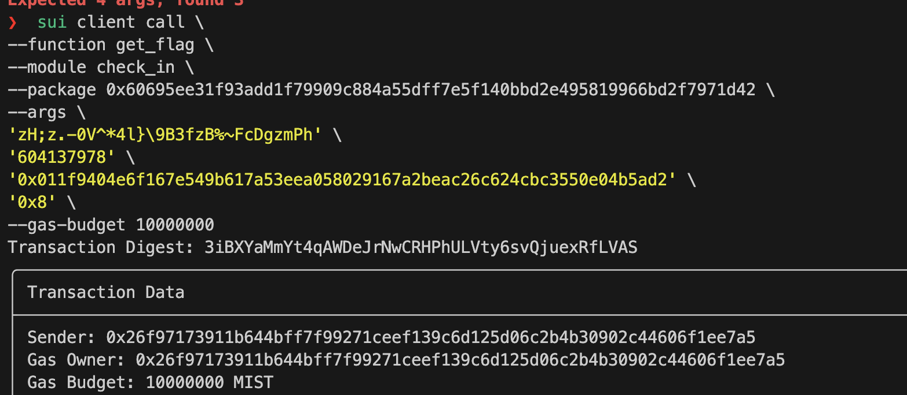

## 基本信息
- Sui钱包地址: `0x26f97173911b644bff7f99271ceef139c6d125d06c2b4b30902c44606f1ee7a5`
> 首次参与需要完成第一个任务注册好钱包地址才被合并，并且后续学习奖励会打入这个地址
- github: `604137978`

## 个人简介
- 工作经验: 1年
- 技术栈: 前端
> 重要提示 请认真写自己的简介
- rust 入门中
- 联系方式: `604137978@qq.com`

## 任务

##   01 hello move  
- [x] Sui cli version: 1.27.0
- [x] Sui钱包截图: 
- [x] package id: 0xc1b88f7d39cf4b5d0cb5bfcc38860739de8d1ba8a4a1743db57165a23a3d2448
- [x] package id 在 scan上的查看截图:

##   02 move coin
- [x] My Coin package id : 0xf2d31bf186bd425f6772349ac59863e49a733d5e2a29bad97a9de7435489cbb5
- [x] Faucet package id : 0xa06247df0859c7dff209bb56c1835e3ff4f7c48bc008cfcbd8e57ace5b81c111
- [x] 转账 `My Coin` hash: AVpDkZXmeum5YhDABSWYr7XD5ugHB5nEnexht9RPnFCt
- [x] `Faucet Coin` address1 mint hash: 47k7xC6uVL5kxPvdxkikaD4RV9MQ35b5qDeBp7eYzc2q
- [x] `Faucet Coin` address2 mint hash: HTrpLZQfPqtpFspkdA5VuMrwkme7K8dhGe86EWAQ4ZLK

##   03 move NFT
- [x] nft package id : 0x4378ca6f8a40899ea9f74ced249911492cea27d5ec91bf50b8c7322d30e90c50
- [x] nft object id :0xa89c8380ad0fb7254be20f7ccf0c2e0d53de9f17db5a16fc74a6d481625573dd
- [x] 转账 nft  hash: Dum4nugdM2ZHsTK75fZwtZMEkzNBm2jCVEvr5nFrDCj2
- [x] scan上的NFT截图: 8KfUWLay18vTcGX7zogH698VAKVZ2hNF38JkeVJDt1w7 

##   04 Move Game
- [] game package id :
- [] deposit Coin hash:
- [] withdraw `Coin` hash:
- [] play game hash:

##   05 Move Swap
- [] swap package id :
- [] call swap CoinA-> CoinB  hash :
- [] call swap CoinB-> CoinA  hash :

##   06 Dapp-kit SDK PTB
- [] save hash :

##   07 Move CTF Check In
- [x] CLI call 截图 : 
- [x] flag hash :  3iBXYaMmYt4qAWDeJrNwCRHPhULVty6svQjuexRfLVAS

##   08 Move CTF Lets Move
- [x] proof : 25506975
- [x] flag hash : DectkVSus8iVVnU7rU2RcviBsvPdMYwpn8J7MnXz1vNv
