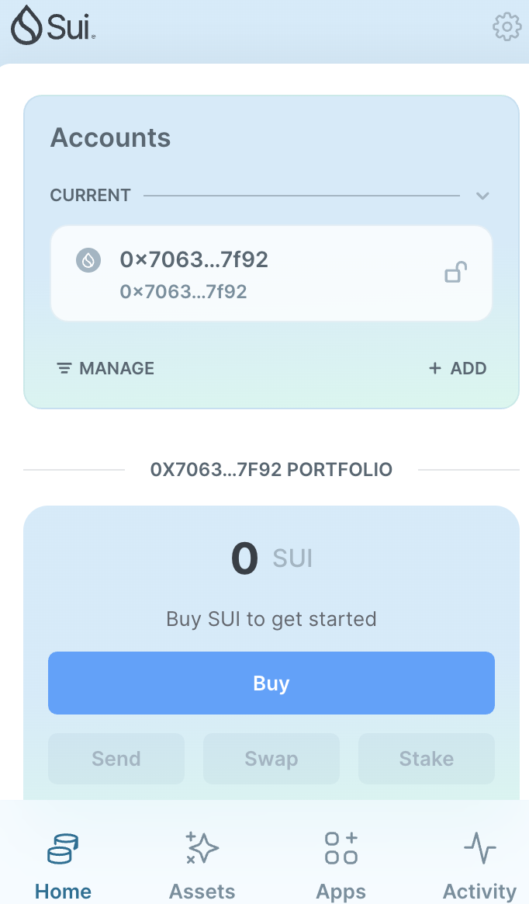
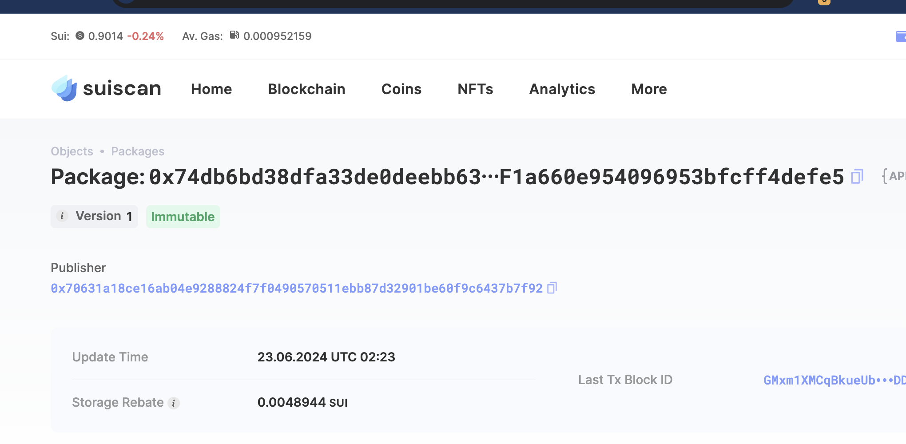
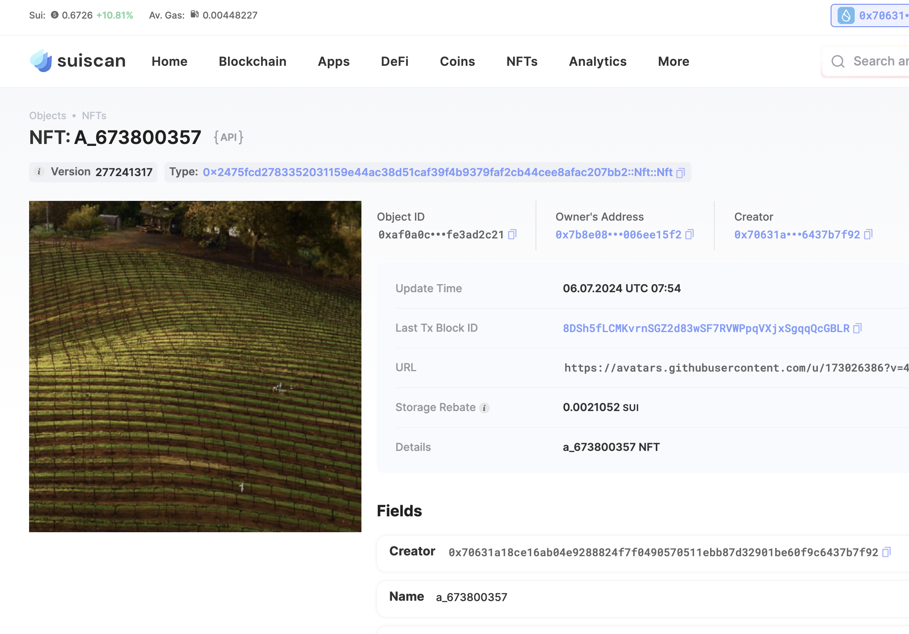

## 基本信息
- Sui钱包地址: `- 0x70631a18ce16ab04e9288824f7f0490570511ebb87d32901be60f9c6437b7f92`
> 首次参与需要完成第一个任务注册好钱包地址才被合并，并且后续学习奖励会打入这个地址
- github: `673800357`

## 个人简介
- 工作经验: 0.5年
- 技术栈: 前端
> 重要提示 请认真写自己的简介
- 前端开发, 目前在学习 web3 开发
- 联系方式: `673800357@qq.com`

## 任务

##   01 hello move  
- [x] Sui cli version: 1.27.0
- [x] Sui钱包截图: 
- [x] package id: 0x74db6bd38dfa33de0deebb63f219f83930f55f1a660e954096953bfcff4defe5
- [x] package id 在 scan上的查看截图:

##   02 move coin
- [x] My Coin package id : 0xb8a39dc51be7e4ca2899c97fb04f3ec3d370c665f287926f9109097677298571
- [x] Faucet package id : 0x4be9140e935699fa0953376eeb9932be3105022cf4fec54391af3c861d05b46e
- [x] 转账 `My Coin` hash: DeS1REc5PZEGFySqqAj2xHu6BtBaVFdTN5r2HnZzXTxt
- [x] `Faucet Coin` address1 mint hash: 6J5yzRXnXnu2dZjjFW6HzynPJTXHS8aVZiw8Cbgs5m1s
- [x] `Faucet Coin` address2 mint hash: 2tdaB7gQrsrMkqJBdypFH9u6JB25ETRoRyrU46TmmLFh

##   03 move NFT
- [x] nft package id : 0x2475fcd2783352031159e44ac38d51caf39f4b9379faf2cb44cee8afac207bb2
- [x] nft object id : 0x3452403202d020afe21a830807eed65e60ed5cac42564fa7615424fa6edad4a7
- [x] 转账 nft  hash: 8DSh5fLCMKvrnSGZ2d83wSF7RVWPpqVXjxSgqqQcGBLR
- [x] scan上的NFT截图: 

##   04 Move Game
- [] game package id :
- [] deposit Coin hash:
- [] withdraw `Coin` hash:
- [] play game hash:

##   05 Move Swap
- [] swap package id :
- [] call swap CoinA-> CoinB  hash :
- [] call swap CoinB-> CoinA  hash :

##   06 Dapp-kit SDK PTB
- [] save hash :

##   07 Move CTF Check In
- [] CLI call 截图 : 
- [] flag hash : 

##   08 Move CTF Lets Move
- [] proof : 
- [] flag hash : 
