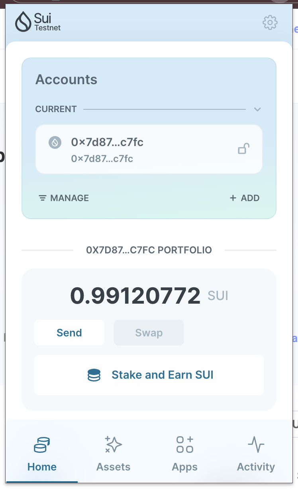
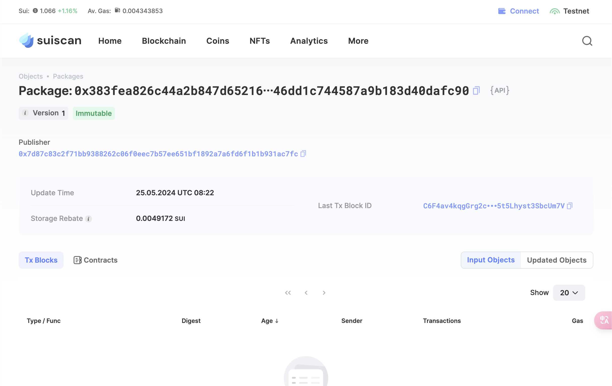

## 基本信息
- Sui钱包地址: `0x7d87c83c2f71bb9388262c06f0eec7b57ee651bf1892a7a6fd6f1b1b931ac7fc`
> 首次参与需要完成第一个任务注册好钱包地址才被合并，并且后续学习奖励会打入这个地址
- github id: `93503087`

## 个人简介
- 工作经验: 1年
- 技术栈: `C#` `C++`
> 重要提示 请认真写自己的简介
- 我是一名具有C#和C++后端开发经验的程序员，专注于Web2领域的工作。现在，我正积极学习Move语言并且了解Movement模块化框架，对Sui生态感兴趣。我的目标是通过Move语言的学习和应用，顺利转型并加入Web3领域。
- 联系方式: tg: `@R_Ludius` 

## 任务

##   01 hello move  
- [] Sui cli version: sui 1.25.1-homebrew
- [] Sui钱包截图: 
- [] package id: 0x383fea826c44a2b847d65216416e366447a3b46dd1c744587a9b183d40dafc90
- [] package id 在 scan上的查看截图:

##   02 move coin
- [] My Coin package id : 
- [] Faucet package id : 
- [] 转账 `My Coin` hash:
- [] `Faucet Coin` address1 mint hash:
- [] `Faucet Coin` address2 mint hash:

##   03 move NFT
- [] nft package id :
- [] nft object id : 
- [] 转账 nft  hash:
- [] scan上的NFT截图:

##   04 Move Game
- [] game package id :
- [] deposit Coin hash:
- [] withdraw `Coin` hash:
- [] play game hash:

##   05 Move Swap
- [] swap package id :
- [] call swap CoinA-> CoinB  hash :
- [] call swap CoinB-> CoinA  hash :

##   06 Dapp-kit SDK PTB
- [] save hash :
