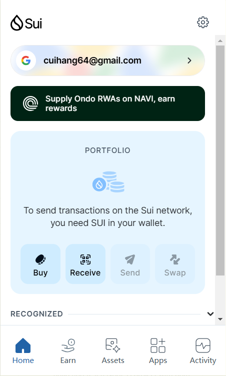
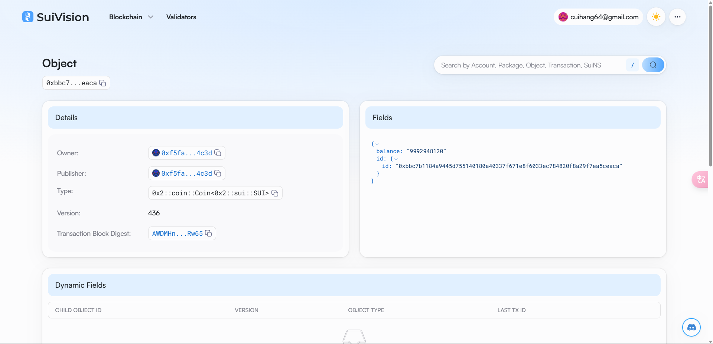

## 基本信息

- Sui钱包地址: `0xf5faaeb116a7de809967575794603a84cf318e8797ef50d83a0e162781314c3d`

> 首次参与需要完成第一个任务注册好钱包地址才被合并，并且后续学习奖励会打入这个地址

- github: `A1LinLin1`

## 个人简介

- 工作经验: 0年
- 技术栈:  `C++` `python`

> 重要提示 请认真写自己的简介

- 有2年开发经验，对区块链特别感兴趣，想通过Move入门区块链
- 联系方式: tg: `Andy Edward`

## 任务

## 01 hello move

- [X] Sui cli version: 1.44.0-57bb5f612ac5-dirty
- [X] Sui钱包截图: 
- [X] package id: 0xbbc7b1184a9445d755140180a40337f671e8f6033ec784820f8a29f7ea5ceaca

- [X] package id 在 scan上的查看截图:

## 02 move coin

- [] My Coin package id :
- [] Faucet package id :
- [] 转账 `My Coin` hash:
- [] `Faucet Coin` address1 mint hash:
- [] `Faucet Coin` address2 mint hash:

## 03 move NFT

- [] nft package id :
- [] nft object id :
- [] 转账 nft  hash:
- [] scan上的NFT截图:

## 04 Move Game

- [] game package id :
- [] deposit Coin hash:
- [] withdraw `Coin` hash:
- [] play game hash:

## 05 Move Swap

- [] swap package id :
- [] call swap CoinA-> CoinB  hash :
- [] call swap CoinB-> CoinA  hash :

## 06 Dapp-kit SDK PTB

- [] save hash :

## 07 Move CTF Check In

- [] CLI call 截图 : 
- [] flag hash :

## 08 Move CTF Lets Move

- [] proof :
- [] flag hash :
