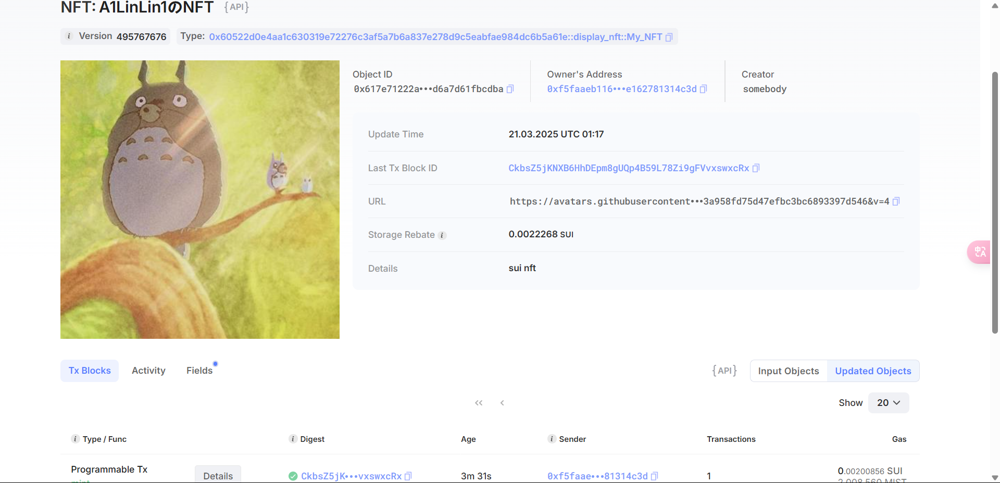

## 基本信息

- Sui钱包地址: `0xf5faaeb116a7de809967575794603a84cf318e8797ef50d83a0e162781314c3d`

> 首次参与需要完成第一个任务注册好钱包地址才被合并，并且后续学习奖励会打入这个地址

- github: `A1LinLin1`

## 个人简介

- 工作经验: 0年
- 技术栈:  `C++` `python`

> 重要提示 请认真写自己的简介

- 有2年开发经验，对区块链特别感兴趣，想通过Move入门区块链
- 联系方式: tg: `Andy Edward`

## 任务

## 01 hello move

- [X] Sui cli version: 1.44.0-57bb5f612ac5-dirty
- [X] Sui钱包截图: 
- [X] package id: `0xbbc7b1184a9445d755140180a40337f671e8f6033ec784820f8a29f7ea5ceaca`

- [X] package id 在 scan上的查看截图:

## 02 move coin

- [X] My Coin package id : `0xf03d70b8c37326289213f3b64f2ee82e6046dffca3ed26ed057c7ce8fd556565`
- [X] Faucet package id : `0x9f4147dedf3fb03a3314db8262bdccf6be43794ab8f1496571b91bc42228ee1f`
- [X] 转账 `My Coin` hash: `91D6ioXJDCP8Gu24xvuwUcmJnnTFJcj1Axk9wkYGj7xP`
- [X] `Faucet Coin` address1 mint hash: `DmNLgt6wNrZtDS3XHzKGyKQ7gm5abTSoTuodib25jdTp`
- [X] `Faucet Coin` address2 mint hash: `BM3nSaVC8Ea7CjACNYJtBdrP515kgLWWYaWniMKkT8vs`

## 03 move NFT

- [X] nft package id : `0x60522d0e4aa1c630319e72276c3af5a7b6a837e278d9c5eabfae984dc6b5a61e`
- [X] nft object id :`0x617e71222ab523f44dcb6e26b6de191999c3c03514a920563b2d6a7d61fbcdba`
- [X] 转账 nft  hash: `CkbsZ5jKNXB6HhDEpm8gUQp4B59L78Zi9gFVvxswxcRx`
- [X] scan上的NFT截图:

## 04 Move Game

- [X] game package id :`0x3a4760a8d362d49e81a6b3e98c3c5f3360e861d1c1546b15bc8d987830f73767`
- [X] deposit Coin hash:`BgUJp2KJqZmbmg1hJuD7NukYpjFpvYJPNKFy225hetPY` `68efLTV9TPhb8sbKSM5TG7ceZ5n1Urrqbw2PL1NA7986`
- [X] withdraw `Coin` hash:`42v6BDNVgmRBYGXbgPPK1dJGmiuiUksCim7Qp1bAZSCN`
- [X] play game hash:`6JexX8fvhyD9mWYVhx6jcuomhTKuEgvVnTtbtRxVXxZr`

## 05 Move Swap

- [] swap package id :
- [] call swap CoinA-> CoinB  hash :
- [] call swap CoinB-> CoinA  hash :

## 06 Dapp-kit SDK PTB

- [] save hash :

## 07 Move CTF Check In

- [] CLI call 截图 : 
- [] flag hash :

## 08 Move CTF Lets Move

- [] proof :
- [] flag hash :
