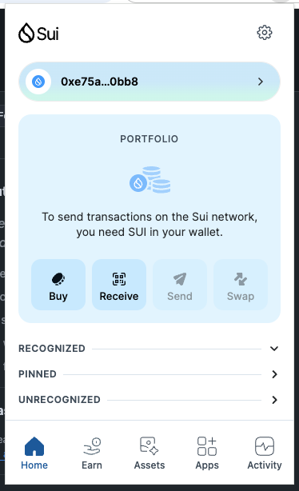
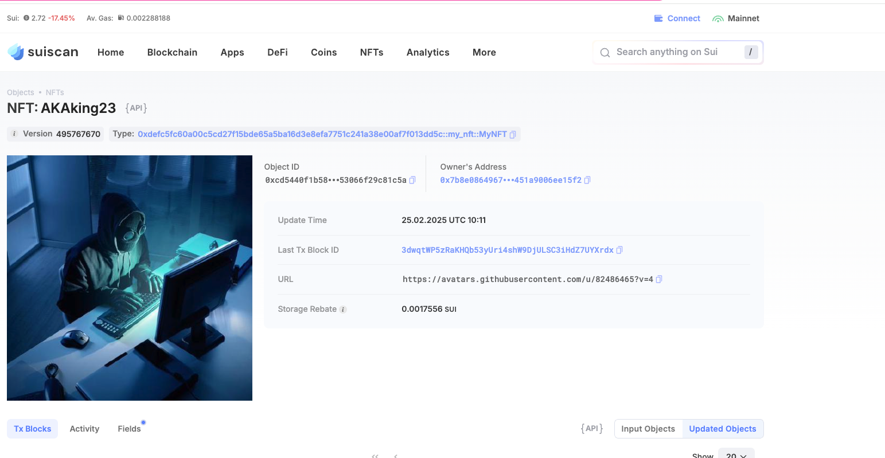

## 基本信息

- Sui 钱包地址: `0xe75a090888082e699c99b6877f93aaacedba68cd172f32006605e76b99260bb8`
  > 首次参与需要完成第一个任务注册好钱包地址才被合并，并且后续学习奖励会打入这个地址
- github: `AKAking23 `

## 个人简介

- 工作经验: 5 年
- 技术栈: `React` `Vue` `Nodejs`
  > 重要提示 请认真写自己的简介
- 从事 web2 前端开发多年，对 web3 有浓厚兴趣，参与过 web3 项目，希望在 web3 领域有所建树
- 联系方式: 邮箱: `haynesAI@163.com`

## 任务

## 01 hello move

- [✅] Sui cli version:sui 1.42.2-homebrew
- [✅] Sui 钱包截图: 
- [✅] package id: 0x48333c75e5126335a68fff0e7fef47f146f932a226a4e2e36657eb05ad6859c4
- [✅] package id 在 scan 上的查看截图:

## 02 move coin

- [✅] My Coin package id :0x36b08d9d4653a30bb01177d04d32c39ba1eadf1d5b88ab201a2ecadb1ff36463
- [✅] Faucet package id :0x411103fd7f11ddf98e5aa2ead6ca0292cd7b029b0223965cfebcd4b1132bfc07
- [✅] 转账 `My Coin` hash:C69gFdtMoBb211FZSCQUwPtdkYXyXT79z4jf49mB5WUo
- [✅] `Faucet Coin` address1 mint hash:FK1HgeRgdWcPUeUfc2QWxhhn4MbYYUgUXxddd7FjokxN
- [✅] `Faucet Coin` address2 mint hash:C6xeDyVqpr9JkFRosipp93AFW2B3hwJpzgw22vW22m3B

## 03 move NFT

- [✅] nft package id: 0xdefc5fc60a00c5cd27f15bde65a5ba16d3e8efa7751c241a38e00af7f013dd5c:
- [✅] nft object id : 0xcd5440f1b58b502a16ebd7eb0bee53def959d498fdac9fe4e753066f29c81c5a
- [✅] 转账 nft hash:3dwqtWP5zRaKHQb53yUri4shW9DjULSC3iHdZ7UYXrdx
- [✅] scan 上的 NFT 截图:

## 04 Move Game

- [] game package id :
- [] deposit Coin hash:
- [] withdraw `Coin` hash:
- [] play game hash:

## 05 Move Swap

- [] swap package id :
- [] call swap CoinA-> CoinB hash :
- [] call swap CoinB-> CoinA hash :

## 06 Dapp-kit SDK PTB

- [] save hash :

## 07 Move CTF Check In

- [] CLI call 截图 : 
- [] flag hash :

## 08 Move CTF Lets Move

- [] proof :
- [] flag hash :
