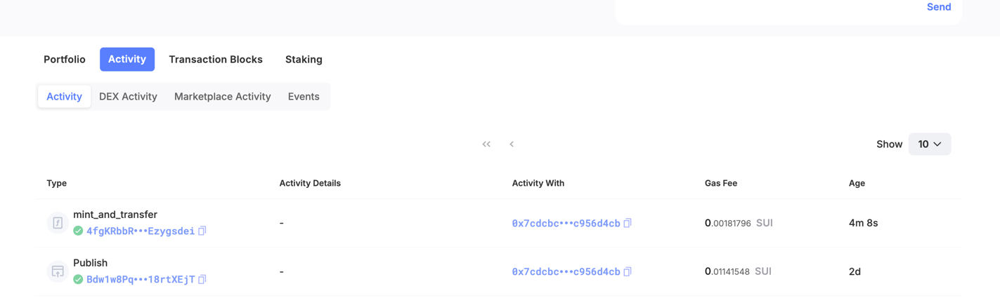

## 基本信息
- Sui钱包地址: `0x9bde06a32952eb498484fadde792dc6db8d0ab08fbddb4d14d404504188a3c1a`
> 首次参与需要完成第一个任务注册好钱包地址才被合并，并且后续学习奖励会打入这个地址
- github: `AaronChengHao`

## 个人简介
- 工作经验: 10年
- 技术栈: `Go` `Php` `Javascript` `Vue`
> 重要提示 请认真写自己的简介
- 多年的 `web2` 行业开发经验，目前 `web2` 行业现状不景气，从长期远光来看很难有根本的改变，想在 `web3` 寻找新的机会。
- 联系方式: tg: `@AaronHao`

## 任务

##   01 hello move
- [] Sui cli version: `sui 1.30.1-a4185da5659d`
- [] Sui钱包截图: 
- [] package id: `0xf77dd6862e4cb88aa195dadffc9521207d56fb84ff87a0c4bb645d9bc08bae0e`
- [] package id 在 scan上的查看截图:

##   02 move coin
- [x] My Coin package id :` 0x7261e9ac62d20f95613bd309702ddbf63817ed5902bb49cb10524365369344df`
- [x] Faucet package id : `0xfd8e86a98ed8d179b847be2c7e24ee66ae1ed9ad2944904f62e414693a78283a`
- [x] 转账 `My Coin` hash: `3BeoTm6w8u8EjGJ4gb1DqMwpuFMQHVkBYque4cWG7N22`

##   03 move NFT
- [x] nft package id : `0x7cdcbc1a971df65993698d6d5a67e4fad62c323a5609a8cb1fafd9a3c956d4cb`
- [x] nft object id : `0xa9e84de3a0ab66f9f0d717744f82de66ac97d180277d9c60c53171a7dc8bd12c`
- [x] 转账 nft  hash: `4fgKRbbRDJDW1CvN8ypuYqb6TrEX1sGFf5ggEzygsdei`
- [x] scan上的NFT截图:

##   04 Move Game
- [] game package id :
- [] deposit Coin hash:
- [] withdraw `Coin` hash:
- [] play game hash:

##   05 Move Swap
- [] swap package id :
- [] call swap CoinA-> CoinB  hash :
- [] call swap CoinB-> CoinA  hash :

##   06 Dapp-kit SDK PTB
- [] save hash :

##   07 Move CTF Check In
- [] CLI call 截图 : 
- [] flag hash :

##   08 Move CTF Lets Move
- [] proof :
- [] flag hash :
