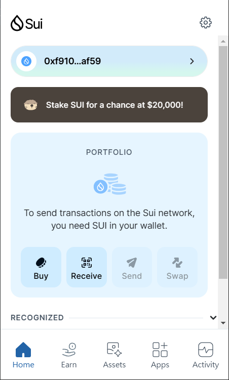
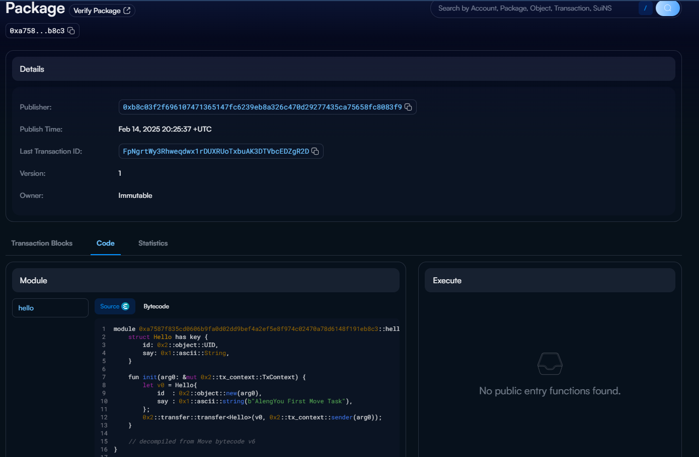

## 基本信息
- Sui钱包地址: `0xf91003c280826a2bc064e391b80bba63e8c6d87355da963d94d8f1c27c34af59`
> 首次参与需要完成第一个任务注册好钱包地址才被合并，并且后续学习奖励会打入这个地址
- github: `AlengYou`

## 个人简介
- 工作经验: 2.5年
- 技术栈: `Angular` `next.js` `Rxjs` `React` `TypeScript` `Ngrx` `IMPEX` `SAP` `Express` `nodeJs` 
> 重要提示 请认真写自己的简介
- 兩年半Web2前端大型電商開發，自己也會接一些小案子React刻板，平常也在幣圈投資和鏈上土狗的參與，想往web3發展讓薪資更上一層樓
- 联系方式: tg: `@Aleng08` WeChat: `Aleng8985`

## 任务

##   01 hello move  
- [✅] Sui cli version: sui 1.43.0-ff1738cacb87
- [✅] Sui钱包截图: 
- [✅] package id: `0xa7587f835cd0606b9fa0d02dd9bef4a2ef5e8f974c02470a78d6148f191eb8c3`
- [✅] package id 在 scan上的查看截图:

##   02 move coin
- [] My Coin package id : 
- [] Faucet package id : 
- [] 转账 `My Coin` hash:
- [] `Faucet Coin` address1 mint hash:
- [] `Faucet Coin` address2 mint hash:

##   03 move NFT
- [] nft package id :
- [] nft object id : 
- [] 转账 nft  hash:
- [] scan上的NFT截图:

##   04 Move Game
- [] game package id :
- [] deposit Coin hash:
- [] withdraw `Coin` hash:
- [] play game hash:

##   05 Move Swap
- [] swap package id :
- [] call swap CoinA-> CoinB  hash :
- [] call swap CoinB-> CoinA  hash :

##   06 Dapp-kit SDK PTB
- [] save hash :

##   07 Move CTF Check In
- [] CLI call 截图 : 
- [] flag hash :

##   08 Move CTF Lets Move
- [] proof : 
- [] flag hash :

