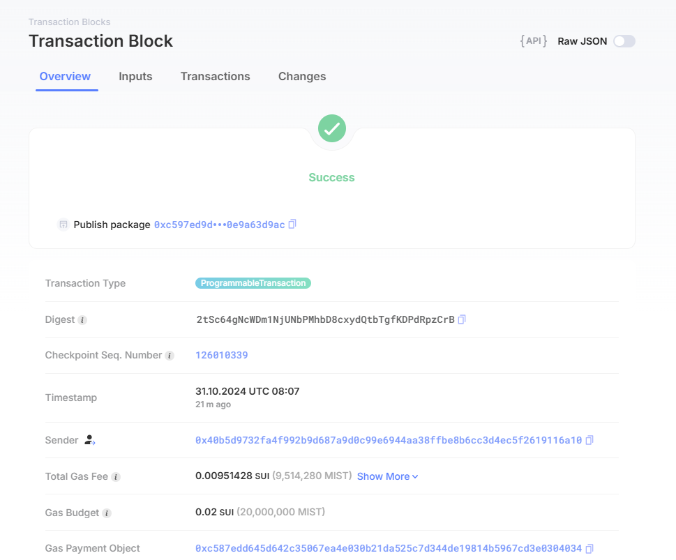

## 基本信息
- Sui钱包地址: `0xda46e2c5f929d6e0e748262137be920601ed7002971388e1de20e02af482e6fa`
> 首次参与需要完成第一个任务注册好钱包地址才被合并，并且后续学习奖励会打入这个地址
- github: `AlexWaker`

## 个人简介
- 工作经验: 研究僧
- 技术栈: `Python` `C++`
> 重要提示 请认真写自己的简介
- 对Web3感兴趣，想通过Move入门区块链
- 联系方式: tg: `@lewisgao2678` 

## 任务

##   01 hello move  
- [✅] Sui cli version: `sui 1.36.2-3ada97c109cc`
- [✅] Sui钱包截图: 
- [✅] package id: `0xf18aea55917ff8e76b8d5127fe4f273675d214b56708172399985603d0be681c`
- [✅] package id 在 scan上的查看截图:

##   02 move coin
- [✅] My Coin package id : `0x4e2e93430bca5205eabe6f75ae0c59d234500ce0e9c2436500b073c9ffed94fe`
- [✅] Faucet package id : `0x2adc11d7339def7528121fb6302719cc37e588e4ea2672851efa8180c29037e5`
- [✅] Faucet 共享object id: `0xe0c3f2fe67dfb2e47be028a8b3f4e9999c5aaac30adbc2523048d93f3f322622`
- [✅] 转账 `My Coin` hash: `D97jinBm8WLjCMqwXUUDqhJaHwmfjub8cHNTQuySJQ5t`
- [✅] `Faucet Coin` address1 mint hash: `Eh78aYmgNBHw3zDjpfQmrrCQHVP3HqLqNf9eg8SjyrGX`
- [✅] `Faucet Coin` address2 mint hash: `Du4kRMA6EGGs2HQ8Erqzn3dTPTkbdKvF6LksAKoAgAM`

##   03 move NFT
- [✅] nft package id : `0x1702e3dcc6a39597e65d5edda6998e02499c29964a77c850c3e2bdb2ab0c1b2e`
- [✅] nft object id : `0xd8f2f918f395f1adc3d790d51d90a236ad0f03765f24225e1707f2711c079313`
- [✅] 转账 nft  hash（mint到目标地址`0x7b8e0864967427679b4e129f79dc332a885c6087ec9e187b53451a9006ee15f2`的哈希）：`3MGKvh2mwRXXfYqtxAAiXSM5snky5v1hUsfVC3RonjqR`
- [✅] scan上的NFT截图:

##   04 Move Game
- [✅] game package id : `0xd58b8295f6bcebbcb3b565cd2506fe547d663e71460fc35c8f77518b03d18172`
- [✅] deposit Coin hash: `3GaUrZiFRhb4pfp4W1HiaSKntPxvCdJk4w27SLfy6aEA`
- [✅] withdraw `Coin` hash: `5Kkc4ckL244b1UiqrpNgp36EfCpgkeoA62rtx148eVrC`
- [✅] play game hash: `Efd8wLmV3QNkF74Cao7jtDu1UXk8r9vTwgzSt6hnKhxn`

##   05 Move Swap
- [✅] swap package id : `0x7088ece81ebbbe992bda5097f7f07fec86c7ddfd2759dc2218121ebadf09c8e6`
- [✅] call swap CoinA-> CoinB  hash : `2Q8CNauAxwqP4Gb54B1ohvXfWiXecUMTNiHqY1jAQDaN`
- [✅] call swap CoinB-> CoinA  hash : `G4bsraFcW7qvdr4Sg1vX5kFWNCEd1tzSeUHWo19T717C`

##   06 Dapp-kit SDK PTB
- [✅] save hash : `HaN5ivgXWD34FxxAjE4yPg58XaCDYwLaC28erCAJ1WSH`
- [✅] scan上的转账截图: 

##   07 Move CTF Check In
- [] CLI call 截图 : 
- [] flag hash :

##   08 Move CTF Lets Move
- [] proof : 
- [] flag hash :
