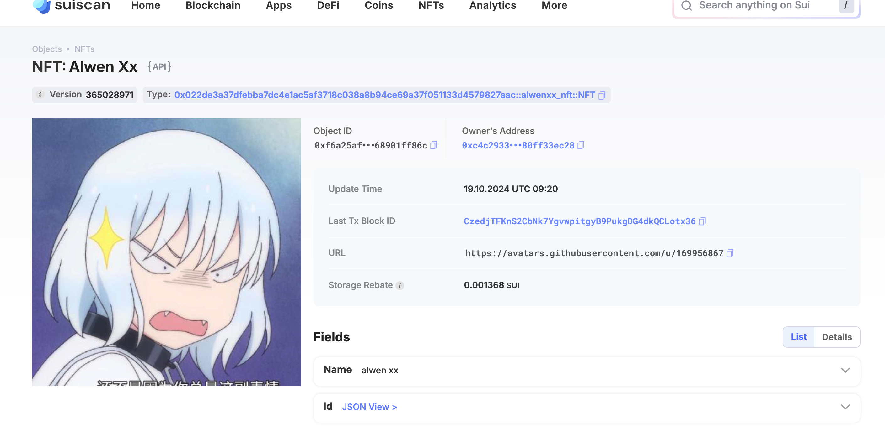

## 基本信息
- Sui钱包地址: `0xc4c29330fd5b41a0a8312aed281b9e901be60a8e7b844975a1354b80ff33ec28`
> 首次参与需要完成第一个任务注册好钱包地址才被合并，并且后续学习奖励会打入这个地址
- github: `AlwenXX`

## 个人简介
- 工作经验: 5年
- 技术栈: `Java`
> 重要提示 请认真写自己的简介
- 多年web2开发经验，对Move特别感兴趣，想通过Move入门区块链
- 联系方式: tg: `AlwenXXL` 

## 任务

##   01 hello move  
- [x] Sui cli version: sui-client 1.34.2-c9ae0f9282a0
- [x] Sui钱包截图: 
- [x] package id:  0x478e8c9e5555a8760de7a32133eca9c28d18f99bdba6d7fbc073b6e5825b9721
- [x] package id 在 scan上的查看截图:

##   02 move coin
- [x] My Coin package id :  0x72b9943e22a65053ebbc1b20d4bb857e1c710f55e54069a5f9d1739d9eb44af
- [x] Faucet package id :  0x72b9943e22a65053ebbc1b20d4bb857e1c710f55e54069a5f9d1739d9eb44af
- [x] 转账 `My Coin` hash: 2tnfB1ETDemiQDeykBN8uautEXjtMkPjw3MEaM4xWaig
- [x] `Faucet Coin` address1 mint hash: CVWyRg3PVVVUpRNUo4UCXmJs4BAs78GfA3jn2LC3Tfeb
- [x] `Faucet Coin` address2 mint hash: CVSnPsQ97N644WheSW11gRCwvkFkYG98cP1jVv2nso4r

##   03 move NFT
- [x] nft package id :0x022de3a37dfebba7dc4e1ac5af3718c038a8b94ce69a37f051133d4579827aac
- [x] nft object id :  0xf6a25af5f68edc93b0bffc88b325b48d1943e0cce537baa30c449768901ff86c
- [x] 转账 nft  hash: A1iAyzAQdNnL4uM3kDG1Jan9Yn9DVxc4h94CXwbzoSBm
- [x] scan上的NFT截图:

##   04 Move Game
- [x] game package id : 0xb5abc8171e489495f68e18312b6867a1875340fdd03ef4ce905c08f49e5d37de
- [x] deposit Coin hash: 2CYaQ3JtLKMvMdhKVdERFCWouqt8NTMyRL1bs8ri9hpP
- [x] withdraw `Coin` hash: 3ZttwkxDn5oQKuC8W3c8gjaNP579ZokD6NupgcAAGADx
- [x] play game hash: Ca6jMT5umfAw53P1fdM1gE1bDK7LgownMpAcsbNaKtZ6

##   05 Move Swap
- [x] swap package id :  0xde8fbdab9aaa7cad7f83b15d035ed245601b1086743814cada68114f4366ace7
- [x] call swap CoinA-> CoinB  hash : C2iYcoPwzgQnx13VzA8YW9SzqpKXAy9LiA9CE3kRv7zx
- [x] call swap CoinB-> CoinA  hash : 9jgqbknY9VjyzEJf8QMRFMbHHWu7mYXTe39vkQ2GS31e

##   06 Dapp-kit SDK PTB
- [] save hash :

##   07 Move CTF Check In
- [] CLI call 截图 : 
- [] flag hash :

##   08 Move CTF Lets Move
- [] proof : 
- [] flag hash :
