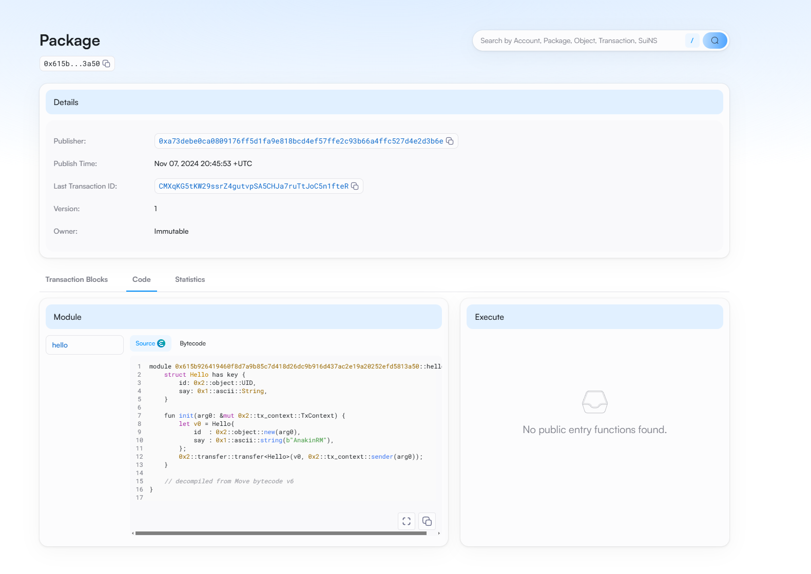

## 基本信息
- Sui钱包地址: `0x37e425477fc1f3af22d3d82983424a3d38e129e86565aec30500a96cae016f2b`
> 首次参与需要完成第一个任务注册好钱包地址才被合并，并且后续学习奖励会打入这个地址
- github: `AnakinRM`

## 个人简介
- 工作经验: 0年
- 技术栈: `Go` `C++`
> 重要提示 请认真写自己的简介
- 现美国约翰霍普金斯大学计算机专业研究生
- 联系方式: tg: `AnakinRM` 

## 任务

##   01 hello move  
- [✔] Sui cli version: sui 1.37.1-7839b9501066
- [✔] Sui钱包截图: 
- [✔] package id: 0x615b926419460f8d7a9b85c7d418d26dc9b916d437ac2e19a20252efd5813a50
- [✔] package id 在 scan上的查看截图:

##   02 move coin
- [] My Coin package id : 
- [] Faucet package id : 
- [] 转账 `My Coin` hash:
- [] `Faucet Coin` address1 mint hash:
- [] `Faucet Coin` address2 mint hash:

##   03 move NFT
- [] nft package id :
- [] nft object id : 
- [] 转账 nft  hash:
- [] scan上的NFT截图:

##   04 Move Game
- [] game package id :
- [] deposit Coin hash:
- [] withdraw `Coin` hash:
- [] play game hash:

##   05 Move Swap
- [] swap package id :
- [] call swap CoinA-> CoinB  hash :
- [] call swap CoinB-> CoinA  hash :

##   06 Dapp-kit SDK PTB
- [] save hash :

##   07 Move CTF Check In
- [] CLI call 截图 : 
- [] flag hash :

##   08 Move CTF Lets Move
- [] proof : 
- [] flag hash :
