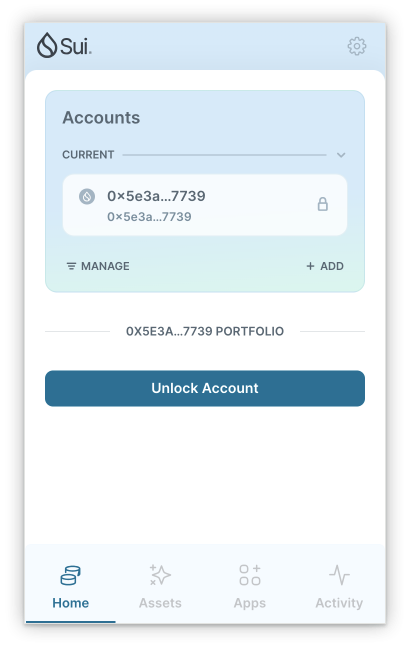
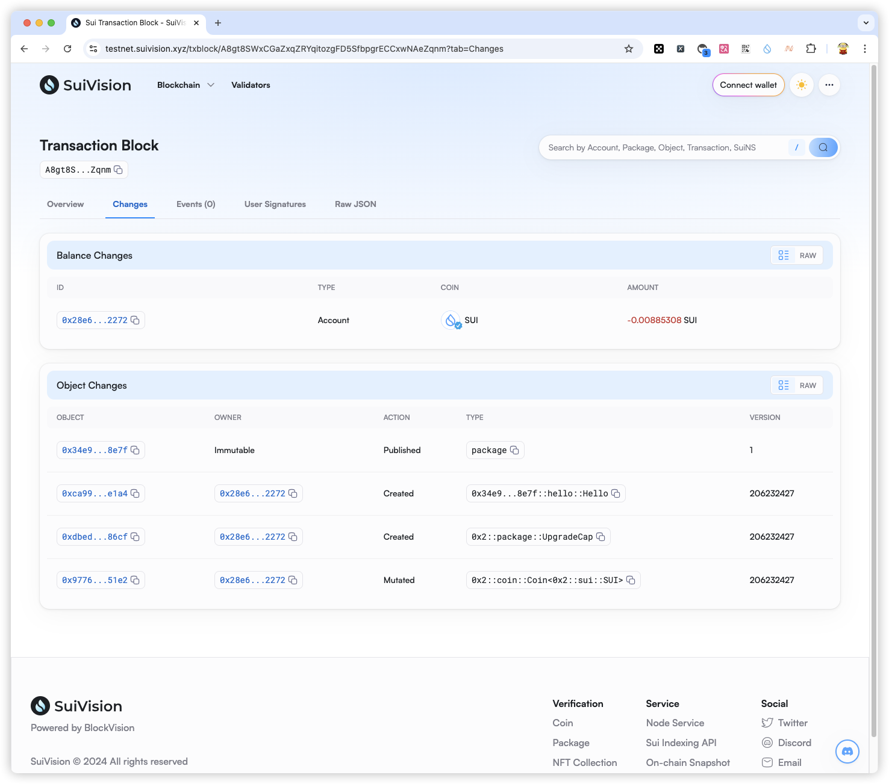

## 基本信息
- Sui钱包地址: `0x5e3a681a6954d31ea685648c0d00d05e6f0f46869b897b27bbefa25733457739`
> 首次参与需要完成第一个任务注册好钱包地址才被合并，并且后续学习奖励会打入这个地址
- github: `Aris1024`

## 个人简介
- 工作经验: 12 年
- 技术栈: `Solidity` `JavaScript` `Java` `iOS` `Android` `Vue`
> 重要提示 请认真写自己的简介
- 一个工作多年的老家伙,什么都会点,希望通过此次共学获取更多技能和财富.
- 联系方式: tg: `@Aris1024` 

## 任务

##   01 hello move  
- [] Sui cli version:`sui-client 1.37.1-7839b9501066`
- [] Sui钱包截图: 
- [] package id: `0x34e919fa4083d5d8879327c3939ced04dab45373fd1420db40415cc8eefa8e7f`
- [] package id 在 scan上的查看截图:

##   02 move coin
- [] My Coin package id : 
- [] Faucet package id : 
- [] 转账 `My Coin` hash:
- [] `Faucet Coin` address1 mint hash:
- [] `Faucet Coin` address2 mint hash:

##   03 move NFT
- [] nft package id :
- [] nft object id : 
- [] 转账 nft  hash:
- [] scan上的NFT截图:

##   04 Move Game
- [] game package id :
- [] deposit Coin hash:
- [] withdraw `Coin` hash:
- [] play game hash:

##   05 Move Swap
- [] swap package id :
- [] call swap CoinA-> CoinB  hash :
- [] call swap CoinB-> CoinA  hash :

##   06 Dapp-kit SDK PTB
- [] save hash :

##   07 Move CTF Check In
- [] CLI call 截图 : 
- [] flag hash :

##   08 Move CTF Lets Move
- [] proof : 
- [] flag hash :
