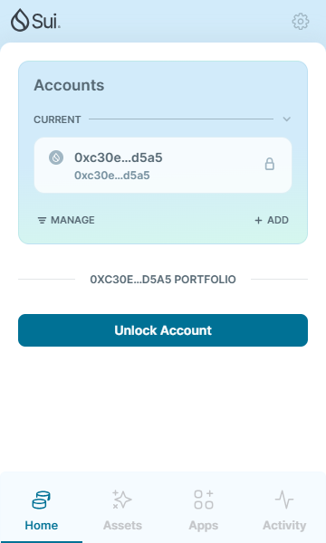
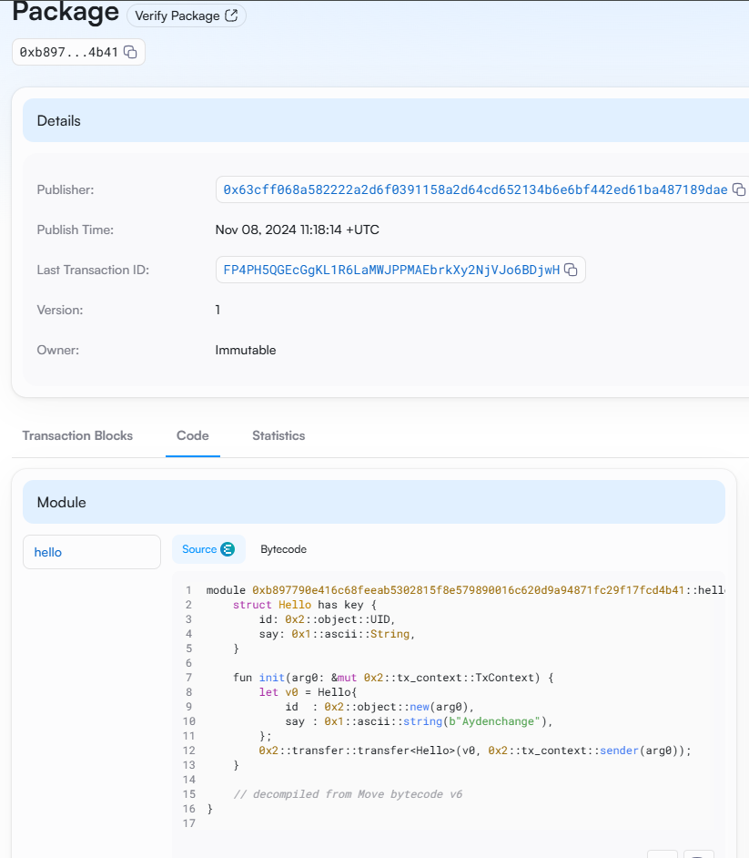

## 基本信息
- Sui钱包地址: `0xc30e46691599511840ae7ba036f9bef61aaf6afccafae36202a3bf511fc0d5a5`
> 首次参与需要完成第一个任务注册好钱包地址才被合并，并且后续学习奖励会打入这个地址
- github: `Aydenchange`

## 个人简介
- 工作经验: 8年
- 技术栈: `Java` `React`
> 重要提示 请认真写自己的简介
- 后端开发3年，后转入传统行业从事系统分析师5年，希望入门区块链
- 联系方式: tg: `Wu Ayden`

## 任务

##   01 hello move  
- [√] Sui cli version:sui 1.37.1-7839b9501066
- [√] Sui钱包截图: 
- [√] package id: 0xb897790e416c68feeab5302815f8e579890016c620d9a94871fc29f17fcd4b41
- [√] package id 在 scan上的查看截图:

##   02 move coin
- [] My Coin package id : 
- [] Faucet package id : 
- [] 转账 `My Coin` hash:
- [] `Faucet Coin` address1 mint hash:
- [] `Faucet Coin` address2 mint hash:

##   03 move NFT
- [] nft package id :
- [] nft object id : 
- [] 转账 nft  hash:
- [] scan上的NFT截图:

##   04 Move Game
- [] game package id :
- [] deposit Coin hash:
- [] withdraw `Coin` hash:
- [] play game hash:

##   05 Move Swap
- [] swap package id :
- [] call swap CoinA-> CoinB  hash :
- [] call swap CoinB-> CoinA  hash :

##   06 Dapp-kit SDK PTB
- [] save hash :

##   07 Move CTF Check In
- [] CLI call 截图 : 
- [] flag hash :

##   08 Move CTF Lets Move
- [] proof : 
- [] flag hash :
