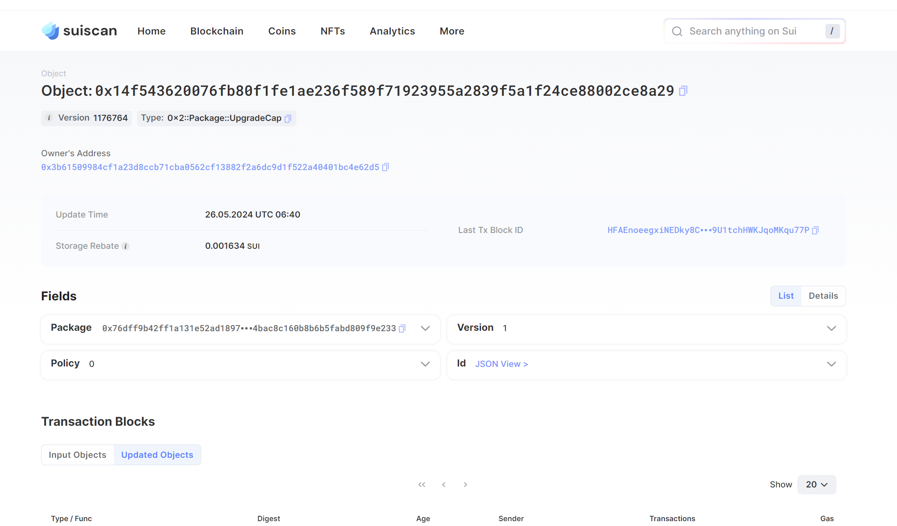

## 基本信息
- Sui钱包地址: `0x5eecaf2a4431bcf129cf7d1f34cb7532cd82e9664628fc8cffa2a0546af5806e`
> 首次参与需要完成第一个任务注册好钱包地址才被合并，并且后续学习奖励会打入这个地址
- github: `Azhan1431`

## 个人简介
- 工作经验: 0年
- 技术栈: `python` 
> 重要提示 请认真写自己的简介
- 大二学生，区块链工程专业，学习网络安全，经常打打CTF，身边有区块链圈的人，接触发现区块链的乐趣，在CTF中，也接触了区块链安全的题，智能合约漏洞之类的，接触区块链，先从Move开始，对此感兴趣
- 联系方式: tg: `Azhan` 

## 任务

##   01 hello move  
- [] Sui cli version:sui 1.25.1-6579e0ed9e43-dirty
- [] Sui钱包截图: 
- [] package id: 0x14f543620076fb80f1fe1ae236f589f71923955a2839f5a1f24ce88002ce8a29
- [] package id 在 scan上的查看截图:

##   02 move coin
- [] My Coin package id : 
- [] Faucet package id : 
- [] 转账 `My Coin` hash:
- [] `Faucet Coin` address1 mint hash:
- [] `Faucet Coin` address2 mint hash:

##   03 move NFT
- [] nft package id :
- [] nft object id : 
- [] 转账 nft  hash:
- [] scan上的NFT截图:

##   04 Move Game
- [] game package id :
- [] deposit Coin hash:
- [] withdraw `Coin` hash:
- [] play game hash:

##   05 Move Swap
- [] swap package id :
- [] call swap CoinA-> CoinB  hash :
- [] call swap CoinB-> CoinA  hash :

##   06 Dapp-kit SDK PTB
- [] save hash :
