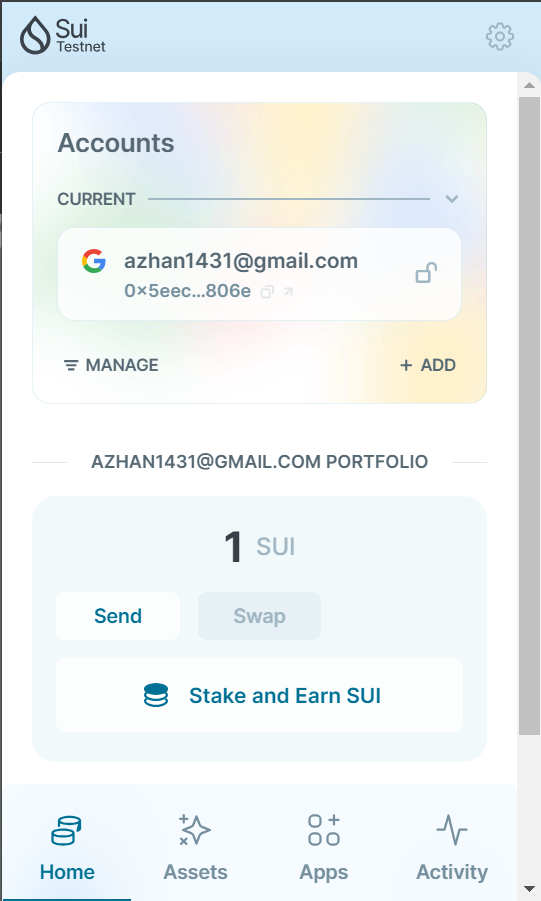
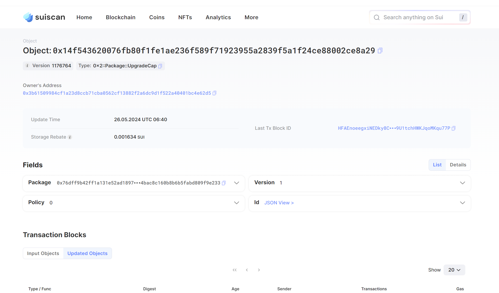
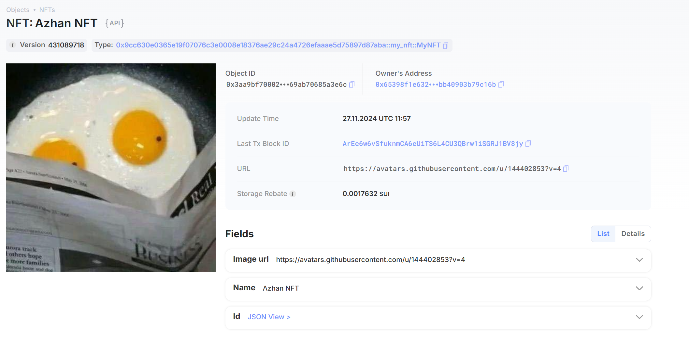
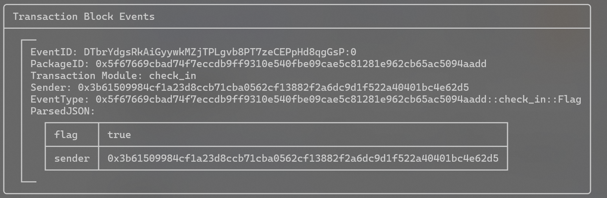

## 基本信息
- Sui钱包地址: `0x5eecaf2a4431bcf129cf7d1f34cb7532cd82e9664628fc8cffa2a0546af5806e`
> 首次参与需要完成第一个任务注册好钱包地址才被合并，并且后续学习奖励会打入这个地址
- github: `Azhan1431`

## 个人简介
- 工作经验: 0年
- 技术栈: `python` ，`solidity`
> 重要提示 请认真写自己的简介
- 区块链工程专业，学习网络安全，经常打打CTF，身边有区块链圈的人，接触发现区块链的乐趣，在CTF中，也接触了区块链安全的题，智能合约漏洞之类的，接触区块链，先从Move开始，对此感兴趣
- 联系方式: tg: `Azhan` 

## 任务

##   01 hello move  
- [x] Sui cli version:sui 1.25.1-6579e0ed9e43-dirty
- [x] Sui钱包截图: 
- [x] package id: 0x14f543620076fb80f1fe1ae236f589f71923955a2839f5a1f24ce88002ce8a29
- [x] package id 在 scan上的查看截图:

##   02 move coin
- [x] My Coin package id :  0xf4842690b5e5d10bdbcc9c568cc809f9cedcb14654af9ff129e1248558d56cf3
- [x] Faucet package id :  0x4518f1d464f260f71a122248737d52ffcab1ccfd52542d0e79e28a6fc22e09f1
- [x] 转账 `My Coin` hash: 86fMx8EMxmEs4qtmW3SaGGroGrJQhB8jtXsknBUW6aBj
- [x] `Faucet Coin` address1 mint hash: 32UTqyFJPYdDumfwC1nwfdadLxi3mZ62mBKwdjpmmRqZ
- [x] `Faucet Coin` address2 mint hash: GJs3BiCbkpKh63PyyQCm1qcFbUScPcPdSZMF9WgcS5iH

##   03 move NFT
- [x] nft package id : 0x9cc630e0365e19f07076c3e0008e18376ae29c24a4726efaaae5d75897d87aba
- [x] nft object id : 0x3aa9bf700023bc0ec028c0f83d677a28b4a7580a5ec08f880f69ab70685a3e6c
- [x] 转账 nft  hash: B586ccPv5bvEZtpoNynTEhYFMCbhdWt7P4s1ai9xKsct
- [x] scan上的NFT截图:

##   04 Move Game
- [x] game package id : 0x385e8128003d4c29e6a37e0f1b210ae956ae4c40b571f320ef93329fe8986783
- [x] deposit Coin hash:  D7W52ugPihfxC64qfaHeEeHqJBgFXoH4UjfQQ4VFk8KG
- [x] withdraw `Coin` hash: 3ogWgAE83rFzTjb2PpEGi1c8AGiPxrXKp1dbVGUY4m7A
- [x] play game hash: CVMN1eFLFyikicRyQusbeignkkri6oAd7haHi5dtrbku

##   05 Move Swap
- [x] swap package id : 0x753eeb4f9a7971ee49bf16ed4f94986fbc7b234e7264140dbc1bf971d157a2a0
- [x] call swap CoinA-> CoinB  hash : DwZi6Rt39t2NhPnnCcbcrmoi9iJoa8UyoDX1Ry9Po5rQ
- [x] call swap CoinB-> CoinA  hash : 9ripiwMGxid2oUtdvQ1dbMGvX1TKRdrocEYMBfskGikY

##   06 Dapp-kit SDK PTB
- [x] save hash : B6YN1B1i1FmwdZrrndUXWKaE2ritEMdwW3y5bDQdEWcE

##   07 Move CTF Check In
- [x] CLI call 截图 : 
- [x] flag hash :DTbrYdgsRkAiGyywkMZjTPLgvb8PT7zeCEPpHd8qgGsP

##   08 Move CTF Lets Move
- [] proof : 
- [] flag hash :