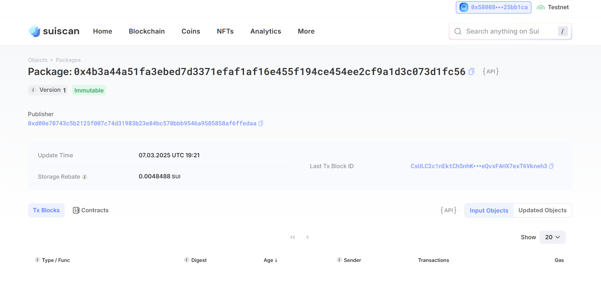

## 基本信息
- Sui钱包地址: `0x58008186b72f149ee473b24a9b61e3b67445a6da4524211e1f8a788bb25bb1ca`
> 首次参与需要完成第一个任务注册好钱包地址才被合并，并且后续学习奖励会打入这个地址
- github: `B1u-e`

## 个人简介
- 工作经验: 1年
- 技术栈: `solidity` `hardhat` `foundry` `ehterjs` `javascript` `vue3`
> 重要提示 请认真写自己的简介
- 2023进入web3，目前今天一年多的web3开发经验，过去主要是从事solidity智能合约的开发，目前对Move特别感兴趣，想通过Move更进一步了解区块链，并且增加自己的技术栈
- 联系方式: tg: `@bblue626` 

## 任务

##   01 hello move  
- [√] Sui cli version:sui 1.44.2-556b6e14896a
- [√] Sui钱包截图: 
- [√] package id: 0x4b3a44a51fa3ebed7d3371efaf1af16e455f194ce454ee2cf9a1d3c073d1fc56
- [√] package id 在 scan上的查看截图:

##   02 move coin
- [] My Coin package id : 
- [] Faucet package id : 
- [] 转账 `My Coin` hash:
- [] `Faucet Coin` address1 mint hash:
- [] `Faucet Coin` address2 mint hash:

##   03 move NFT
- [] nft package id :
- [] nft object id : 
- [] 转账 nft  hash:
- [] scan上的NFT截图:

##   04 Move Game
- [] game package id :
- [] deposit Coin hash:
- [] withdraw `Coin` hash:
- [] play game hash:

##   05 Move Swap
- [] swap package id :
- [] call swap CoinA-> CoinB  hash :
- [] call swap CoinB-> CoinA  hash :

##   06 Dapp-kit SDK PTB
- [] save hash :

##   07 Move CTF Check In
- [] CLI call 截图 : 
- [] flag hash :

##   08 Move CTF Lets Move
- [] proof : 
- [] flag hash :

