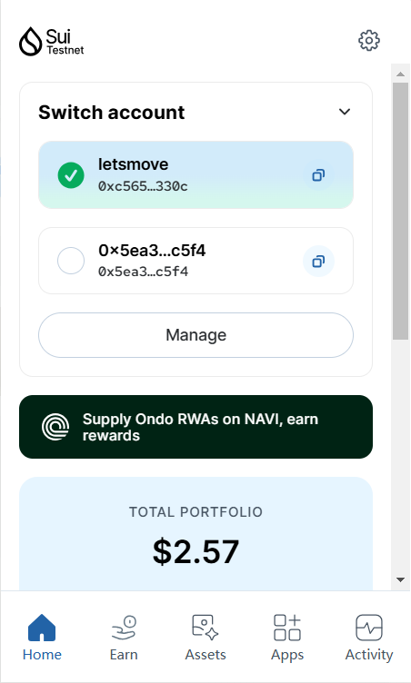
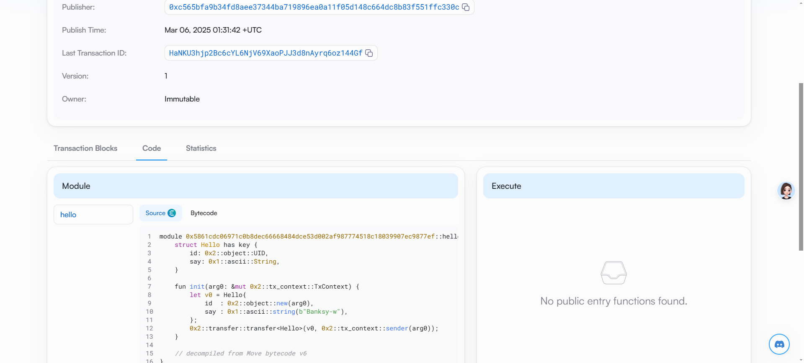

## 基本信息

- Sui 钱包地址: `0xc565bfa9b34fd8aee37344ba719896ea0a11f05d148c664dc8b83f551ffc330c`
  > 首次参与需要完成第一个任务注册好钱包地址才被合并，并且后续学习奖励会打入这个地址
- github: `Banksy-w`

## 个人简介

- 工作经验: 2 年
- 技术栈: `TS` `React` `node.js`
  > 重要提示 请认真写自己的简介
- 从事前端工程师两年，曾接触过 starknet 以及 solana 的黑客松，在 tintinland 社区担任过助教，对于 web3 比较了解，熟悉前端与链上的交互工具，如 eithers.js 或 web3.js，掌握简单的智能合约的开发 cairo、anchor 以及 solidity，想要精进自己的技术，加入 web3，所以来学习 move 开发
- 联系方式: tg: `Banksy_w`

## 任务

## 01 hello move

- [x] Sui cli version:1.44.2-556b6e14896a
- [x] Sui 钱包截图: 
- [x] package id:0x5861cdc06971c0b8dec66668484dce53d002af987774518c18039907ec9877ef
- [x] package id 在 scan 上的查看截图:

## 02 move coin

- [] My Coin package id :
- [] Faucet package id :
- [] 转账 `My Coin` hash:
- [] `Faucet Coin` address1 mint hash:
- [] `Faucet Coin` address2 mint hash:

## 03 move NFT

- [] nft package id :
- [] nft object id :
- [] 转账 nft hash:
- [] scan 上的 NFT 截图:

## 04 Move Game

- [] game package id :
- [] deposit Coin hash:
- [] withdraw `Coin` hash:
- [] play game hash:

## 05 Move Swap

- [] swap package id :
- [] call swap CoinA-> CoinB hash :
- [] call swap CoinB-> CoinA hash :

## 06 Dapp-kit SDK PTB

- [] save hash :

## 07 Move CTF Check In

- [] CLI call 截图 : 
- [] flag hash :

## 08 Move CTF Lets Move

- [] proof :
- [] flag hash :
