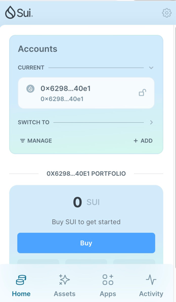
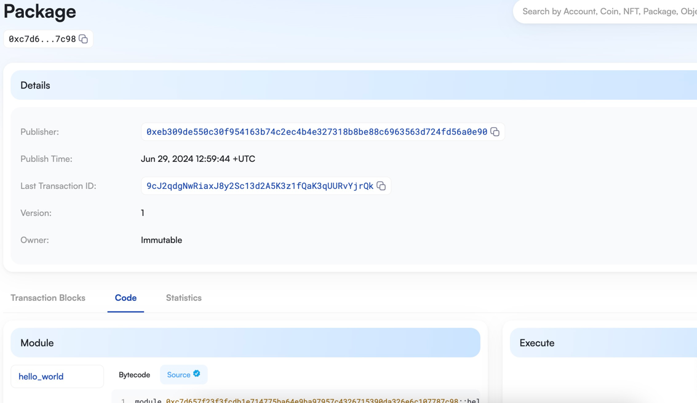
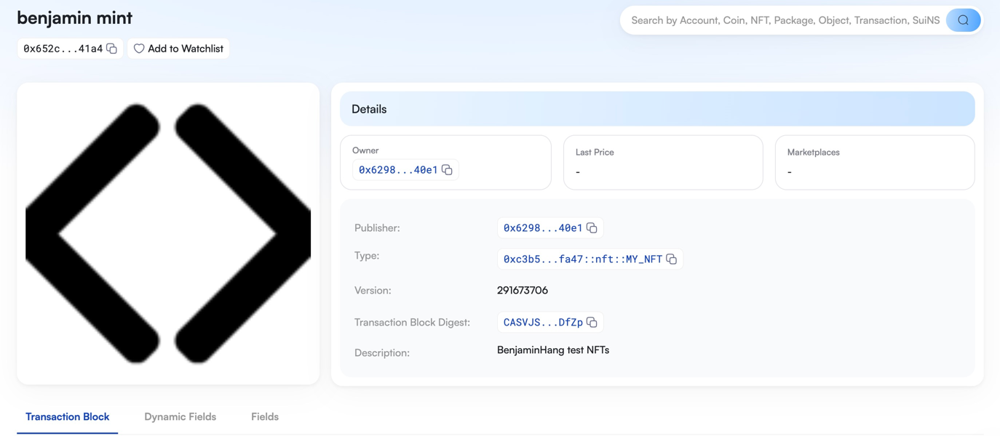
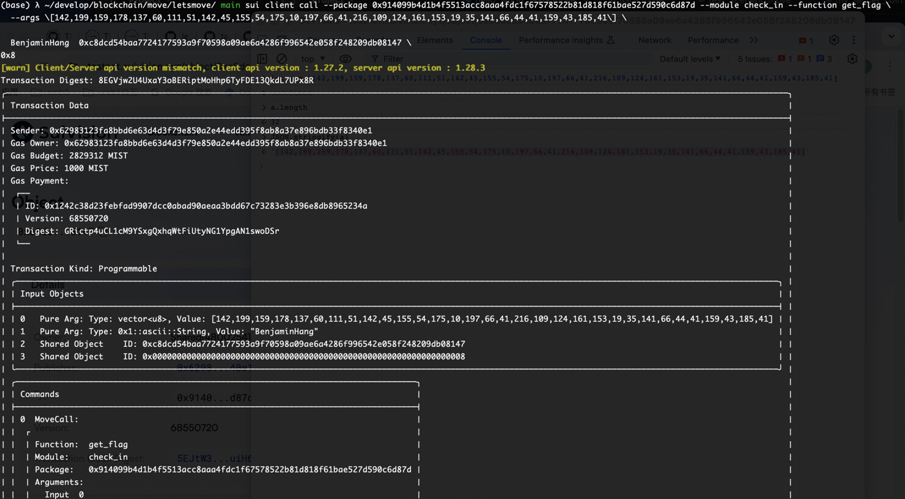

## 基本信息
- Sui钱包地址: `0x62983123fa8bbd6e63d4d3f79e850a2e44edd395f8ab8a37e896bdb33f8340e1`
> 首次参与需要完成第一个任务注册好钱包地址才被合并，并且后续学习奖励会打入这个地址
- github: `BenjaminHang`

## 个人简介
- 工作经验: 6年
- 技术栈: `javascript`
> 重要提示 请认真写自己的简介
- 多年web2开发经验，对Move特别感兴趣，想通过Move入门区块链
- 联系方式: tg: `xxx` 

## 任务

##   01 hello move  
- [x] Sui cli version: sui 1.27.2-homebrew
- [x] Sui钱包截图: 
- [x] package id: 0xc7d657f23f3fcdb1e714775ba64e9ba97957c4326715390da326e6c107787c98
- [x] package id 在 scan上的查看截图:

##   02 move coin
- [x] My Coin package id : 0xb669c8dfd2913ca91e51ceb298d00c52fa76e83e0c8ae33874076bdbba46bc56
- [x] Faucet package id : 0xb669c8dfd2913ca91e51ceb298d00c52fa76e83e0c8ae33874076bdbba46bc56
- [x] 转账 `My Coin` hash: 6pJ4tNA5c3pRSuM5aTMhqbiEuGSe9fuvgGXE8TqCSJ1k
- [x] `Faucet Coin` address1 mint hash: Ew6LEUoJNnYGKS9uCcx13RH1N2MZEL2ePa1en3226Ugt
- [x] `Faucet Coin` address2 mint hash: H2hQa44LWvzvoRwKvUM6SuYHsYAEHFiUUDc7L9QbaxCe

##   03 move NFT
- [x] nft package id : 0xc3b5a0dd7409197aa8a06d903fab7f006d37256475dc7c6a2054746ba752fa47
- [x] nft object id : 0x652c3d082bbd96101b884d2aa552a32fa0f07abc8a15cc2292b013d466e141a4
- [x] 转账 nft  hash: 6gjzyqEaE9zFNL9BtPcxhYWoMbqouJwx4BafJRFLYWGU
- [x] scan上的NFT截图:

##   04 Move Game
- [x] game package id : 0xd5a5daa2c88be180fd8a93dc71699becdf0ca2f8f6057b6d632d111c7471fb95
- [x] deposit Coin hash: 5dxwkyfE1Jis8KkB6HE51P8JaeL7itjW3GzDsUfwNdUQ
- [x] withdraw `Coin` hash: HDBUUZAHAVDosJP3dQagNN3PRydk7XBowP3G4jhKxZXG
- [x] play game hash: testnet(h1c3NHKii76i7HnDrukv7j3hpnW18WE1eAtPbUSiRhU)

##   05 Move Swap
- [x] swap package id : 0x35cb07c876fab777bffa1e3f9faa3df82190540bf4dd5e481c02945ea2b9deac
- [x] call swap CoinA-> CoinB  hash : DVexEK4a6NbWeCfF4D9TEwh5DjKTBMgJsk2edUs9xzsP
- [x] call swap CoinB-> CoinA  hash : GFjxp2brgXS2FJnrQfZK9xSqxEmAYbDfGirRhVPAYwcA

##   06 Dapp-kit SDK PTB
- [x] save hash : GSLmVWdEvFQzKycRdvNhL1oQLdHJ7nFJaxps9niU9ksq

##   07 Move CTF Check In
- [x] CLI call 截图 : 
- [x] flag hash : 8EGVjw2U4UxaY3oBERiptMoHhp6TyFDE13QkdL7UPx8R

##   08 Move CTF Lets Move
- [x] proof : bd6ef7
- [x] flag hash : 7XyuJeLH52JYjM7XBG15TLJEJcsJtDmjdPpn2bXUcpb6
