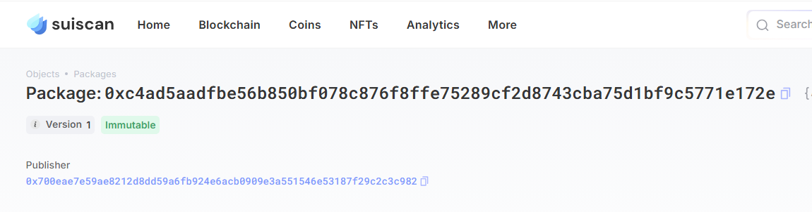
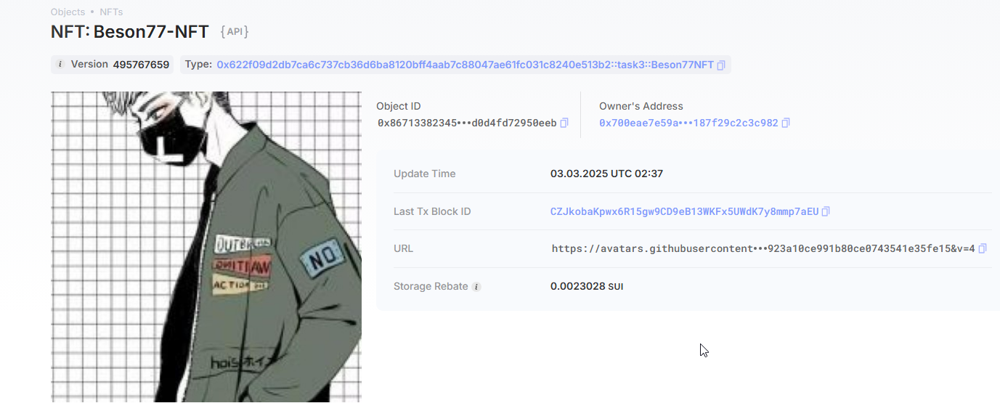
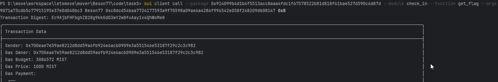

## 基本信息
- Sui钱包地址: `0x700eae7e59ae8212d8dd59a6fb924e6acb0909e3a551546e53187f29c2c3c982`
> 首次参与需要完成第一个任务注册好钱包地址才被合并，并且后续学习奖励会打入这个地址
- github: `Beson77`

## 个人简介
- 工作经验: 2年
- 技术栈: `js`
> 重要提示 请认真写自己的简介
- 多年web2开发经验，对Move特别感兴趣，想通过Move入门区块链
- 联系方式: 

## 任务

##   01 hello move  
- [x] Sui cli version: sui 1.43.1-2f52a7283e5f
- [x] package id: 0xc4ad5aadfbe56b850bf078c876f8ffe75289cf2d8743cba75d1bf9c5771e172e
- [x] package id 在 scan上的查看截图:

##   02 move coin
- [x] My Coin package id : 0x07207e25afe7c367a9be427a56cd3506eca0b34c158f5b787624f0411d27f5e2
- [x] Faucet package id : 0x07207e25afe7c367a9be427a56cd3506eca0b34c158f5b787624f0411d27f5e2
- [x] 转账 `My Coin` hash: 6Cdx2SYNW2hjGJYNbybMpy1zGYB4vFCKRyd9P6CujQot
- [x] `Faucet Coin` address1 mint hash: 8UTYPGmSrcJFXc6f4g53oJx23yaw7NPHHbji2r277qHg
- [x] `Faucet Coin` address2 mint hash: CnT9or2N4iHnkZAvKya4aHHq3zGhySwijdU46fACm5zH

##   03 move NFT
- [x] nft package id : 0x622f09d2db7ca6c737cb36d6ba8120bff4aab7c88047ae61fc031c8240e513b2
- [x] nft object id : 0x86713382345c00c0c5f8b9b381bfeb9c9734db4d6db6f01c87d0d4fd72950eeb
- [x] 转账 nft  hash: 88k1K99a7Sof6eLU9uggSWFGuh92Pu2JWYoXH9De6tuQ
- [x] scan上的NFT截图:

##   04 Move Game
- [x] game package id : 0x119ee8797b75c5f996e2b563d87ccaf8559eac84ccb1a3f700f9a1c2354eef8f
- [x] deposit Coin hash: HJeFv1jJyyS4SLRuUXfK3Z5GRqgFRUNEbYEGFo7AqWsY
- [x] withdraw `Coin` hash: AYLFPdZLAodfvVvi9Xqpkb3rvQeCvEd19yoKMeKRiB5u
- [x] play game hash: GkXBnzffytsintiWpyyVJ7mNDB1CXLBR4Dkxj9cFn3BS

##   05 Move Swap
- [x] swap package id : 0xdeaa9f485143825f083deb288216d843762eb1d45dd502200728dff3b6bbde38
- [x] call swap CoinA-> CoinB  hash : 2wcaN4etuhzMXbFJZGvYRkvxx787ibq6h1gWebwdCew9
- [x] call swap CoinB-> CoinA  hash : 6K3YPG1EvqFkh7yAKivXTejLv6VCFLqRHdFF3w5oNDkT

##   06 Dapp-kit SDK PTB
- [x] save hash : 2YJoLTfEyPYN98LrH7V9qzK8fmV4WRpEF4BKTdqF8qRw

##   07 Move CTF Check In
- [x] CLI call 截图 : 
- [x] flag hash : Ec9AjbFHFbghZB28g9kkGdD3wY2w8fuAay1v4QhWoMe8

##   08 Move CTF Lets Move
- [x] proof : 0x5fc7f10000000000
- [x] flag hash : XiEbBjaY8zT9e92h5ajhmz7wwpNnexjmBCM6CTjE9eA

