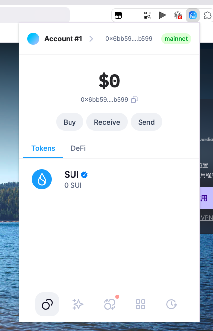
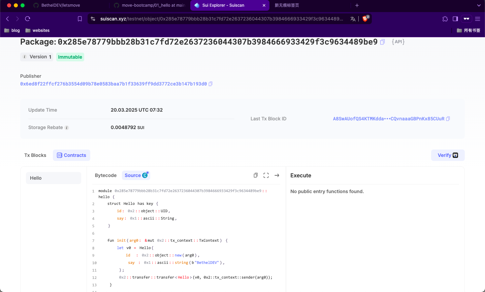
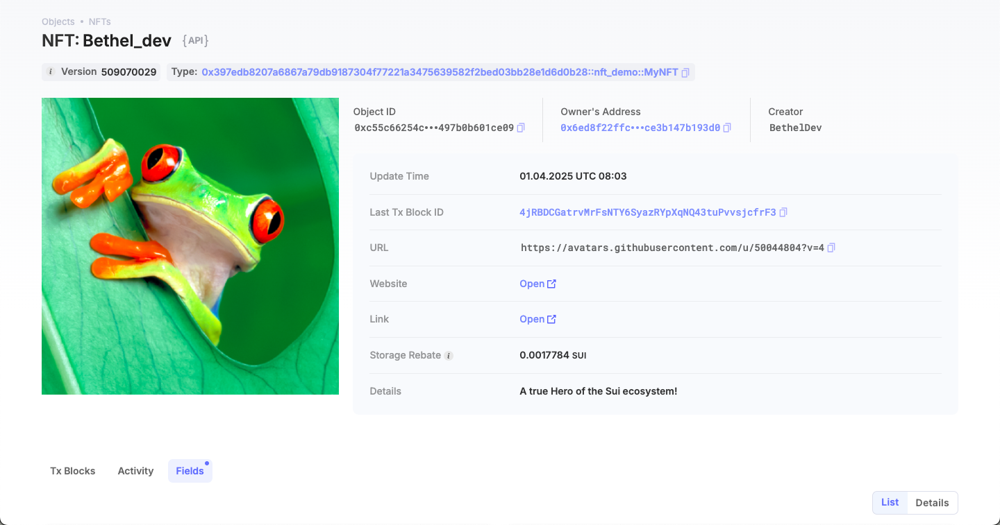
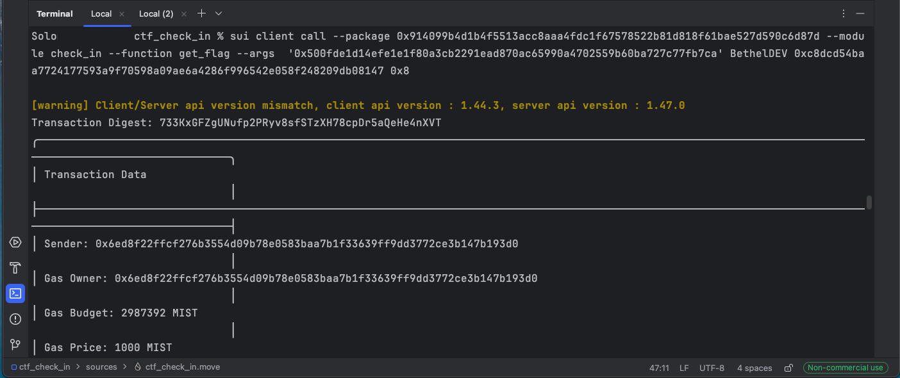

## 基本信息
- Sui钱包地址: `0x6bb595f21ccb3eb26d2e8dd0fedb4a35a0e402a9cc92f206773e7357d294b599`
> 首次参与需要完成第一个任务注册好钱包地址才被合并，并且后续学习奖励会打入这个地址
- github: `BethelDEV`

## 个人简介
- 工作经验: 5年
- 技术栈: `Android` `Java`
> 重要提示 请认真写自己的简介
- 多年移动端开发经验，对Move特别感兴趣，想通过Move入门区块链
- 联系方式: tg: ` ` 

## 任务

##   01 hello move  
- [x] Sui cli version: sui 1.44.3-615516edb0ed
- [x] Sui钱包截图: 
- [x] package id: 0x285e78779bbb28b31c7fd72e2637236044307b3984666933429f3c9634489be9
- [x] package id 在 scan上的查看截图:

##   02 move coin
- [x] My Coin package id : [0x659c9d2eada860b6c0b6e93b7735563a32a4aa6a57317c661d46bb63d71252a7](https://suiscan.xyz/mainnet/object/0x659c9d2eada860b6c0b6e93b7735563a32a4aa6a57317c661d46bb63d71252a7/)
- [x] Faucet package id : 0x659c9d2eada860b6c0b6e93b7735563a32a4aa6a57317c661d46bb63d71252a7
- [x] 转账 `My Coin` hash: [85HQjxRsYEFadSpGAkBwE2CDeSqUCQq1huSNoKeztRJ7](https://suiscan.xyz/mainnet/tx/85HQjxRsYEFadSpGAkBwE2CDeSqUCQq1huSNoKeztRJ7)
- [x] `Faucet Coin` address1 mint hash: [3r6v7dAGvfPytC4NpKttHwXZ2aPoGyNRRa8K2BdLBUsM](https://suiscan.xyz/mainnet/tx/3r6v7dAGvfPytC4NpKttHwXZ2aPoGyNRRa8K2BdLBUsM)
- [x] `Faucet Coin` address2 mint hash: [8U4kShqFNXJ2yFvMYeizPJBfssinagJ6ZfgQa59NdxB8](https://suiscan.xyz/mainnet/tx/8U4kShqFNXJ2yFvMYeizPJBfssinagJ6ZfgQa59NdxB8)

##   03 move NFT
- [x] nft package id :[0x397edb8207a6867a79db9187304f77221a3475639582f2bed03bb28e1d6d0b28](https://suiscan.xyz/mainnet/object/0x397edb8207a6867a79db9187304f77221a3475639582f2bed03bb28e1d6d0b28)
- [x] nft object id : 0xc55c66254c745e980c7866139255c052ce1e6721edbb071ef2c497b0b601ce09
- [x] 转账 nft  hash: [FMVKHi2AHGxFpLs43zyMS7n1n9BKVyeoPPM5KQ6qB4SS](https://suiscan.xyz/mainnet/tx/FMVKHi2AHGxFpLs43zyMS7n1n9BKVyeoPPM5KQ6qB4SS)
- [x] scan上的NFT截图:

##   04 Move Game
- [x] game package id :0x402665d84cff26f8977a99495c299f7fa47913079b96aad45dd665b75186a0db
- [x] deposit Coin hash:[3TUE7U14DLAy1kAEwmRKPyxC3Da6t4jgfyCHbTRrKMfo](https://suiscan.xyz/mainnet/tx/3TUE7U14DLAy1kAEwmRKPyxC3Da6t4jgfyCHbTRrKMfo)
- [x] withdraw `Coin` hash:[8eYKXso8LVVd7FQYo7X4mqHsQ9HN3qXbVyNcW1MXETdu](https://suiscan.xyz/mainnet/tx/8eYKXso8LVVd7FQYo7X4mqHsQ9HN3qXbVyNcW1MXETdu)
- [x] play game hash:[GsXAv1gBoMF1CdLZ6jjhYoWLr8H5iPp38bnXbuyDdT6A](https://suiscan.xyz/mainnet/tx/GsXAv1gBoMF1CdLZ6jjhYoWLr8H5iPp38bnXbuyDdT6A)

##   05 Move Swap
- [x] swap package id : 0x2c34afe08f26db7913440e9bf4dda1b79ba825b15ad9e37259cf042c587007e8
- [x] call swap CoinA-> CoinB  hash : [BXKbx24HadxLCRArXzShRB2nmgHdrjj8q9XyU6EQhNGe](https://suiscan.xyz/mainnet/tx/BXKbx24HadxLCRArXzShRB2nmgHdrjj8q9XyU6EQhNGe)
- [x] call swap CoinB-> CoinA  hash : [34heyyuxuWiij9VK28dyiPdzNmirfxFcjbmLsSprV2c6](https://suiscan.xyz/mainnet/tx/34heyyuxuWiij9VK28dyiPdzNmirfxFcjbmLsSprV2c6)

##   06 Dapp-kit SDK PTB
- [x] save hash : [6Rk93GqbZ6eMfRsuW9CmvSPYPeg6eNeJ15Xr24Bgufwh](https://suivision.xyz/txblock/6Rk93GqbZ6eMfRsuW9CmvSPYPeg6eNeJ15Xr24Bgufwh)

##   07 Move CTF Check In
- [] CLI call 截图 : 
- [] flag hash : [733KxGFZgUNufp2PRyv8sfSTzXH78cpDr5aQeHe4nXVT](https://suiscan.xyz/testnet/tx/733KxGFZgUNufp2PRyv8sfSTzXH78cpDr5aQeHe4nXVT)

##   08 Move CTF Lets Move
- [] proof : 
- [] flag hash :

