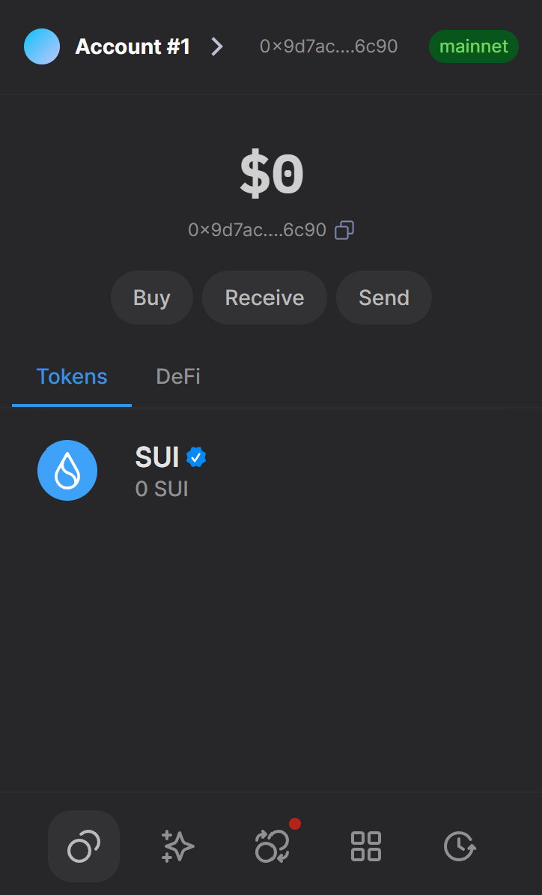
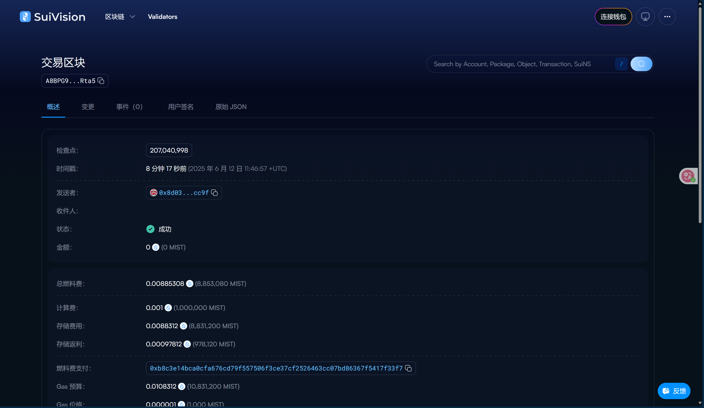

## 基本信息
- Sui钱包地址: `0x9d7ac6c2315249bfecb087bd75240c98e88aade0308cf8f50fcdd1d1f0e16c90`
- github: `BlkSword`

## 个人简介
- 工作经验: 0年，大学在读
- 技术栈: `Python` `Vue` `Go` `C++` `Dart`
- 在学网络安全，热爱创造。想通过Move入门区块链。
- 联系方式: email: `wfshenm@qq.com` 

## 任务

##   01 hello move  
- [√] Sui cli version: sui 1.49.2-62b9f371e37e
- [√] Sui钱包截图: 
- [√] package id: A8BPG9vp5DsFokcc42niaBXkLqqsWSpJJnf5mqhKRta5
- [√] package id 在 scan上的查看截图:(./images/tasks1-3.png)

##   02 move coin
- [] My Coin package id : 
- [] Faucet package id : 
- [] 转账 `My Coin` hash:
- [] `Faucet Coin` address1 mint hash:
- [] `Faucet Coin` address2 mint hash:

##   03 move NFT
- [] nft package id :
- [] nft object id : 
- [] 转账 nft  hash:
- [] scan上的NFT截图:

##   04 Move Game
- [] game package id :
- [] deposit Coin hash:
- [] withdraw `Coin` hash:
- [] play game hash:

##   05 Move Swap
- [] swap package id :
- [] call swap CoinA-> CoinB  hash :
- [] call swap CoinB-> CoinA  hash :

##   06 Dapp-kit SDK PTB
- [] save hash :

##   07 Move CTF Check In
- [] CLI call 截图 : 
- [] flag hash :

##   08 Move CTF Lets Move
- [] proof : 
- [] flag hash :

