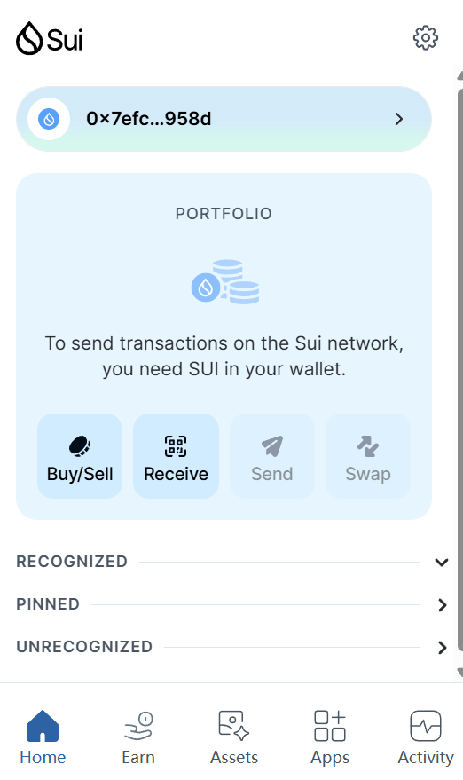
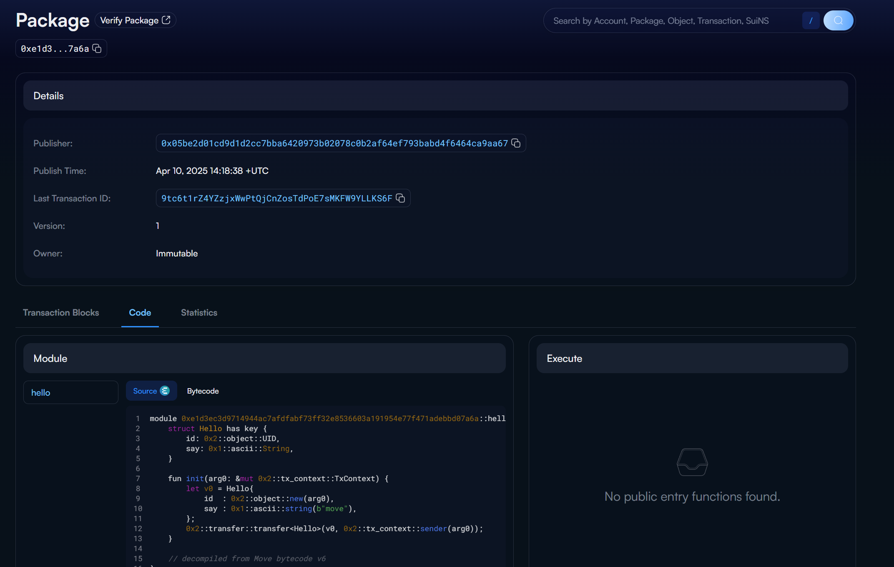

## 基本信息
- Sui钱包地址: `0x7efc4d676d7f9d9fe408221e811994ac9a0ff827d109b7d6de0498c47886958d`
> 首次参与需要完成第一个任务注册好钱包地址才被合并，并且后续学习奖励会打入这个地址
- github: `BorisJohnsonha`

## 个人简介
- 工作经验: 1年
- 技术栈: `Move` `C`
> 重要提示 请认真写自己的简介
- 有一定编程基础，对Web3和Move特别感兴趣，想通过Move入门Web3
- 联系方式: tg: `xxx` 

## 任务

##   01 hello move  
- [] Sui cli version: sui 1.46.2-43e8aad17f0d
- [] Sui钱包截图: 
- [] package id: 0xe1d3ec3d9714944ac7afdfabf73ff32e8536603a191954e77f471adebbd07a6a
- [] package id 在 scan上的查看截图:

##   02 move coin
- [] My Coin package id : 
- [] Faucet package id : 
- [] 转账 `My Coin` hash:
- [] `Faucet Coin` address1 mint hash:
- [] `Faucet Coin` address2 mint hash:

##   03 move NFT
- [] nft package id :
- [] nft object id : 
- [] 转账 nft  hash:
- [] scan上的NFT截图:

##   04 Move Game
- [] game package id :
- [] deposit Coin hash:
- [] withdraw `Coin` hash:
- [] play game hash:

##   05 Move Swap
- [] swap package id :
- [] call swap CoinA-> CoinB  hash :
- [] call swap CoinB-> CoinA  hash :

##   06 Dapp-kit SDK PTB
- [] save hash :

##   07 Move CTF Check In
- [] CLI call 截图 : 
- [] flag hash :

##   08 Move CTF Lets Move
- [] proof : 
- [] flag hash :

