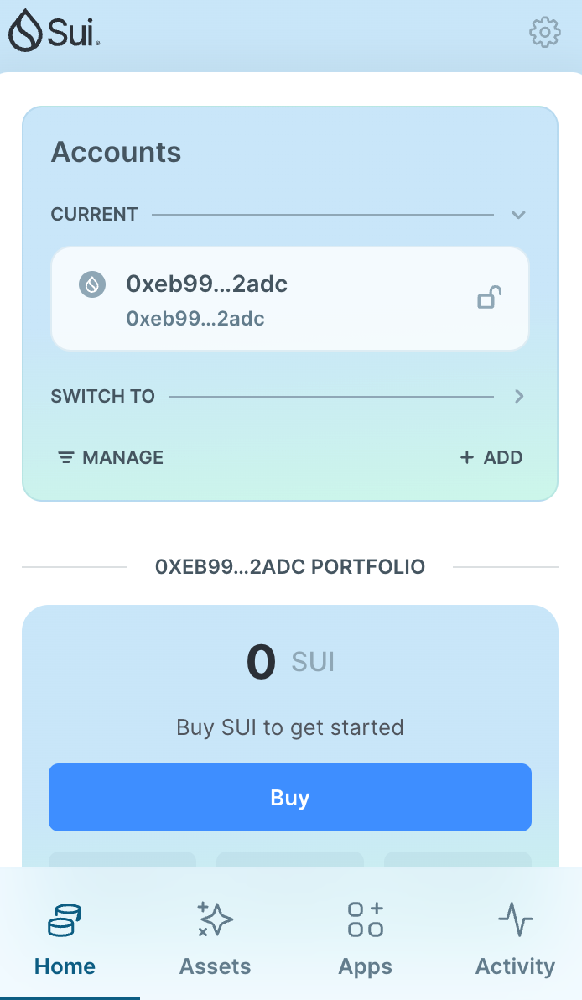
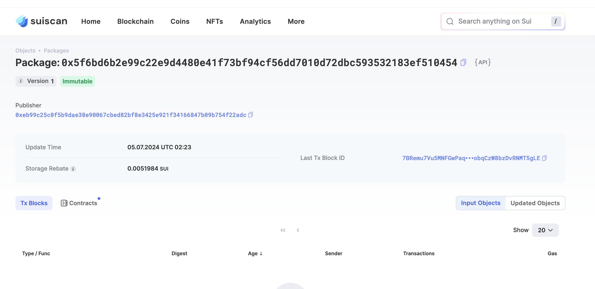
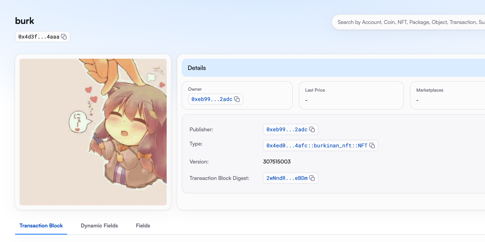
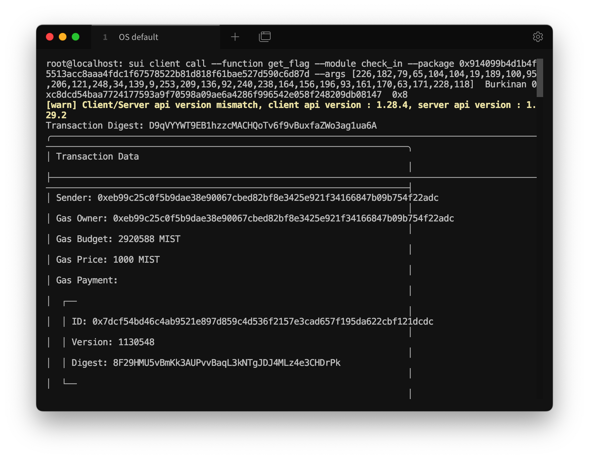

## 基本信息
- Sui钱包地址: `0xeb99c25c0f5b9dae38e90067cbed82bf8e3425e921f34166847b09b754f22adc`
> 首次参与需要完成第一个任务注册好钱包地址才被合并，并且后续学习奖励会打入这个地址
- github: `Burkinan`

## 个人简介
- 工作经验: 4年
- 技术栈: `Java`
> 重要提示 请认真写自己的简介
- 多年Java开发经验，对Move特别感兴趣，想通过Move入门区块链
- 联系方式: tg: `bukinannn` 

## 任务

##   01 hello move  
- [x] Sui cli version:  sui-client 1.29.0-1bc3c6996246
- [x] Sui钱包截图: 
- [x] package id: 0x5f6bd6b2e99c22e9d4480e41f73bf94cf56dd7010d72dbc593532183ef510454    
- [x] package id 在 scan上的查看截图:

##   02 move coin
- [x] My Coin package id :  0x5db5229e7d4d518e03a217774b72da4059c5d0275f75da28edf929cc4a41c491
- [x] Faucet package id : 0x5db5229e7d4d518e03a217774b72da4059c5d0275f75da28edf929cc4a41c491
- [x] 转账 `My Coin` hash: 8mmAmnQzCEBfQeLUkbjm9WgbUHgbW8MwnqymKpckQNGM
- [x] `Faucet Coin` address1 mint hash: HBpeEBNQrqhPjgEZWb68u8TFbnUthLKnGyXmgL2gTY8r
- [x] `Faucet Coin` address2 mint hash: CNPVqQLRUTwgLEziadBszRgVr5FCks7kgQKrmSpbkyh1

##   03 move NFT
- [x] nft package id : 0x4ed08186238ef20df72465b4e8398ee57ea153f815719c9ec46de2eea7174afc
- [x] nft object id : 0x4d3f502c3a09131cc7ccd98fe42a9ea89ea75730c0c7ac9fd11e47c4fa2a4aaa
- [x] 转账 nft  hash: HxzcichsCzXkSEs9oBg4N5ksx6M278xTCnV5SoSNXGwk
- [x] scan上的NFT截图:

##   04 Move Game
- [x] game package id :  0xeda1fb9295c5bd4c44324ae88daf5adcc4c70ad98d38a9670d60f8294b6cb569 `testnet`
- [x] deposit Coin hash: Bw3SJECJyjYLtzDqCzNFRFKCn1EBMznnAg1XfJbfuuKQ `testnet`
- [x] withdraw `Coin` hash:  RVBRLi7d2s6HYJDx1gqVgStVJUx9TztTLD8dAFdMeGN `testnet`
- [x] play game hash:  6ErXygbUtFPd4ETJSPWnWzTEWLhAJzJ47BxeUVrLvAgp `testnet`

##   05 Move Swap
- [x] swap package id : 0x87986aad9367f25821093784f767b48afa232205346b4df64f66d30f227b2e21
- [x] call swap CoinA-> CoinB  hash : EVyhZZDXLTEZ6xqatJ3Y5QibkWtzL2U1JDey5BGsEDcw
- [x] call swap CoinB-> CoinA  hash : CiVuJcbVqqabD6NVLpjZCxxGKJLtgS7cFmFtY8rcUcwE

##   06 Dapp-kit SDK PTB
- [x] save hash : 2iCE9viXdQEqDToj64nNJjgACWLd5Bk8B7VMaUasp4TF

##   07 Move CTF Check In
- [x] CLI call 截图 : 
- [x] flag hash : D9qVYYWT9EB1hzzcMACHQoTv6f9vBuxfaZWo3ag1ua6A

##   08 Move CTF Lets Move
- [x] proof :  007ff2bb54b8a2a64f47
- [x] flag hash : DBVr3NX2cumEv8ibpDCUTUuWNKXG8fZyi9Bq3Sn2xEWL
