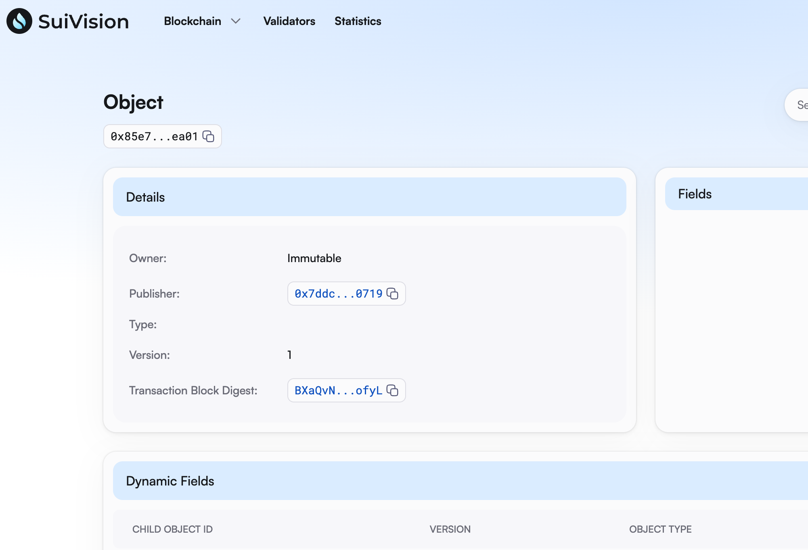
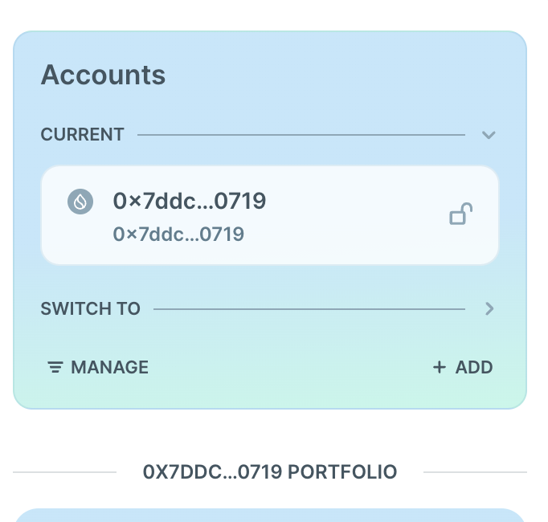
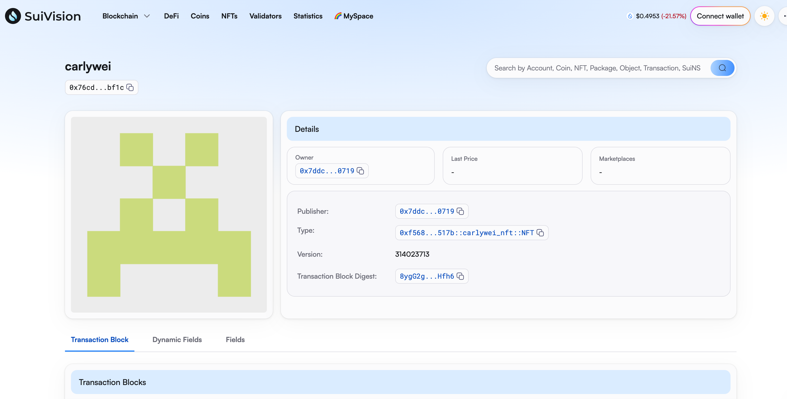

## 基本信息
- Sui钱包地址: `0x7ddc0886f353d4c47e1945c56066c9d9be5f63c6dbf6166ea7181ca276ce0719`
> 首次参与需要完成第一个任务注册好钱包地址才被合并，并且后续学习奖励会打入这个地址
- github: `Carly Wei`

## 个人简介
- 工作经验: 4年
- 技术栈: `DBA`
> 重要提示 请认真写自己的简介
- 多年数据库开发经验，对Move特别感兴趣，想通过Move入门区块链
- 联系方式: tg: `Carly-Wei` 

## 任务

##   01 hello move  
- [x] Sui cli version: sui-client 1.29.2-09db80adf1af
- [x] Sui钱包截图: 
- [x] package id:  0x85e74d6b4ed5d063678a42189d70fbf3ddfda2cc8cf966354fb1eb6e9445ea01
- [x] package id 在 scan上的查看截图:

##   02 move coin
- [x] My Coin package id : 0x35d38bd46fe73e4e21fce981da1991af6e6253e55745192efe550762b7f3070b
- [x] Faucet package id : 0x35d38bd46fe73e4e21fce981da1991af6e6253e55745192efe550762b7f3070b
- [x] 转账 `My Coin` hash: 9cDjdeYcP2YiFkSh1RFRkt9wqpdtVz8oJ7RHKD27xBMX
- [x] `Faucet Coin` address1 mint hash: A9Sf3qyDZDGiZPT5JxSF1xGmbHY1ADQsNzhfoGFWNQ4q
- [x] `Faucet Coin` address2 mint hash: DSywXEtYbQ7Tuq2cnwYHraPV9dTVSA6X9AdQrW6k95Ki

##   03 move NFT
- [x] nft package id : 0xf56839ac15af07f0273ce381da0549641f4b73d1dcee1886c22f0eabb343517b
- [x] nft object id :  0x76cd9285c00f35e06a4aafbb2addaf32b0025756fbb0541d9bb5f0f84294bf1c
- [x] 转账 nft  hash: 6btymG5k5WaMnKSJKhCRZq3gt9LHCsv7Dt2Ao6RgasKJ
- [x] scan上的NFT截图:

##   04 Move Game
- [] game package id :
- [] deposit Coin hash:
- [] withdraw `Coin` hash:
- [] play game hash:

##   05 Move Swap
- [] swap package id :
- [] call swap CoinA-> CoinB  hash :
- [] call swap CoinB-> CoinA  hash :

##   06 Dapp-kit SDK PTB
- [] save hash :

##   07 Move CTF Check In
- [] CLI call 截图 : 
- [] flag hash :

##   08 Move CTF Lets Move
- [] proof : 
- [] flag hash :
