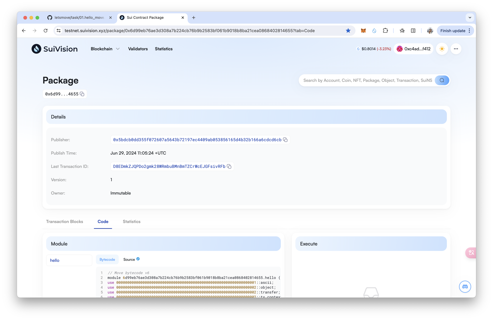
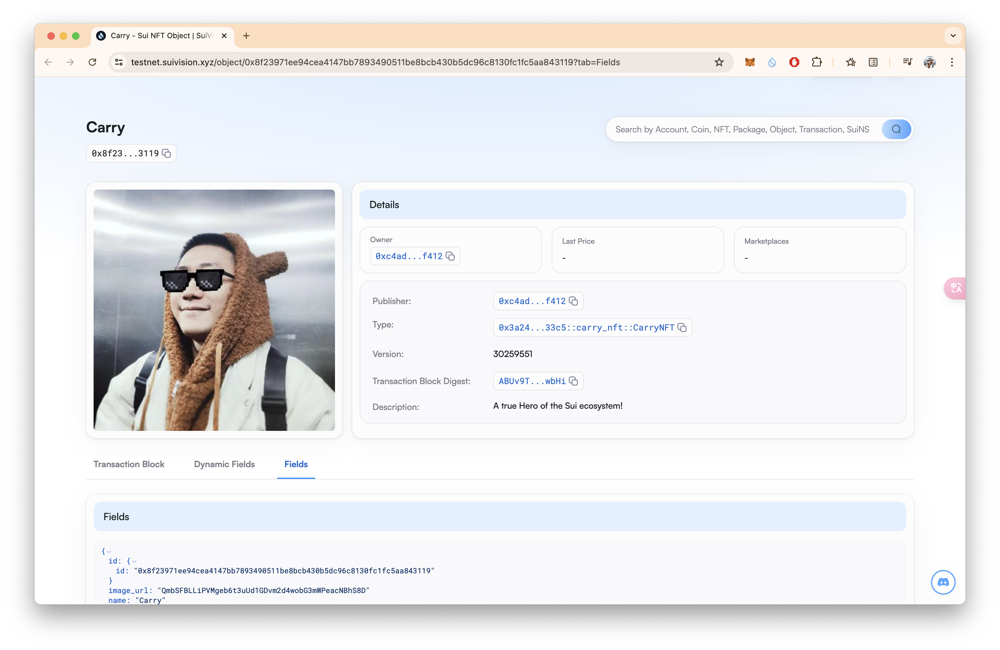

## 基本信息

- Sui 钱包地址: `0xc4ad60560fa9d197213f703827361441ed3cebdfba507343d0d754589c41f412`
  > 首次参与需要完成第一个任务注册好钱包地址才被合并，并且后续学习奖励会打入这个地址
- github: `https://github.com/CarryWang`

## 个人简介

- 工作经验: 5 年
- 技术栈: `JavaScrpit` `Solidity` `C#` `Java`
  > 重要提示 请认真写自己的简介
- Web3 全栈开发
- 联系方式: tg: `@Carry_Wang`

## 任务

## 01 hello move

- [x] Sui cli version: sui 1.27.2-homebrew
- [x] Sui 钱包截图: 
- [x] package id: 0x6d99eb76ae3d308a7b224cb76b9b2583bf061b9018b8ba21cea0868402814655
- [x] package id 在 scan 上的查看截图:

## 02 move coin

- [x] My Coin package id : 0x7070ef7e9504ba53eb35772f003ab07b41c18a61e6ce642fed13d3372d86919d
- [x] Faucet package id : 0xc6801ae6c7aff5305843a6be407b2da546b3d493d8f0d4fbb8f6a61e26257e3f
- [x] 转账 `My Coin` hash: DdWhuuhEzewYZ6osN1a9GESydjdGAjVT8xoAXkoEAMjy
- [x] `Faucet Coin` address1 mint hash: BQbVGEkHtca4iCLHNynrVYbZsVChpWZGFUGMDAg4Dah2
- [x] `Faucet Coin` address2 mint hash: 9TneNRRTqV78EMHhMGpKcNPA5wmUfV7xW4wSStJwkVaL

## 03 move NFT

- [x] nft package id : 0xb43a9d10c9899d0240c7bf6a82716ca24d5184089fb565c01bbdc57431ad797b
- [x] nft object id : 0xc7bdaa8f721711f60d4bd72882bc192f30eb1345ae25b267b32929897fc25bb9
- [x] 转账 nft hash: 76Vfnn3HeDDmPP2Vr1cGCu5qW3QUcxtD58jEccy1wYYN
- [x] scan 上的 NFT 截图:

## 04 Move Game

- [x] game package id : 0x5dead564593c8fb294776bf4df4dbcebf39793e5d51d35e17de099a0b2f0c686
- [x] deposit Coin hash: 3AHd6o2YuycwKqG4GHmHJNPUGgYg1FQcgKvYSiuUUC8U
- [x] withdraw `Coin` hash: 4UCPUcNvGSaUFo1avTNsxy7tgs6s4BHK5EATLvT9Vkrv
- [x] play game hash: GaqBjEUoFrkJKHSQTsCfgjSeFETN824BJgcFmACYgQWi

## 05 Move Swap

- [x] swap package id : 0xaa88171226271a6d114cc5aa32bc2222de7057afa8e0595047c1692c820939e0
- [x] call swap CoinA-> CoinB hash : EqfFiM3xPMkLVyuSX5hR8Fc9Zkx1LqZza2fX3pge3Ns9
- [x] call swap CoinB-> CoinA hash : DfJmfwbpGMFvNugwG6kANm3NPCSD7W7rCiTu7Qjqc4qi

## 06 Dapp-kit SDK PTB

- [] save hash :

## 07 Move CTF Check In

- [] CLI call 截图 : 
- [] flag hash :

## 08 Move CTF Lets Move

- [] proof :
- [] flag hash :
